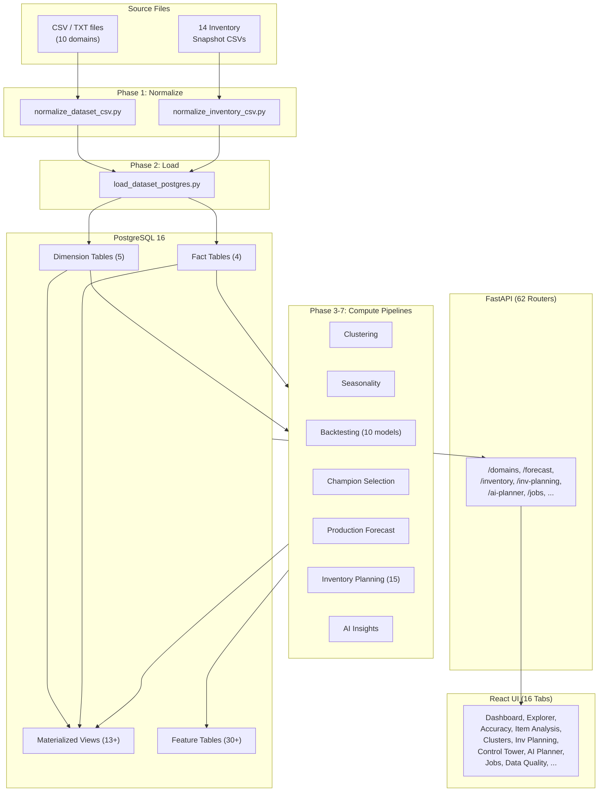
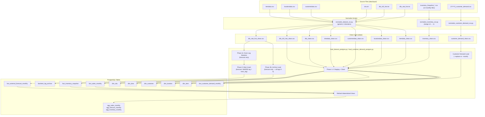

# Supply Chain Command Center — Unified Architecture & Data Flow Reference

The single authoritative reference for system architecture, data flow, database schema, pipeline dependencies, API routing, ML pipeline, frontend components, and testing infrastructure.

---

## 1. Goal

Reduce dataset-by-dataset duplication and provide a reusable path for adding new dimensions and facts.

## 2. Current Pattern

1. Define dataset spec in `common/domain_specs.py`
2. Add DDL in `sql/`
3. Reuse generic scripts:
   - `normalize_dataset_csv.py`
   - `load_dataset_postgres.py`
4. Reuse generic API query paths in `api/main.py`:
   - `/domains/{domain}`
   - `/domains/{domain}/page`
   - `/domains/{domain}/meta`
   - `/domains/{domain}/analytics`
5. Reuse one shared React UI app (`frontend/src/App.tsx`)

---

## 3. High-Level Pipeline Overview



---

## 4. Input Files Inventory

| Domain | Source File | Format | Delimiter | Normalize Script | Clean Output | Key Columns |
|--------|-----------|--------|-----------|-----------------|-------------|-------------|
| **item** | `data/input/itemdata.csv` | CSV | `,` | `normalize_dataset_csv.py --dataset item` | `data/itemdata_clean.csv` | `item_id` (PK) |
| **location** | `data/input/locationdata.csv` | CSV | `,` | `normalize_dataset_csv.py --dataset location` | `data/locationdata_clean.csv` | `location_id` (PK) |
| **customer** | `data/input/customerdata.csv` | CSV | `,` | `normalize_dataset_csv.py --dataset customer` | `data/customerdata_clean.csv` | `site + customer_no` (CK) |
| **time** | _(auto-generated 2020-2035)_ | — | — | `normalize_dataset_csv.py --dataset time` | `data/timedata_clean.csv` | `date_key` (PK) |
| **sku** | `data/input/sku.txt` | TXT | `\|` | `normalize_dataset_csv.py --dataset sku` | `data/dfu_clean.csv` | `item_id + customer_group + loc` (CK) |
| **sales** | `data/input/dfu_lvl2_hist.txt` | TXT | `\|` | `normalize_dataset_csv.py --dataset sales` | `data/dfu_lvl2_hist_clean.csv` | `item_id + customer_group + loc + startdate + type` |
| **forecast** | `data/input/dfu_stat_fcst.txt` | TXT | `\|` | `normalize_dataset_csv.py --dataset forecast` | `data/dfu_stat_fcst_clean.csv` | `item_id + customer_group + loc + fcstdate + startdate` |
| **inventory** | `data/input/Inventory_Snapshot_YYYY_MM.csv` (14 files) | CSV | `,` | `normalize_inventory_csv.py` | `data/inventory_clean.csv` | `item_id + loc + snapshot_date` |
| **sourcing** | `data/input/sourcing.csv` | CSV | `,` | `normalize_dataset_csv.py --dataset sourcing` | `data/sourcing_clean.csv` | `item_id + loc + source_cd` (CK) |
| **purchase_order** | `data/input/purchase_orders.csv` | CSV | `,` | `normalize_dataset_csv.py --dataset purchase_order` | `data/purchase_orders_clean.csv` | `po_number + item_id + loc` (CK) |
| **customer_demand** | `data/input/{YYYY}_customer_demand.csv` or `{YYYYMM}_customer_demand.csv` | CSV | `,` | `normalize_customer_demand_csv.py` | `data/customer_demand_clean.csv` | `item_id + customer_no + location_id + startdate` |

**Normalization rules applied to all domains:**
- Null normalization: `''`, `'null'`, `'none'`, `'NA'` → `NULL`
- Type casting: integer/float/date fields auto-cast with null coercion
- Sales: only `TYPE=1` rows retained
- Forecast: `lag = month_diff(startdate, fcstdate)`, only lags 0-4
- Inventory: `qty_on_order = qty_on_hand_on_order - qty_on_hand` (derived)
- Customer demand: `warehouse_no` → `location_id` via `dim_location.site_id`, `posting_prd` YYYYMM → `startdate`, `demand_qty = MAX(0, demand_cases)`, `sales_qty = MAX(0, demand_cases - oos_cases)`

---

## 5. Data Ingestion Flow



### Forecast Dual-Path Loading (Critical Detail)

The forecast loader uses phase ordering to preserve multi-horizon accuracy:

1. **12-month filter** — Delete staging rows with `startdate` older than 12 months from planning date
2. **Archive load** — Insert remaining rows into `backtest_lag_archive` FIRST from untouched staging (original lag values preserved)
3. **Execution lag resolution** — Overwrite both `lag` and `execution_lag` on staging from `dim_sku` (all external forecasts are assumed to be at execution lag; source file's lag/execution_lag fields are ignored)
4. **Main insert** — All rows enter `fact_external_forecast_monthly` (no lag filter)

**Flags:** `--replace` (keep backtest/champion rows), `--skip-archive` (skip archive for speed)

### Data Loading

Data loads directly from CSV into main tables via `scripts/load_dataset_postgres.py`. Single-pass: COPY to staging, type-cast + dedup, INSERT into target tables. Batch tracking via `audit_load_batch`.

---

## 6. Component Technologies

1. Source ingestion + normalization:
   - Python scripts + `uv` + Make
2. Relational sink:
   - PostgreSQL 16 (pgvector/pgvector:pg16) via `psycopg` copy/load
3. API + UI:
   - FastAPI backend + React/Vite/shadcn UI frontend
6. NL→SQL chatbot:
   - OpenAI GPT-4o (generation) + text-embedding-3-small (embeddings)
   - pgvector for schema metadata vector search
   - Read-only SQL execution with safety guardrails (SELECT only, 5s timeout, 500-row cap)
6b. AI Planning Agent:
   - Anthropic Claude `claude-opus-4-6` via `anthropic>=0.40.0` SDK (tool_use API)
   - `AIPlannerAgent` in `common/ai_planner.py`: 10 tools, agentic loop, insight creation
   - Not a chatbot — proactive exception work-queue scanner writing structured insights to DB
6c. Data Quality & Pipeline Observability:
   - `DQEngine` in `common/dq_engine.py`: rule-based data quality checks with 7 check types (freshness, completeness, row_count, uniqueness, range, volume_delta, referential_integrity)
   - Scheduled checks via job scheduler integration; dashboard with pass/fail/warn KPI cards and trend chart
   - 5 API endpoints under `/data-quality/` (dashboard, rules, history, run, acknowledge)
   - Config: `config/data_quality_config.yaml` (rules per dataset, thresholds, severity mapping, schedule)
6d. User Management & RBAC:
   - JWT authentication via `common/auth.py` with bcrypt password hashing
   - 4 roles: viewer, planner, manager, admin — role-based endpoint access control
   - Audit logging: all mutations recorded with user, timestamp, action, resource
   - Router: `api/routers/auth_router.py` (login, register, refresh) + `api/routers/users.py` (CRUD, role assignment)
6e. Performance & Caching:
   - `InMemoryBackend` cache in `common/cache.py` with configurable TTL per endpoint
   - Query performance tracking: slow query detection, response time histograms
   - Config: `config/cache_config.yaml` (TTL, max entries, eviction policy)
6f. Notifications & Alerting:
   - `NotificationEngine` in `common/notification_engine.py` with pluggable adapter pattern
   - 4 adapters: Slack, Teams, Email (SMTP), PagerDuty
   - Router: `api/routers/notifications.py` (channels, preferences, send, history)
   - Config: `config/notification_config.yaml` (channels, routing rules, severity thresholds)
6g. Webhooks:
   - `WebhookDispatcher` in `common/webhook_dispatcher.py` with HMAC-SHA256 signed payloads
   - Retry with exponential backoff (configurable max attempts)
   - Router: `api/routers/webhooks.py` (register, list, test, delivery history)
   - Config: `config/webhook_config.yaml` (retry policy, signing secrets, event types)
6h. SQL Runner:
   - Freeform read-only SQL execution from the UI
   - Two-layer write protection: regex-based DML/DDL rejection + DB-level `SET TRANSACTION READ ONLY`
   - Configurable row limits (default 1000) and query timeouts (default 30s)
   - Schema browser (information_schema introspection) and in-memory query history
   - Router: `api/routers/sql_runner.py` (execute, schema, history)
   - Config: `config/sql_runner_config.yaml` (max_rows, statement_timeout_ms, enabled)
   - Frontend: `SqlRunnerTab` under System sidebar section
6i. API Governance:
   - Rate limiting via `common/rate_limiter.py` (token bucket algorithm)
   - API versioning support (v1/v2 path prefixes)
   - Rate limiting logic in `common/rate_limiter.py`; no dedicated router (governance endpoints planned, not yet mounted)
7. Multi-model forecasting:
   - `model_id` column on forecast fact table
   - Per-model analytics and model selector in UI
8. DFU clustering:
   - Feature engineering: 14 core features across 6 dimensions (volume, trend, seasonality, periodicity, intermittency, lifecycle) from 36-month sales history
   - New features: FFT periodicity strength, OLS seasonal R-squared, Croston ADI, scale-invariant trend slope, IQR, CAGR, recency ratio, YoY correlation
   - KMeans clustering with combined Silhouette + Calinski-Harabasz scoring (0.5*sil + 0.5*CH); gap statistic removed
   - Hard 5% minimum cluster size constraint; k_range [5, 18]; post-hoc merge of small clusters
   - Priority-ordered taxonomy labeling: Intermittency -> Periodicity -> Seasonality -> Trend -> Volatility -> Volume (5 tiers)
   - Compound labels: `high_volume_seasonal_growing`, `low_volume_intermittent`, `very_high_volume_growing`, etc.
   - MLflow experiment tracking (`dfu_clustering`)
   - Cluster assignments stored in `dim_sku.cluster_assignment`
   - Master switch: `clustering.enabled` in `config/forecast_pipeline_config.yaml` controls whether the clustering pipeline runs; when `false`, all backtest scripts auto-fall back to `global` strategy
   - Pipeline config references: `clustering_config.yaml`, `cluster_tuning_profiles.yaml`, `cluster_experiment_templates.yaml`
9. LGBM backtesting (Feature 44):
   - Expanding window backtest (10 timeframes A-J) with LightGBM regressors
   - Configurable `cluster_strategy`: `per_cluster` (default, one model per ml_cluster) or `global` (one model on all data)
   - `cluster_strategy` resolution: `forecast_pipeline_config.yaml` algorithm entry > `algorithm_config.yaml` > default `per_cluster`; auto-falls back to `global` when `clustering.enabled` is `false`
   - `ml_cluster` is always a hard feature — never stripped from feature_cols in either strategy
   - Algorithm options controlled by `config/algorithm_config.yaml` (cluster_strategy, recursive, shap_select, tune_inline, params_file, hyperparameters)
   - Causal feature engineering: lag 1-12, rolling stats, calendar, DFU/item attributes
   - Execution-lag predictions loaded into `fact_external_forecast_monthly` via COPY + upsert
   - All-lag (0-4) predictions archived in `backtest_lag_archive` for accuracy at any horizon
   - MLflow experiment tracking (`demand_backtest`)
10. CatBoost backtesting (Feature 44):
   - Same expanding window framework as LGBM (10 timeframes A-J) with CatBoost regressors
   - Configurable `cluster_strategy`: `per_cluster` (default) or `global`; ml_cluster always a hard feature
   - Algorithm options controlled by `config/algorithm_config.yaml`
   - Native categorical feature handling via ordered target encoding (no one-hot needed)
   - GPU support via `task_type="GPU"`; auto-detected at runtime
   - MLflow experiment tracking (`demand_backtest`)
11. XGBoost backtesting (Feature 44):
   - Same expanding window framework as LGBM (10 timeframes A-J) with XGBoost regressors
   - Configurable `cluster_strategy`: `per_cluster` (default) or `global`; ml_cluster always a hard feature
   - Algorithm options controlled by `config/algorithm_config.yaml`
   - Native categorical support via `enable_categorical=True` with `tree_method="hist"`
   - GPU support via `device="cuda"`; auto-detected at runtime
   - MLflow experiment tracking (`demand_backtest`)
11b. MSTL backtesting:
   - MSTL (Multiple Seasonal-Trend decomposition using LOESS) from the `statsforecast` library
   - Per-DFU fitting with parallel workers (default 8); decomposes into trend + multiple seasonal components
   - Config in `config/algorithm_config.yaml` under `mstl` key: `season_length: 12`, `min_history: 25`
   - Outputs to `data/backtest/mstl/`; default model ID: `mstl`
   - CLI: `make backtest-mstl`, `make backtest-mstl-full` (backtest + load)
11c. N-HiTS backtesting:
   - N-HiTS deep learning model from the `neuralforecast` library
   - Global model training (single model across all DFUs); supports Apple MPS, CUDA, and CPU
   - Config in `config/algorithm_config.yaml` under `nhits` key: `h: 6`, `input_size: 24`, `max_steps: 500`
   - Outputs to `data/backtest/nhits/`; default model ID: `nhits`
   - CLI: `make backtest-nhits`, `make backtest-nhits-full` (backtest + load)
11d. N-BEATS backtesting:
   - N-BEATS deep learning model from the `neuralforecast` library
   - Global model training (single model across all DFUs); supports Apple MPS, CUDA, and CPU
   - Config in `config/algorithm_config.yaml` under `nbeats` key: `h: 6`, `input_size: 24`, `max_steps: 500`
   - Outputs to `data/backtest/nbeats/`; default model ID: `nbeats`
   - CLI: `make backtest-nbeats`, `make backtest-nbeats-full` (backtest + load)
12. Multi-dimensional accuracy slicing:
   - Pre-aggregated `agg_accuracy_by_dim` view: (model_id, lag, month, cluster, supplier, abc_vol, region, brand) grain
   - Pre-aggregated `agg_accuracy_lag_archive` view: same grain for archive table + timeframe
   - `/forecast/accuracy/slice` endpoint: compare WAPE, Accuracy %, Bias across models by any DFU attribute
   - `/forecast/accuracy/lag-curve` endpoint: accuracy degradation by lag horizon (0–4) per model
   - UI Accuracy Comparison panel: model comparison pivot table + lag curve chart
   - Views refreshed automatically by `backtest-load`; also manually via `make accuracy-slice-refresh`
17. Champion model selection (feature15):
   - Per-DFU per-month best-model selection using Forecast Value Added (FVA) approach
   - 8 configurable strategies via `common/champion_strategies.py` strategy registry:
     - `expanding` — cumulative WAPE, all prior months equal weight (default)
     - `rolling` — last N months only (configurable `window_months`)
     - `decay` — exponential decay weighting recent months more (`decay_factor`)
     - `ensemble` — blend top-K models by inverse-WAPE weights
     - `meta_learner` — ML classifier predicts best model from DFU features + performance stats
     - `hybrid_warmup` — uses ensemble for months with sufficient history + rolling for warm-up months (addresses 58% coverage gap where expanding/ensemble discard DFU-months with fewer than `min_prior_months`); configurable `warmup_strategy`, `warmup_window`, `warmup_min_prior`, `primary_strategy`, `primary_top_k`
     - `adaptive_ensemble` — varies top-K (2–5) per DFU-month based on model WAPE spread; low-spread months use `min_k` to avoid diluting the best model, high-spread months use `max_k` for robustness; configurable `spread_threshold`
     - `ensemble_rolling` — blends top-K models using rolling window WAPE instead of expanding; combines rolling adaptiveness (reacts to regime changes) with ensemble robustness; configurable `window_months`, `top_k`, `weight_method`
   - All strategies enforce **exec-lag-aware strict causality**: selection for month T with execution_lag=L uses ONLY data from `startdate < T − L` (= `startdate < fcstdate`), implemented as `shift(exec_lag + 1)` per DFU-model group — prevents using actuals not available at forecast issuance time
   - **Fallback model** (`fallback_model_id`, default `lgbm_cluster`): fills warm-up DFU-months so every DFU-month always has a champion row
   - WAPE-based DFU-level evaluation: `SUM(ABS(F-A)) / ABS(SUM(A))` per DFU per model
   - Champion composite stored as `model_id='champion'` in `fact_external_forecast_monthly` — auto-appears in all accuracy views
   - Ceiling (oracle) model: per-DFU per-month best model selection — theoretical upper bound with perfect foresight
   - Ceiling stored as `model_id='ceiling'` — provides accuracy benchmark alongside champion
   - Gap-to-ceiling metric shows how far champion is from theoretical best (in percentage points)
   - Meta-learner trained on ceiling labels as ground truth with strict temporal train/test split
   - Simulation script (`simulate_champion_strategies.py`) runs all strategies and compares accuracy vs ceiling; includes 16 simulation entries: expanding, rolling_3/6/9/12, decay_090/095, ensemble_top3_inv/eq, meta_learner, ensemble_top5_inv, ensemble_roll6_inv, ensemble_roll9_inv, adaptive_ensemble, hybrid_warmup, hybrid_warmup_adapt
   - YAML config: `config/forecast_pipeline_config.yaml` (master config — `champion` section for strategy, strategy_params, meta_learner; `algorithms` section for competing models via `compete: true` flag). Legacy `config/model_competition.yaml` still works via backward compat
   - CLI: `make champion-select`, `make champion-simulate`, `make champion-train-meta`, `make champion-all`
   - API endpoints: `GET/PUT /competition/config`, `POST /competition/run`, `GET /competition/summary`
   - UI: Champion Selection panel in Accuracy tab with model checkboxes, metric/lag selectors, strategy selector, champion + ceiling KPI cards, gap indicator, and dual model wins bar charts
   - Summary saved to `data/champion/champion_summary.json` (includes `fallback_rows_inserted` count)
18. Data Explorer performance & UX (feature16):
   - Type-aware SQL filtering: `_col_type()` dispatches to native-type clauses instead of universal `::text` casts
   - GIN trigram indexes (`gin_trgm_ops`) on fact table text columns (model_id, item_id, loc, customer_group) for indexed `ILIKE` substring search
   - Capped COUNT: `pg_class.reltuples` for unfiltered; `LIMIT 100001` subquery for filtered large tables; `total_approximate` flag in response
   - Column-level typeahead suggestions: `/domains/{domain}/suggest` reused per column header with native HTML `<datalist>`
   - Chemistry-themed loading overlay: periodic table element tile with `pulse-glow` animation, frosted glass backdrop
   - Debounce stability: `useDebounce` uses `JSON.stringify` deep comparison for object values to prevent re-render loops
19. Item Analysis tab (feature17 + feature34 merge):
   - Merged DFU Analysis + Inventory into a single **Item Analysis** tab with a checkbox toggle toolbar
   - 7 toggleable panels grouped as Demand (Forecast Chart, SHAP, Model KPIs) and Supply (Inv KPIs, Position Table, Variability, Lead Time); toggle state persisted in localStorage via `usePanelToggles` hook
   - `ItemAnalysisTab.tsx` replaces separate `DfuAnalysisTab.tsx` and `InventoryTab.tsx` (old files kept in repo but no longer imported from `App.tsx`)
   - `useUrlState.ts` includes `itemAnalysis` in VALID_TABS with backward compat redirects from `dfuAnalysis`/`inventory`
   - Sidebar: single "Item Analysis" nav item replaces two separate items
   - **Demand side:** Unified sales vs multi-model forecast overlay on a single chart; three analysis modes (Item @ Location, All Items @ Location, Item @ All Locations); `GET /sku/analysis` endpoint; per-model KPI cards; toggleable measure visibility; typeahead item/location filters
   - **Clickable forecast lines**: clicking any backtest model line sets `selectedModel` state; selected line renders thicker + unselected lines fade to 30% opacity; hint text "click a forecast line to explore SHAP" near toggles
   - **Per-DFU SHAP Panel** (`DfuShapPanel.tsx`): on model selection renders a stacked Recharts BarChart below the overlay chart showing signed SHAP feature contributions per month; future months rendered at 45% fill opacity; 15-color palette per feature; scrollable container (min 800px); dual-stack with `ReferenceLine y={0}` baseline; falls back to cluster-level summary SHAP (existing `/forecast/shap/{model}/summary` endpoint) with warning banner when per-DFU pkl artifacts are not available (404); placeholder card when no model selected
   - **Supply side:** Inventory KPI cards, trend chart (dual Y-axis), paginated position table, item detail drill-down — all from sub-panels in `tabs/inventory/`
20. Market intelligence (feature18):
   - `POST /market-intelligence` endpoint combining Google Custom Search + GPT-4o narrative
   - Item metadata lookup from `dim_item` (item_desc, brand_name, category, producer_name)
   - Location metadata lookup from `dim_location` (state_id, site_desc)
   - Google Custom Search API for product news/trends (5 results)
   - GPT-4o synthesizes search results + state demographics into 3-5 paragraph market briefing
   - Graceful degradation: if Google search fails, LLM generates from its own knowledge
   - UI: "Mi" tab with item/location typeahead, generate button, search result cards, narrative card
   - Requires `GOOGLE_API_KEY` and `GOOGLE_CSE_ID` env vars

---

## 7. Current Dimensions

1. `item`
2. `location`
3. `customer`
4. `time`
5. `sku`
6. `sourcing` (`dim_sourcing`) — maps item-location to supply sources (supplier-plant combinations)

## 8. Current Facts

1. `sales` (`fact_sales_monthly`) from `dfu_lvl2_hist.txt` filtered to `TYPE=1`
   - grain: `item_id` + `customer_group` + `loc` + `startdate` (monthly) + `type`
   - key: `sales_ck` with `_` separator
   - rule: `startdate` must be month-start (`YYYY-MM-01`)
2. `forecast` (`fact_external_forecast_monthly`) from `dfu_stat_fcst.txt`
   - grain: `item_id` + `customer_group` + `loc` + `fcstdate` + `startdate` + `model_id`
   - key: `forecast_ck` with `_` separator; uniqueness: `UNIQUE(forecast_ck, model_id)`
   - rule: `fcstdate` and `startdate` must be month-start
   - rule: `lag = month_diff(startdate, fcstdate)` and only lags `0..4`
   - rule: `model_id` defaults to `'external'` when absent from source
   - loading: dual-path insert with **phase ordering** — 12-month filter removes old rows, archive loads FIRST from untouched staging (original lag values preserved), THEN staging's `lag` and `execution_lag` are both overwritten from `dim_sku` (all external forecasts assumed at execution lag; unmatched DFUs default to 0), THEN all rows enter main table (no lag filter)
   - `--replace` flag: deletes only `model_id='external'` rows instead of truncating (preserves backtest/champion/ceiling data)
   - `--skip-archive` flag: skips archive load entirely — only loads into main table for faster external forecast reloads
3. `inventory` (`fact_inventory_snapshot`) from 14 monthly CSV files (`Inventory_Snapshot_YYYY_MM.csv`)
   - grain: `item_id` + `loc` + `snapshot_date` (monthly)
   - key: `inventory_ck` with `_` separator
   - measures: `qty_on_hand`, `qty_on_hand_on_order`, `qty_on_order` (derived), `mtd_sales`, `lead_time_days`
   - source columns: `exec_date` → `snapshot_date`, `item` → `item_id`, `loc` → `loc`, `lead_time` → `lead_time_days`, `tot_oh` → `qty_on_hand`, `tot_oh_oo` → `qty_on_hand_on_order`, `mtd_sls` → `mtd_sales`
   - rule: `qty_on_order = qty_on_hand_on_order - qty_on_hand` (computed during normalization)
   - materialized view: `agg_inventory_monthly` aggregates to monthly grain with avg/sum metrics
4. `purchase_order` (`fact_purchase_orders`) from `purchase_orders.csv`
   - grain: `po_number` + `item_id` + `loc`
   - key: `po_ck` with `_` separator
   - measures: `ordered_qty`, `net_price`, `gross_value`; dates: `delivery_date`, `original_delivery_date`, `current_ship_date`, `original_ship_date`
   - computed columns: `lead_time_planned`, `lead_time_actual`, `is_closed`, `open_qty`
   - rule: YYYYMMDD dates parsed to ISO during normalization; `source_cd` split into `supplier_id` + `plant_id`
   - materialized views: `mv_supplier_po_performance` (OTD%, lead time stats), `mv_po_lead_time_analysis` (monthly trends)
5. `customer_demand` (`fact_customer_demand_monthly`) from `{YYYY}_customer_demand.csv` or `{YYYYMM}_customer_demand.csv`
   - grain: `item_id` + `customer_no` + `location_id` + `startdate` (monthly)
   - key: `demand_ck` with `_` separator
   - measures: `demand_qty`, `sales_qty`, `oos_qty`
   - **monthly range-partitioned** by `startdate`
   - normalization: `warehouse_no` → `location_id` via `dim_location.site_id` join, `posting_prd` YYYYMM → `startdate` (YYYY-MM-01), `demand_qty = MAX(0, demand_cases)`, `sales_qty = MAX(0, demand_cases - oos_cases)`
   - loading: dedicated `load_customer_demand_postgres.py`; `--replace` (full truncate + reload), `--month YYYY-MM` (single partition drop + reload)

---

## 9. Database Schema Map

```mermaid
erDiagram
    dim_item ||--o{ fact_sales_monthly : "item_id"
    dim_item ||--o{ fact_inventory_snapshot : "item_id"
    dim_item ||--o{ fact_customer_demand_monthly : "item_id"
    dim_location ||--o{ fact_inventory_snapshot : "loc"
    dim_location ||--o{ fact_customer_demand_monthly : "location_id"
    dim_customer ||--o{ fact_customer_demand_monthly : "customer_no"
    dim_sku ||--o{ fact_sales_monthly : "item_id+loc"
    dim_sku ||--o{ fact_external_forecast_monthly : "item_id+loc"
    dim_customer ||--o{ fact_sales_monthly : "customer_group"
    dim_time ||--o{ fact_sales_monthly : "startdate"

    fact_sales_monthly ||--o{ agg_sales_monthly : "refresh"
    fact_external_forecast_monthly ||--o{ agg_forecast_monthly : "refresh"
    fact_external_forecast_monthly ||--o{ backtest_lag_archive : "all lags"
    fact_inventory_snapshot ||--o{ agg_inventory_monthly : "refresh"

    agg_inventory_monthly ||--o{ mv_inventory_forecast_monthly : "join"
    fact_external_forecast_monthly ||--o{ mv_inventory_forecast_monthly : "join"

    backtest_lag_archive ||--o{ agg_accuracy_by_dim : "refresh"
    backtest_lag_archive ||--o{ agg_accuracy_lag_archive : "refresh"

    dim_sku ||--o{ fact_safety_stock_targets : "item_id+loc"
    dim_sku ||--o{ fact_eoq_targets : "item_id+loc"
    dim_sku ||--o{ fact_dfu_policy_assignment : "item_id+loc"

    fact_safety_stock_targets ||--o{ mv_inventory_health_score : "SS gap"
    fact_safety_stock_targets ||--o{ fact_ss_simulation_results : "base"
    fact_safety_stock_targets ||--o{ fact_rebalancing_plan : "imbalance"

    fact_inventory_snapshot ||--o{ mv_fill_rate_monthly : "refresh"
    fact_inventory_snapshot ||--o{ mv_intramonth_stockout : "refresh"
    fact_inventory_snapshot ||--o{ mv_supplier_performance : "refresh"

    dim_item {
        text item_id PK
        text brand_name
        text category
        text class
        text supplier_desc
    }
    dim_location {
        text location_id PK
        text state_id
        text site_id
    }
    dim_sku {
        text item_id
        text customer_group
        text loc
        text ml_cluster
        text cluster_assignment
        text seasonality_profile
        text abc_vol
        text xyz_class
    }
    fact_sales_monthly {
        text sales_ck PK
        text item_id
        text loc
        date startdate
        numeric qty
    }
    fact_external_forecast_monthly {
        text forecast_ck
        text model_id
        text item_id
        text loc
        date startdate
        numeric basefcst_pref
        numeric tothist_dmd
        int lag
    }
    fact_inventory_snapshot {
        text inventory_ck PK
        text item_id
        text loc
        date snapshot_date
        numeric qty_on_hand
        numeric qty_on_order
        numeric mtd_sales
        int lead_time_days
    }
    fact_customer_demand_monthly {
        text demand_ck PK
        text item_id
        text customer_no
        text site
        text location_id
        date startdate
        numeric demand_qty
        numeric sales_qty
        numeric oos_qty
    }
```



---

## 10. All Tables by Category (~86 tables + 15 materialized views)

### Core Tables

**Core Dimensions (6):** `dim_item`, `dim_location`, `dim_customer`, `dim_time`, `dim_sku`, `dim_sourcing`

**Core Facts (5):** `fact_sales_monthly`, `fact_external_forecast_monthly`, `fact_inventory_snapshot`, `fact_purchase_orders`, `fact_customer_demand_monthly`

**Archive:** `backtest_lag_archive`

### Core Materialized Views (6)

`agg_sales_monthly`, `agg_forecast_monthly`, `agg_inventory_monthly`, `agg_accuracy_by_dim`, `agg_accuracy_lag_archive`, `agg_dfu_coverage`

### Inventory Planning Tables (12)

`fact_safety_stock_targets`, `fact_eoq_targets`, `dim_replenishment_policy`, `fact_dfu_policy_assignment`, `fact_replenishment_exceptions`, `fact_demand_signals`, `fact_ss_simulation_results`, `fact_inventory_investment_plan`, `fact_efficient_frontier`, `dim_transfer_lane`, `fact_rebalancing_plan`, `fact_rebalancing_transfer`

### Inventory Planning Views (9)

`mv_inventory_forecast_monthly`, `mv_inventory_health_score`, `mv_fill_rate_monthly`, `mv_supplier_performance`, `mv_intramonth_stockout`, `mv_network_balance`, `mv_control_tower_kpis`, `mv_supplier_po_performance`, `mv_po_lead_time_analysis`

### Forecasting & Champion (7)

`fact_production_forecast`, `fact_replenishment_plan`, `champion_experiment`, `champion_experiment_lag`, `champion_experiment_month`, `champion_experiment_comparison`, `champion_promotion_log`

### AI & Exception Tables (5)

`ai_insights`, `ai_planning_memos`, `ai_call_log`, `ai_recommendation_outcomes`, `fact_storyboard_exceptions`

### Operations Tables (12)

`fact_bias_corrections`, `fact_service_level_tracking`, `fact_lead_time_learning`, `fact_blended_forecast`, `fact_echelon_planning`, `fact_financial_plan`, `fact_sop_cycles` (+ 4 phase tables), `fact_event_planning`, `fact_supply_scenarios`

### Supply Chain (8)

`dim_supplier_master`, `fact_open_purchase_orders`, `fact_po_receipts`, `fact_inventory_projection`, `fact_planned_orders`, `fact_demand_plan`, `fact_consensus_plan`, `fact_procurement_workflow`

### Platform Tables (13)

`dim_dq_check_catalog`, `fact_dq_check_results`, `mv_dq_dashboard`, `dim_user`, `fact_audit_log`, `fact_notification_log`, `fact_annotation`, `fact_external_signals`, `fact_fva_tracking`, `dim_report_template`, `fact_report_schedule`, `fact_webhook_registrations`, `fact_query_performance`

### Batch Tracking (1)

`audit_load_batch`

### Chat

`schema_embeddings`

### Jobs

`job_history`, `job_schedule`

### Detailed Table Descriptions

1. `chat_embeddings` — pgvector table storing schema metadata embeddings (1536-dim) for NL query context retrieval
2. `backtest_lag_archive` — stores all-lag (0–4) predictions for accuracy reporting at any horizon; grain: `(forecast_ck, model_id, lag)`; includes `timeframe` column (A–J) for traceability; for external forecasts, archive is loaded BEFORE staging mutation (original lag values preserved); for backtest models, each row preserves its original lag
3. `fact_inventory_snapshot` — monthly range-partitioned inventory snapshots (~198M rows across 15 months); grain: `(item_id, loc, snapshot_date)`; partitioned by `snapshot_date` (1 partition per calendar month, ~13M rows each); measures: qty_on_hand, qty_on_hand_on_order, qty_on_order, mtd_sales, lead_time_days
4. `agg_inventory_monthly` — materialized view aggregating inventory to monthly grain (avg on-hand, avg on-order, avg lead time, total MTD sales)
5. `job_history` — persistent job tracking table for the APScheduler-powered job engine; includes scheduling columns (`scheduled_cron`, `retry_count`, `max_retries`, `pipeline_id`, `pipeline_step`, `triggered_by`), `pid` (INTEGER) for subprocess PID tracking, `log` (TEXT) for persistent execution log streaming; grain: `(job_id)` PK
6. `job_schedule` — recurring schedule definitions for APScheduler cron/interval triggers; grain: `(schedule_id)` PK; columns: `job_type`, `params`, `cron_expr`, `interval_min`, `active`
7. `fact_eoq_targets` — computed EOQ metrics per DFU (IPfeature4); grain: `(item_id, loc)`; columns: demand_mean_monthly, annual_demand, ordering_cost, holding_cost_pct, unit_cost, moq, eoq, effective_eoq, eoq_cycle_stock, order_frequency, annual_holding_cost, annual_order_cost, total_annual_cost, computed_at
8. `dim_replenishment_policy` — replenishment policy definitions (IPfeature5); grain: `(policy_id)`; columns: policy_name, policy_type, segment, review_cycle_days, service_level, use_eoq, use_safety_stock, active, dfu_count
9. `fact_dfu_policy_assignment` — DFU-to-policy assignments (IPfeature5); grain: `(item_id, loc)`; columns: policy_id (FK), assigned_at, assigned_by; `UNIQUE(item_id, loc)` prevents duplicate assignments
10. `fact_safety_stock_targets` — stub table for safety stock targets (IPfeature6); populated by IPfeature3; currently empty, causing health score SS components to return neutral scores until IPfeature3 is implemented
11. `mv_inventory_health_score` — materialized view computing composite inventory health scores (IPfeature6); grain: `(item_id, loc)`; 4 components x 25 pts = 0-100 composite; tiers: healthy (>=80), monitor (>=60), at_risk (>=40), critical (<40); components: SS Coverage (0-25), DOS Target Adherence (0-25), Stockout Risk History (0-25), Forecast Accuracy (0-25)
12. `fact_replenishment_exceptions` — exception queue table (IPfeature7); grain: `(exception_id)` UUID PK; columns: item_id, loc, exception_date, exception_type, severity, current state snapshot, recommendation (order qty, order_by date, receipt date, estimated value), workflow (status, acknowledged_by, acknowledged_ts, ordered_ts, resolved_ts, notes); 6 exception types: below_rop, below_rop_critical, below_ss, stockout, excess, zero_velocity; 4 severity levels: critical/high/medium/low; 4 workflow statuses: open/acknowledged/ordered/resolved
13. `mv_fill_rate_monthly` — materialized view aggregating order fill rate metrics by item-location-month (IPfeature8)
14. `fact_demand_signals` — short-horizon demand signals computed from recent sales velocity and inventory movement (IPfeature9); grain: `(item_id, loc, signal_date)`
15. `fact_ss_simulation_results` — Monte Carlo safety stock simulation output (IPfeature10); grain: `(simulation_id, item_id, loc)`
16. `mv_supplier_performance` — materialized view aggregating supplier delivery performance KPIs from inventory receipt data (IPfeature12)
17. `fact_inventory_investment_plan` — computed capital investment allocation plan per item-location (IPfeature13); grain: `(item_id, loc, plan_date)`
18. `fact_efficient_frontier` — efficient frontier curve data points for budget vs. service level trade-off (IPfeature13)
19. `mv_intramonth_stockout` — materialized view detecting within-month stockout events from daily inventory snapshots (IPfeature14)
20. `mv_control_tower_kpis` — materialized view aggregating cross-dimensional KPIs for the Control Tower dashboard (IPfeature15)
21. `ai_insights` — AI-generated planning exception records (IPAIfeature1); grain: `(insight_id)` PK; 5 insight types (stockout_risk, excess_inventory, forecast_bias, policy_gap, champion_degradation); 4 severity levels; open/acknowledged/resolved workflow; financial_impact_estimate, reasoning, recommendation
22. `ai_planning_memos` — AI-generated planning narrative memos (IPAIfeature1); grain: `(memo_id)` PK; scope: portfolio or DFU; narrative_text + content_json; indexed by period + scope
23. `fact_replenishment_plan` — forward-looking replenishment plan per item-location-month (CI Bands + Repl. Plan); grain: `(item_id, loc, plan_month, plan_version)`; measures: forecast_qty with P10/P90 CI bands (forecast_qty_lower, forecast_qty_upper), ss_combined (forecast-driven SS), historical_ss, ss_delta, eoq, cycle_stock, reorder_point, order_qty, order_up_to_level, is_below_ss, horizon_months, avg_daily_demand, sigma_method
24. `dq_rule_results` — data quality rule execution results (08-01); grain: `(result_id)` PK; columns: rule_id, rule_name, rule_type, dataset, status (pass/fail/warn), metric_value, threshold, message, run_id, executed_at; DDL: `sql/062_create_dq_tables.sql`
25. `dq_run_history` — data quality run history with aggregate metrics (08-01); grain: `(run_id)` PK; columns: triggered_by, started_at, completed_at, total_rules, passed, failed, warned
26. `app_users` — user accounts with bcrypt password hashes (08-02); grain: `(user_id)` PK; columns: username, email, password_hash, role (viewer/planner/manager/admin), is_active, created_at, last_login; DDL: `sql/063_create_user_tables.sql`
27. `audit_log` — mutation audit trail (08-02); grain: `(audit_id)` PK; columns: user_id, action, resource_type, resource_id, details_json, ip_address, timestamp
28. `refresh_tokens` — JWT refresh token storage (08-02); grain: `(token_id)` PK; columns: user_id, token_hash, expires_at, revoked
29. `notification_channels` — notification channel configurations (08-04); grain: `(channel_id)` PK; columns: channel_type (slack/teams/email/pagerduty), config_json, active; DDL: `sql/065_create_notification_tables.sql`
30. `notification_history` — sent notification log (08-04); grain: `(notification_id)` PK; columns: channel_id, event_type, recipient, payload_json, status, sent_at, error_message
31. `notification_preferences` — per-user notification routing preferences (08-04); columns: user_id, event_type, channel_id, enabled
32. `collaboration_threads` — threaded comment discussions (08-05); grain: `(thread_id)` PK; columns: resource_type, resource_id, created_by, created_at; DDL: `sql/066_create_collaboration_tables.sql`
33. `collaboration_comments` — individual comments with @mentions (08-05); grain: `(comment_id)` PK; columns: thread_id (FK), parent_id (self-FK for nesting), author_id, body, mentions (array), created_at, updated_at
34. `shared_views` — saved shared view configurations (08-05); grain: `(view_id)` PK; columns: name, owner_id, view_config_json, shared_with (array), is_public, created_at
35. `external_signal_sources` — external demand signal source registrations (08-06); grain: `(source_id)` PK; columns: source_name, source_type, config_json, active, last_fetched_at; DDL: `sql/067_create_external_signals_tables.sql`
36. `fact_external_signals` — ingested external demand signal values (08-06); grain: `(signal_id)` PK; columns: source_id (FK), item_id, loc, signal_date, signal_type, signal_value, confidence
37. `demand_decomposition` — demand decomposition results (08-06); grain: `(decomp_id)` PK; columns: item_id, loc, period, base_demand, trend_component, seasonal_component, external_signal_component, residual
38. `fva_waterfall` — forecast value added tracking (08-07); grain: `(fva_id)` PK; columns: item_id, loc, period, stage (statistical/planner/consensus), model_id, forecast_qty, actual_qty, wape, bias, value_added_pct; DDL: `sql/068_create_fva_tables.sql`
39. `fva_interventions` — planner forecast interventions (08-07); grain: `(intervention_id)` PK; columns: item_id, loc, period, user_id, original_forecast, adjusted_forecast, reason, intervention_type, created_at
40. `report_templates` — report template definitions (08-08); grain: `(template_id)` PK; columns: name, description, report_type, config_json, created_by, created_at; DDL: `sql/069_create_report_tables.sql`
41. `report_schedules` — scheduled report delivery definitions (08-08); grain: `(schedule_id)` PK; columns: template_id (FK), cron_expr, recipients, delivery_method (email/slack/s3), active, last_run_at
42. `report_deliveries` — report delivery tracking (08-08); grain: `(delivery_id)` PK; columns: schedule_id (FK), template_id (FK), status, file_path, delivered_at, error_message
43. `webhook_registrations` — registered webhook endpoints (08-10); grain: `(webhook_id)` PK; columns: url, secret (HMAC key), event_types (array), active, created_by, created_at; DDL: `sql/070_create_webhook_tables.sql`
44. `webhook_deliveries` — webhook delivery log with retry tracking (08-10); grain: `(delivery_id)` PK; columns: webhook_id (FK), event_type, payload_json, status, http_status, attempts, next_retry_at, last_attempt_at
45. `dim_transfer_lane` — network topology for cross-location inventory rebalancing (IPfeature-rebalancing); grain: `(lane_id)` PK; unique on `(source_loc, dest_loc)`; columns: source_loc, dest_loc, transfer_cost, transit_days, min_transfer_qty, max_transfer_qty, active; enables greedy + LP solver optimization
46. `fact_rebalancing_plan` — rebalancing plan header (IPfeature-rebalancing); grain: `(plan_id)` PK; columns: plan_date, status (draft/approved/executed/cancelled), solver (greedy/lp), total_transfers, total_qty, total_cost, total_benefit, net_benefit, created_by, approved_by, approved_at, executed_at
47. `fact_rebalancing_transfer` — individual transfer recommendations within a plan (IPfeature-rebalancing); grain: `(transfer_id)` PK; columns: plan_id (FK), item_id, source_loc, dest_loc, transfer_qty, transfer_cost, transit_days, source_dos_before, source_dos_after, dest_dos_before, dest_dos_after, benefit_estimate
48. `mv_network_balance` — materialized view computing per-item DOS coefficient of variation across locations to detect network imbalances (IPfeature-rebalancing); grain: `(item_id)`; columns: loc_count, avg_dos, min_dos, max_dos, dos_cv, imbalance_flag
49. `fact_sop_cycles` — S&OP cycle header (F4.2); grain: `(cycle_id)` PK; columns: cycle_month, current_stage (demand_review/supply_review/pre_sop/executive_sop/approved/closed), approved_by, approved_plan_version, created_at, updated_at; DDL: `sql/056_create_sop_module.sql`
50. `fact_sop_demand_review` — S&OP demand review data (F4.2); grain: `(review_id)` PK; columns: cycle_id (FK), item_id, loc, forecast_qty, adjusted_qty, notes
51. `fact_sop_supply_constraints` — S&OP supply-side constraints (F4.2); grain: `(constraint_id)` PK; columns: cycle_id (FK), item_id, loc, constraint_type, capacity, lead_time_impact, notes
52. `fact_sop_gaps` — S&OP demand-supply gap analysis (F4.2); grain: `(gap_id)` PK; columns: cycle_id (FK), item_id, loc, demand_qty, supply_qty, gap_qty, gap_pct, severity, resolution
53. `fact_sop_approved_plan` — S&OP locked approved demand plan (F4.2); grain: `(plan_id)` PK; columns: cycle_id (FK), item_id, loc, approved_qty, plan_version
54. `lgbm_tuning_run` — LGBM hyperparameter tuning experiment runs (LGBM Tuning); grain: `(run_id)` SERIAL PK; columns: run_label, model_id, started_at, completed_at, status (running/completed/failed), accuracy_pct, wape, bias, n_predictions, n_dfus, feature_count, config_json, params, notes; DDL: `sql/095_create_lgbm_tuning.sql`
55. `lgbm_tuning_timeframe` — per-timeframe accuracy breakdown for each tuning run (LGBM Tuning); grain: `(id)` PK; columns: run_id (FK), timeframe (A–J), accuracy_pct, wape, bias, n_predictions
56. `lgbm_tuning_cluster` — per-cluster accuracy breakdown for each tuning run (LGBM Tuning); grain: `(id)` PK, UNIQUE(run_id, cluster_type, cluster_value); columns: run_id (FK), cluster_type (ml_cluster/business_cluster), cluster_value, n_predictions, n_dfus, accuracy_pct, wape, bias; DDL: `sql/095_create_lgbm_tuning.sql`
57. `lgbm_tuning_month` — per-month accuracy breakdown for each tuning run (LGBM Tuning); grain: `(id)` PK, UNIQUE(run_id, month_start); columns: run_id (FK), month_start (DATE), n_predictions, n_dfus, accuracy_pct, wape, bias; DDL: `sql/095_create_lgbm_tuning.sql`
58. `lgbm_tuning_comparison` — pairwise run comparison records (LGBM Tuning); grain: `(comparison_id)` PK; columns: baseline_run_id (FK), candidate_run_id (FK), delta_accuracy, delta_wape, delta_bias, verdict (improved/degraded/neutral), created_at
59. `tuning_chat_session` — AI tuning chat sessions (LGBM Tuning Chat); grain: `(session_id)` UUID PK; columns: title, status (active/archived), context (JSONB), created_at, updated_at; DDL: `sql/096_create_tuning_chat.sql`
60. `tuning_chat_message` — messages within tuning chat sessions (LGBM Tuning Chat); grain: `(message_id)` SERIAL PK; columns: session_id (FK), role (user/assistant/system), content, message_type (text/recommendation/run_started/run_completed/run_failed/analysis/error), metadata (JSONB), created_at; DDL: `sql/096_create_tuning_chat.sql`

**Unified Model Tuning (Feature 46) — schema extensions:**
- `lgbm_tuning_run` gains `is_promoted BOOLEAN DEFAULT FALSE` and `promoted_at TIMESTAMPTZ` columns; partial unique index `idx_tuning_run_promoted_per_model ON (model_id) WHERE is_promoted = TRUE` ensures at most one promoted run per model type; DDL: `sql/098_add_promoted_to_tuning.sql`
- The `model_id` column (`lgbm_cluster`, `catboost_cluster`, `xgboost_cluster`) discriminates model types within the same table — all 3 model types share the existing `lgbm_tuning_run`, `lgbm_tuning_timeframe`, `lgbm_tuning_cluster`, and `lgbm_tuning_month` tables
- Unified API router at `/model-tuning/{model}/` (model = lgbm | catboost | xgboost) with 14 endpoints: list, detail, lags, clusters, months, logs, compare, templates, promoted, promotions, create, promote, cancel, delete

**Cluster Experimentation Studio (Feature 47) — new tables + schema extensions:**
61. `cluster_experiment` — cluster experimentation lifecycle tracking (Feature 47); grain: `(experiment_id)` SERIAL PK, UNIQUE(scenario_id); columns: scenario_id, label, notes, template_id, status (queued/running/completed/failed/cancelled), created_at, started_at, completed_at, runtime_seconds, job_id, feature_params (JSONB), model_params (JSONB), label_params (JSONB), optimal_k, silhouette_score, inertia, total_dfus, n_clusters, cluster_sizes (JSONB), profiles (JSONB), k_selection_results (JSONB), is_promoted, promoted_at, artifacts_path; DDL: `sql/101_cluster_experiments.sql`
62. `cluster_experiment_comparison` — cached pairwise comparison results for cluster experiments (Feature 47); grain: `(id)` SERIAL PK, UNIQUE(experiment_a_id, experiment_b_id); columns: experiment_a_id (FK), experiment_b_id (FK), created_at, migration_matrix (JSONB), quality_comparison (JSONB), profile_comparison (JSONB); DDL: `sql/101_cluster_experiments.sql`
- `lgbm_tuning_run` gains `cluster_source VARCHAR(20) DEFAULT 'production'` (CHECK: production/experimental) and `cluster_experiment_id INTEGER` (FK to `cluster_experiment` with ON DELETE SET NULL); partial index on `cluster_experiment_id WHERE NOT NULL`; DDL: `sql/101_cluster_experiments.sql`
- Cluster experiments API router at `/cluster-experiments` with 10 endpoints: list, detail, create, update, delete, promote, compare, templates, completed, used-by

**Champion Experimentation Studio (Feature 48) — new tables:**
63. `champion_experiment` — champion selection strategy experiment lifecycle tracking (Feature 48); grain: `(experiment_id)` SERIAL PK; columns: label, notes, template_id, status (queued/running/completed/failed/cancelled), created_at, started_at, completed_at, runtime_seconds, job_id, strategy (expanding/rolling/decay/ensemble/meta_learner), strategy_params (JSONB), meta_learner_params (JSONB), models (JSONB, default all 3 tree models), metric (accuracy_pct/wape), lag_mode (execution/0-4), min_sku_rows, champion_accuracy, ceiling_accuracy, gap_bps, n_champions, n_dfu_months, model_distribution (JSONB), is_promoted, promoted_at, is_results_promoted, results_promoted_at, results_promote_job_id; DDL: `sql/102_champion_experiments.sql`
64. `champion_experiment_lag` — per-execution-lag accuracy breakdown for each champion experiment (Feature 48); grain: `(id)` SERIAL PK, UNIQUE(experiment_id, exec_lag); columns: experiment_id (FK), exec_lag, champion_accuracy, ceiling_accuracy, gap_bps, n_dfu_months, model_distribution (JSONB); DDL: `sql/102_champion_experiments.sql`
65. `champion_experiment_month` — per-month accuracy breakdown for each champion experiment (Feature 48); grain: `(id)` SERIAL PK, UNIQUE(experiment_id, month_start); columns: experiment_id (FK), month_start (DATE), champion_accuracy, ceiling_accuracy, gap_bps, n_champions, model_distribution (JSONB); DDL: `sql/102_champion_experiments.sql`
66. `champion_experiment_comparison` — cached pairwise comparison results for champion experiments (Feature 48); grain: `(id)` SERIAL PK, UNIQUE(experiment_a_id, experiment_b_id); columns: experiment_a_id (FK), experiment_b_id (FK), created_at, overall_comparison (JSONB), per_lag_comparison (JSONB), per_month_comparison (JSONB), model_dist_comparison (JSONB), config_diffs (JSONB); DDL: `sql/102_champion_experiments.sql`
67. `champion_promotion_log` — audit log for champion strategy promotions (Feature 48); grain: `(id)` SERIAL PK; columns: experiment_id (FK), promoted_at, promoted_by (default 'manual'), previous_experiment_id, strategy, champion_accuracy, config_snapshot (JSONB); DDL: `sql/102_champion_experiments.sql`
- Champion experiments API router at `/champion-experiments` with 15 endpoints: list, templates, promoted, promotions, compare, detail, lags, months, logs, create, promote, promote-results, promote-results/status, cancel, delete

---

## 11. Accuracy Slice Materialized Views (feature10)

Pre-aggregated views enabling O(1) multi-dimensional KPI slicing without raw-table joins:

1. `agg_accuracy_by_dim` — joins `fact_external_forecast_monthly` + `dim_sku`, aggregates at (model_id, lag, month, cluster, supplier, abc_vol, region, brand, execution_lag) grain; stores `SUM(F)`, `SUM(A)`, `SUM(ABS(F-A))` for KPI derivation. Refreshed by `backtest-load`.
2. `agg_accuracy_lag_archive` — same aggregation from `backtest_lag_archive` + `dim_sku`, adds `timeframe` grain; used for lag-horizon accuracy curves. Refreshed by `backtest-load`.

Performance impact: aggregate queries (cluster-level, supplier-level) drop from 5-30s → <300ms.

---

## 12. Materialized View Refresh Order

Views must be refreshed in dependency order. Later views depend on earlier ones.

```
1. agg_sales_monthly          <- fact_sales_monthly
2. agg_forecast_monthly       <- fact_external_forecast_monthly
3. agg_inventory_monthly      <- fact_inventory_snapshot
4. agg_accuracy_by_dim        <- backtest_lag_archive + dim_sku
5. agg_accuracy_lag_archive   <- backtest_lag_archive
6. agg_dfu_coverage           <- fact_sales_monthly + dim_sku
|
+- (parallel, independent of each other)
+-- 7a. mv_fill_rate_monthly          <- fact_inventory_snapshot
+-- 7b. mv_supplier_performance       <- fact_inventory_snapshot (receipts)
+-- 7c. mv_intramonth_stockout        <- fact_inventory_snapshot
+-- 7d. mv_inventory_forecast_monthly <- agg_inventory_monthly + fact_external_forecast_monthly + dim_sku
|
8. mv_inventory_health_score  <- fact_safety_stock_targets + fact_replenishment_exceptions
                                 + mv_fill_rate_monthly + fact_dfu_policy_assignment
9. mv_network_balance         <- agg_inventory_monthly + fact_safety_stock_targets
10. mv_control_tower_kpis     <- all IPfeature tables (aggregates everything)
11. mv_dq_dashboard           <- fact_dq_check_results
```

**Note:** `mv_inventory_forecast_monthly` must refresh BEFORE `mv_inventory_health_score`. Use `SET max_parallel_workers_per_gather = 0` if you encounter shared memory errors during concurrent refresh.

---

## 13. Compute Pipeline Dependency Graph

```mermaid
flowchart TD
    LOAD["Phase 2: Data Loaded<br/>(sales, forecast, inventory,<br/>dimensions in PostgreSQL)"]

    subgraph P3["Phase 3: Inventory Planning"]
        VAR["variability-compute<br/>→ dim_sku CV columns"]
        LT["lt-profile-compute<br/>→ lead_time_profile"]
        SS["ss-compute<br/>→ fact_safety_stock_targets"]
        EOQ["eoq-compute<br/>→ fact_eoq_targets"]
        POL["policy-assign<br/>→ fact_dfu_policy_assignment"]
        ABC["abc-xyz-classify<br/>→ dim_sku XYZ columns"]
        FILL["fill-rate-refresh<br/>→ mv_fill_rate_monthly"]
        SIG["demand-signals-compute<br/>→ fact_demand_signals"]
        INTRA["intramonth-refresh<br/>→ mv_intramonth_stockout"]
        SUPP["supplier-perf-refresh<br/>→ mv_supplier_performance"]
        HEALTH["health-refresh<br/>→ mv_inventory_health_score"]
        EXC["exceptions-generate<br/>→ fact_replenishment_exceptions"]
        SIM["sim-run<br/>→ fact_ss_simulation_results"]
        INV_P["investment-plan<br/>→ fact_investment_plan"]
        REBAL["rebalancing-compute<br/>→ fact_rebalancing_plan"]
        CT["control-tower-refresh<br/>→ mv_control_tower_kpis"]
    end

    subgraph P4["Phase 4: ML Features"]
        CL["cluster-all<br/>features → train → label → update<br/>→ dim_sku.ml_cluster"]
        SEAS["seasonality-all<br/>detect → update<br/>→ dim_sku.seasonality_*"]
    end

    subgraph P5["Phase 5: Backtesting"]
        TUNE["tune-all (optional)<br/>→ data/tuning/best_params_*.json"]
        BT_L["backtest-lgbm<br/>→ data/backtest/lgbm_cluster/"]
        BT_C["backtest-catboost<br/>→ data/backtest/catboost_cluster/"]
        BT_X["backtest-xgboost<br/>→ data/backtest/xgboost_cluster/"]
        BT_MSTL["backtest-mstl<br/>→ data/backtest/mstl/"]
        BT_NHITS["backtest-nhits<br/>→ data/backtest/nhits/"]
        BT_NBEATS["backtest-nbeats<br/>→ data/backtest/nbeats/"]
        BT_LOAD["backtest-load-all<br/>→ fact_external_forecast_monthly<br/>+ backtest_lag_archive"]
    end

    subgraph P6["Phase 6: Champion Selection"]
        CHAMP["champion-select<br/>→ model_id='champion'+'ceiling'"]
    end

    subgraph P7["Phase 7: Production"]
        PROD["forecast-generate<br/>→ fact_production_forecast"]
        REPL["replplan-compute<br/>→ fact_replenishment_plan"]
    end

    subgraph P8["Phase 8-9: Intelligence"]
        AI["ai-insights-scan<br/>→ ai_insights"]
        STORY["storyboard-generate<br/>→ fact_storyboard_exceptions"]
        DQ["dq-run<br/>→ fact_dq_check_results"]
    end

    %% Dependencies
    LOAD --> P3 & P4

    %% Inventory planning dependencies
    LOAD --> VAR & LT & EOQ & POL & ABC & FILL & SIG & INTRA & SUPP
    VAR & LT --> SS
    SS --> HEALTH & EXC & SIM & INV_P & REBAL
    SS & EOQ & POL & FILL --> CT

    %% ML pipeline
    LOAD --> CL & SEAS
    CL --> TUNE
    TUNE -.->|params_file| BT_L & BT_C & BT_X
    CL --> BT_L & BT_C & BT_X
    LOAD --> BT_MSTL & BT_NHITS & BT_NBEATS
    BT_L & BT_C & BT_X & BT_MSTL & BT_NHITS & BT_NBEATS --> BT_LOAD
    BT_LOAD --> CHAMP
    CHAMP --> PROD
    PROD --> REPL

    %% Intelligence depends on everything
    CHAMP & SS & HEALTH --> AI & STORY
    LOAD --> DQ
```



---

## 14. Script-Level Dependency Details

| Pipeline | Scripts (in order) | Reads | Writes | Config |
|----------|--------------------|-------|--------|--------|
| **Customer Demand** | `normalize_customer_demand_csv.py` → `load_customer_demand_postgres.py` | `{YYYY}_customer_demand.csv`, `dim_location` | `fact_customer_demand_monthly` | — (flags: `--replace`, `--month YYYY-MM`) |
| **Clustering** | `generate_clustering_features.py` → `train_clustering_model.py` → `label_clusters.py` → `update_cluster_assignments.py` | `dim_sku`, `dim_item`, `fact_sales_monthly` | `dim_sku.ml_cluster`, `data/clustering/` | `forecast_pipeline_config.yaml` (`clustering` section; refs `clustering_config.yaml`) |
| **Seasonality** | `detect_seasonality.py` → `update_seasonality_profiles.py` | `fact_sales_monthly`, `dim_sku` | `dim_sku.seasonality_*` (6 cols) | `seasonality_config.yaml` |
| **Variability** | `compute_demand_variability.py` | `fact_sales_monthly` | `dim_sku.cv_demand` + variability cols | `variability_config.yaml` |
| **Lead Time** | `compute_lead_time_variability.py` | `fact_inventory_snapshot` | lead time profile table | `lead_time_config.yaml` |
| **Safety Stock** | `compute_safety_stock.py` | `dim_sku` (variability), LT profile | `fact_safety_stock_targets` | `safety_stock_config.yaml` |
| **EOQ** | `compute_eoq.py` | `agg_inventory_monthly`, `dim_sku` | `fact_eoq_targets` | `eoq_config.yaml` |
| **Policy** | `assign_replenishment_policies.py` | `dim_sku` (ABC/XYZ) | `dim_replenishment_policy`, `fact_dfu_policy_assignment` | `replenishment_policy_config.yaml` |
| **ABC-XYZ** | `classify_abc_xyz.py` | `agg_sales_monthly`, `dim_sku` | `dim_sku.abc_vol`, `xyz_class` | — |
| **Exceptions** | `generate_replenishment_exceptions.py` | inventory + policy + SS data | `fact_replenishment_exceptions` | `exception_config.yaml` |
| **Demand Signals** | `compute_demand_signals.py` | `fact_inventory_snapshot`, forecast | `fact_demand_signals` | — |
| **SS Simulation** | `run_ss_simulation.py` | `fact_safety_stock_targets`, LT | `fact_ss_simulation_results` | `simulation_config.yaml` |
| **Investment** | `compute_investment_plan.py` | `fact_safety_stock_targets`, `dim_sku` | `fact_inventory_investment_plan` | — |
| **Rebalancing** | `compute_rebalancing.py` | `agg_inventory_monthly`, SS, `dim_transfer_lane` | `fact_rebalancing_plan`, `fact_rebalancing_transfer` | `rebalancing_config.yaml` |
| **Tuning** | `tune_hyperparams.py` | `fact_sales_monthly`, `fact_external_forecast_monthly` | `data/tuning/best_params_*.json` | `hyperparameter_tuning.yaml` |
| **LGBM Backtest** | `run_backtest.py` | sales, forecast, `dim_sku.ml_cluster` | `data/backtest/lgbm_cluster/` | `forecast_pipeline_config.yaml` (`cluster_strategy`, `backtest_sampling`); `algorithm_config.yaml` |
| **CatBoost Backtest** | `run_backtest_catboost.py` | same | `data/backtest/catboost_cluster/` | `forecast_pipeline_config.yaml` (`cluster_strategy`, `backtest_sampling`); `algorithm_config.yaml` |
| **XGBoost Backtest** | `run_backtest_xgboost.py` | same | `data/backtest/xgboost_cluster/` | `forecast_pipeline_config.yaml` (`cluster_strategy`, `backtest_sampling`); `algorithm_config.yaml` |
| **MSTL Backtest** | `run_backtest_mstl.py` | sales, forecast | `data/backtest/mstl/` | `algorithm_config.yaml` |
| **N-HiTS Backtest** | `run_backtest_dl.py --model nhits` | sales, forecast | `data/backtest/nhits/` | `algorithm_config.yaml` |
| **N-BEATS Backtest** | `run_backtest_dl.py --model nbeats` | sales, forecast | `data/backtest/nbeats/` | `algorithm_config.yaml` |
| **Backtest Load** | `load_backtest_forecasts.py` | `data/backtest/*/` CSVs | `fact_external_forecast_monthly`, `backtest_lag_archive` | — (flags: `--models`, `--bulk`, `--main-only`, `--archive-only`) |
| **Champion** | `run_champion_selection.py` | `fact_external_forecast_monthly`, archive | rows with `model_id='champion'`, `'ceiling'` | `forecast_pipeline_config.yaml` (champion section; legacy: `model_competition.yaml`) |
| **Prod Forecast** | `generate_production_forecasts.py` | champion assignments, cluster `.pkl` models | `fact_production_forecast` | `forecast_pipeline_config.yaml` (production_forecast section; legacy: `production_forecast_config.yaml`). Horizon: 24 months, lookback: 36 months. Cold-start routing: < 12 mo history -> rolling_mean; < 3 mo -> skipped. Embargo: 1 month. |
| **Repl Plan** | `compute_replenishment_plan.py` | `fact_production_forecast`, SS, EOQ | `fact_replenishment_plan` | — |
| **AI Insights** | `generate_ai_insights.py` | multi-table queries (DFU, forecast, inventory, health) | `ai_insights`, `ai_planning_memos`, `ai_call_log` | `ai_planner_config.yaml` |
| **Storyboard** | `generate_storyboard_exceptions.py` | forecast, inventory, accuracy views | `fact_storyboard_exceptions` | `exception_config.yaml` |
| **DQ Checks** | `populate_dq_checks.py` + DQ engine | all data tables | `fact_dq_check_results`, `mv_dq_dashboard` | `data_quality_config.yaml` |
| **Bias Correction** | `compute_bias_corrections.py` | `fact_external_forecast_monthly` | `fact_bias_corrections` | `bias_correction_config.yaml` |
| **Blended Forecast** | `compute_blended_forecast.py` | forecast, demand signals | `fact_blended_forecast` | — |
| **Echelon SS** | `compute_echelon_targets.py` | `fact_safety_stock_targets`, network | `fact_echelon_planning` | `echelon_config.yaml` |
| **Inv Projection** | `compute_inventory_projection.py` | `agg_inventory_monthly`, prod forecast | `fact_inventory_projection` | `projection_config.yaml` |
| **Financial Plan** | `compute_financial_plan.py` | SS targets, `dim_sku` | `fact_financial_plan` | `financial_plan_config.yaml` |
| **S&OP** | `run_sop_cycle.py` | consensus plan, S&OP tables | `fact_sop_cycles` + 4 phase tables | `sop_config.yaml` |

---

## 15. API Router Architecture

`api/main.py` creates the app, adds middleware, and mounts all 63 routers via `app.include_router()`. All route handlers live in router modules under `api/routers/`. `domains.py` is mounted last (catch-all `{domain}` path parameter). Note: `inv_planning.py` is a thin compatibility shim (not directly mounted); `api_governance.py` does not exist as a router file (governance logic is in `common/rate_limiter.py`).

**63 mounted routers** (as of 08-01 through 08-10 + all evolution features + Feature 46 + Feature 47 + Feature 48):
accuracy, ai_planner, analysis, auth_router, bias_corrections, blended_forecast, champion_experiments, chat, cluster_experiments, clusters, collaboration, competition, consensus_plan, control_tower, dashboard, data_quality, domains, echelon_planning, events, external_signals, fill_rate, financial_plan, fva, intel, inv_backtest, inv_planning_abc_xyz, inv_planning_demand_signals, inv_planning_eoq, inv_planning_exceptions, inv_planning_health, inv_planning_intramonth, inv_planning_investment, inv_planning_lead_time, inv_planning_policy, inv_planning_projection, inv_planning_rebalancing, inv_planning_replenishment, inv_planning_safety_stock, inv_planning_simulation, inv_planning_supplier, inv_planning_variability, inventory, jobs, lead_time_learning, lgbm_tuning, notifications, production_forecast, reports, service_level, shap, sop, storyboard, supply, supply_scenarios, unified_model_tuning, users, webhooks

**33 Vite proxy path prefixes** in `frontend/vite.config.ts`:
`/domains`, `/jobs`, `/clustering`, `/forecast`, `/inventory`, `/dashboard`, `/health`, `/chat`, `/sku`, `/competition`, `/market-intelligence`, `/inv-planning`, `/fill-rate`, `/control-tower`, `/ai-planner`, `/storyboard`, `/data-quality`, `/auth`, `/users`, `/notifications`, `/collaboration`, `/external-signals`, `/fva`, `/reports`, `/api`, `/webhooks`, `/lgbm-tuning`, `/cluster-eda`, `/feature-lab`, `/accuracy-budget`, `/model-tuning`, `/cluster-experiments`, `/champion-experiments`

**CRITICAL:** Every new API path prefix must be added to `frontend/vite.config.ts` or the frontend receives HTML instead of JSON. Restart the Vite dev server after changes.

---

## 16. API → Frontend Data Flow

| Frontend Tab | API Endpoints | Primary DB Tables/Views |
|-------------|---------------|------------------------|
| **Dashboard** | `/dashboard/kpis`, `/trend`, `/heatmap`, `/alerts`, `/top-movers` | `fact_external_forecast_monthly`, `agg_sales_monthly`, `fact_sales_monthly` (inline query) |
| **Data Explorer** | `/domains/{domain}/rows`, `/search`, `/filter`, `/meta` | All dimension + fact tables |
| **Portfolio Analysis** | `/forecast/accuracy/slice`, `/lag-curve`, `/champions/*`, `/shap/*` | `agg_accuracy_by_dim`, `backtest_lag_archive`, `fact_external_forecast_monthly` |
| **Item Analysis** | `/sku/*`, `/forecast/shap/{model}/sku`, `/inventory/*` | `fact_sales_monthly`, `fact_external_forecast_monthly`, `fact_inventory_snapshot`, SHAP CSVs |
| **Clusters** | `/clustering/list`, `/scenario`, `/scenario/{id}/status` | `dim_sku`, `data/clustering/` |
| **Inv Planning** (34 panels, 5 view presets) | `/inv-planning/*` (14 router modules) | All `fact_*` inv planning tables + MVs |
| **Control Tower** | `/control-tower/kpis`, `/alerts`, `/top-critical`, `/trend` | `mv_control_tower_kpis` |
| **AI Planner** | `/ai-planner/insights`, `/portfolio-scan`, `/metrics` | `ai_insights`, `ai_planning_memos`, `ai_call_log` |
| **Storyboard** | `/storyboard/exceptions`, `/summary`, `/detail` | `fact_storyboard_exceptions` |
| **Jobs** | `/jobs/*` (12 endpoints) | `job_history`, `job_schedule` |
| **Data Quality** | `/data-quality/dashboard`, `/checks`, `/results`, `/run` | `dim_dq_check_catalog`, `fact_dq_check_results`, `mv_dq_dashboard` |
| **FVA** | `/fva/waterfall`, `/roi`, `/detail` | `fact_fva_tracking` |
| **S&OP** | `/sop/cycles`, `/advance`, `/plan` | `fact_sop_cycles` + 4 phase tables |
| **LGBM Tuning** | `/lgbm-tuning/runs`, `/run/{id}`, `/run/{id}/clusters`, `/run/{id}/months`, `/compare`, `/comparisons` | `lgbm_tuning_run`, `lgbm_tuning_timeframe`, `lgbm_tuning_cluster`, `lgbm_tuning_month`, `lgbm_tuning_comparison` |
| **LGBM Tuning Chat** | `/lgbm-tuning/chat/sessions`, `/chat/sessions/{id}`, `/chat/sessions/{id}/messages`, `/chat/sessions/{id}/confirm-run`, `/chat/sessions/{id}/run-status/{run_id}` | `tuning_chat_session`, `tuning_chat_message` |
| **Cluster EDA** | `/cluster-eda/profile`, `/error-concentration`, `/seasonality-heatmap` | `ml_cluster_assignments`, `backtest_lag_archive` |
| **Feature Lab** | `/feature-lab/importance`, `/stability`, `/correlation`, `/cluster-importance`, `/categories` | `backtest_lag_archive`, `ml_cluster_assignments` |
| **Accuracy Budget** | `/accuracy-budget/decomposition`, `/abc`, `/models`, `/monthly`, `/forecast-value` | `backtest_lag_archive`, `fact_sales_monthly` |
| **Sampled Backtest** | `/lgbm-tuning/sampled/run`, `/sampled/status/{job_id}`, `/sampled/result/{job_id}` | `lgbm_tuning_run` (sampled mode) |
| **Unified Model Tuning** | `/model-tuning/{model}/experiments`, `/experiments/{id}`, `/experiments/{id}/lags`, `/experiments/{id}/clusters`, `/experiments/{id}/months`, `/experiments/{id}/logs`, `/compare`, `/templates`, `/promoted`, `/promotions`, `/experiments/{id}/promote`, `/experiments/{id}/cancel` | `lgbm_tuning_run`, `lgbm_tuning_timeframe`, `lgbm_tuning_cluster`, `lgbm_tuning_month`, `lgbm_tuning_comparison` |
| **Cluster Experiments** | `/cluster-experiments`, `/{id}`, `/compare`, `/templates`, `/completed`, `/{id}/promote`, `/{id}/used-by` | `cluster_experiment`, `cluster_experiment_comparison` |
| **Champion Experiments** | `/champion-experiments`, `/{id}`, `/{id}/lags`, `/{id}/months`, `/{id}/logs`, `/templates`, `/promoted`, `/promotions`, `/compare`, `/{id}/promote`, `/{id}/promote-results`, `/{id}/promote-results/status`, `/{id}/cancel` | `champion_experiment`, `champion_experiment_lag`, `champion_experiment_month`, `champion_experiment_comparison`, `champion_promotion_log` |

### Vite Proxy Routes (frontend/vite.config.ts)

All API prefixes proxied to FastAPI at `http://127.0.0.1:8000`:

`/domains`, `/jobs`, `/clustering`, `/forecast`, `/inventory`, `/dashboard`, `/health`, `/chat`, `/sku`, `/competition`, `/bench`, `/market-intelligence`, `/inv-planning`, `/fill-rate`, `/control-tower`, `/ai-planner`, `/storyboard`, `/data-quality`, `/sop`, `/fva`, `/supply`, `/notifications`, `/reports`, `/webhooks`, `/auth`, `/cluster-eda`, `/feature-lab`, `/accuracy-budget`, `/model-tuning`, `/cluster-experiments`, `/champion-experiments`

> **CRITICAL:** When adding a new API path prefix, add a corresponding proxy entry in `vite.config.ts` or the frontend will receive HTML instead of JSON.

---

## 17. Shared Backtest Framework (`common/`)

All tree-based backtest scripts share common logic extracted into reusable modules:

| Module | Purpose |
|--------|---------|
| `common/backtest_framework.py` | `run_tree_backtest()` orchestrator, timeframe generation, data loading, execution-lag assignment, all-lag expansion, post-processing, model-scoped output saving (`data/backtest/<model_id>/`), feature importance; `_fill_predict_nans()`, `_predict_single_month()`, `recursive` param for recursive multi-step inference (Feature 43); configurable `shap_retrain_threshold` from `algorithm_config.yaml` |
| `common/model_registry.py` | Centralized model abstraction layer: `CANONICAL_TO_NATIVE` / `NATIVE_TO_CANONICAL` parameter name mapping (lgbm/catboost/xgboost), `to_native_params()` / `from_native_params()` for canonical ↔ native translation, `fit_model()` unified fit function replacing duplicate if/elif/else blocks, `get_best_iteration()` abstracting attribute differences (`best_iteration_` vs `best_iteration`), `compute_early_stop_patience()` for standardized 3% patience across all models |
| `common/feature_engineering.py` | `build_feature_matrix()`, `get_feature_columns()`, `mask_future_sales()` with `cat_dtype` parameter for framework-specific categorical handling; `update_grid_with_predictions()` for recursive multi-step lag write-back (Feature 43) |
| `common/metrics.py` | `compute_accuracy_metrics()`: WAPE, bias, accuracy % |
| `common/mlflow_utils.py` | `log_backtest_run()`: generic MLflow experiment logging |
| `common/db.py` | `get_db_params()`: shared DB connection parameters |
| `common/constants.py` | `CAT_FEATURES`, `LAG_RANGE`, `ROLLING_WINDOWS`, output column ordering, thresholds |
| `common/tuning.py` | Shared tuning utilities: `generate_cv_month_splits`, `compute_wape_stabilised`, `suggest_params`, `save_best_params`, `load_best_params`, `best_rounds_to_n_estimators`, `tune_for_timeframe()` (per-timeframe causal tuning, PL-002), `TRAIN_FOLD_FNS` registry (`train_lgbm_fold`, `train_catboost_fold`, `train_xgboost_fold`) (Feature 41) |
| `common/shap_selector.py` | SHAP-based feature selection: `compute_shap_global` (LGBM/XGBoost via `shap.TreeExplainer`), `compute_shap_catboost` (native ShapValues), `compute_timeframe_shap` (cluster-pooled or global), `build_shap_summary`, `save_shap_outputs` (Feature 42) |
| `common/job_state.py` | In-memory job state: `_active_jobs`, `_pending_queues`, `_cancel_flags`, state lock, status constants; extracted from `job_registry.py` for separation of concerns |
| `common/job_scheduler.py` | APScheduler wrapper: `make_scheduler()`, `make_trigger()` utilities; extracted from `job_registry.py` to isolate APScheduler-specific initialization and trigger creation |
| `common/auth.py` | JWT authentication: `create_access_token()`, `create_refresh_token()`, `verify_token()`, `hash_password()`, `verify_password()`, `get_current_user()` FastAPI dependency, role-based `require_role(role)` dependency factory (08-02) |
| `common/cache.py` | `InMemoryBackend` cache: `get()`, `set()`, `invalidate()`, `invalidate_pattern()` with TTL, LRU eviction, max entry count; `cache_response()` FastAPI middleware decorator (08-03) |
| `common/rate_limiter.py` | Token bucket rate limiter: `RateLimiter` class with per-endpoint and per-user rate tracking, `check_rate_limit()` FastAPI dependency, 429 response with `Retry-After` header (08-09) |
| `common/dq_engine.py` | `DQEngine` data quality engine: `run_rules()`, `evaluate_rule()`, pluggable rule types (completeness, freshness, schema_drift, outlier, referential_integrity), severity scoring, result persistence (08-01) |
| `common/notification_engine.py` | `NotificationEngine` with adapter pattern: `send()`, `register_channel()`, `route_event()`; adapters: `SlackAdapter`, `TeamsAdapter`, `EmailAdapter`, `PagerDutyAdapter`; event routing by type x severity (08-04) |
| `common/webhook_dispatcher.py` | `WebhookDispatcher`: `dispatch()`, `sign_payload()` (HMAC-SHA256), `retry_delivery()` with exponential backoff; `deliver_webhook()` async worker; event type filtering per registration (08-10) |
| `common/planning_date.py` | `get_planning_date()`: shared planning date replacing `date.today()` across all scripts and routers; config in `config/planning_config.yaml` |
| `common/utils.py` | `_ts()` timestamp helper, `load_config()` thread-safe YAML config loader with caching, `reset_config()` for tests |
| `common/forecast_ci.py` | Forecast confidence interval computation for production forecasts |
| `common/exception_engine.py` | `ExceptionEngine` class: threshold evaluation, severity scoring, exception type classification for storyboard (Feature 40) |
| `common/sql_helpers.py` | Shared SQL utilities for load scripts: `qident()`, `typed_expr()`, `business_key_expr()`, `_elapsed()`, `NULL_SQL`, `MV_REFRESH_ARCHIVE`, constants (`IQR_OUTLIER_MULTIPLIER`, `LEAD_TIME_MAX_DAYS`, `LEAD_TIME_DEFAULT_DAYS`, `HASH_CHUNK_SIZE`, `EXTERNAL_MODEL_ID`, percentile constants) |
| `common/query_tracker.py` | API query tracking + usage metrics for governance and observability |

Each model script (LGBM, CatBoost, XGBoost) implements both `train_and_predict_per_cluster()` and `train_and_predict_global()`, selecting which to pass to `run_tree_backtest()` based on the `cluster_strategy` key in `config/algorithm_config.yaml` (`per_cluster` or `global`). **`ml_cluster` is always a hard feature** — it is never stripped from `feature_cols` in either strategy. In `per_cluster` mode it provides a constant identity signal within each partition; in `global` mode it provides inter-cluster discrimination across the full dataset. Algorithm behavior (cluster_strategy, recursive, SHAP selection, inline tuning, params file, hyperparameters) is read from `config/algorithm_config.yaml`, not from CLI flags. `run_tree_backtest()` accepts optional `feature_selector_fn` callable (Feature 42): when provided, each timeframe computes SHAP after the initial model train and retrains on the selected feature subset before generating predictions. `run_tree_backtest()` also accepts `recursive: bool = False` (Feature 43): when `True`, each predict month is scored one at a time using `_predict_single_month(models, predict_data, feature_cols)`, and predictions are written back into the feature grid via `update_grid_with_predictions()` so that `qty_lag_1` for month T+1 reflects the model's own prediction for month T rather than zero.

---

## 18. ML Pipeline Components

1. **Feature Engineering** (`generate_clustering_features.py`):
   - Extracts 14 core features across 6 dimensions (volume, trend, seasonality, periodicity, intermittency, lifecycle) from `fact_sales_monthly` (36-month window, min 12 months)
   - New features: FFT periodicity strength, OLS seasonal R-squared, Croston ADI, scale-invariant trend slope (`slope * n / mean`), IQR, CAGR, recency ratio, YoY correlation
   - Joins with `dim_sku` and `dim_item` for attribute features
   - Outputs feature matrix CSV for clustering
2. **Clustering Model** (`train_clustering_model.py`):
   - Log-transforms skewed volume features (`mean_demand`, `iqr_demand`, `adi`, etc.) via `log1p` before StandardScaler
   - Uses only 14 CORE_FEATURES for clustering (not all computed features)
   - KMeans with combined Silhouette + Calinski-Harabasz scoring (`0.5 * sil_norm + 0.5 * CH_norm`); gap statistic removed
   - Hard 5% minimum cluster size constraint during K selection; k_range [5, 18]
   - Post-hoc `merge_small_clusters()` merges any cluster below threshold into nearest large neighbor
   - Optional PCA dimensionality reduction (disabled by default)
   - Generates cluster assignments and centroids
   - Logs to MLflow with parameters, metrics, and visualization artifacts
3. **Cluster Labeling** (`label_clusters.py`):
   - Priority-ordered taxonomy: Intermittency -> Periodicity -> Seasonality -> Trend -> Volatility -> Volume
   - Volume tiers: 5 levels (very_high/high/medium/low/very_low based on percentile thresholds)
   - Compound labels: `high_volume_seasonal_growing`, `low_volume_intermittent`, `medium_volume_periodic`, etc.
   - Two-pass disambiguation: base labels first, then secondary features resolve duplicates
4. **Assignment Update** (`update_cluster_assignments.py`):
   - Updates `dim_sku.cluster_assignment` column in PostgreSQL
   - Validates updates and reports cluster distribution
5. **LGBM Backtest** (`run_backtest.py` → `common/backtest_framework.py` — Feature 44):
   - Uses shared `run_tree_backtest()` orchestrator from `common/backtest_framework.py`
   - Script implements both `train_and_predict_per_cluster()` and `train_and_predict_global()`; selects based on `cluster_strategy` config key
   - `ml_cluster` is always a hard feature (never stripped from feature_cols)
   - Algorithm options read from `config/algorithm_config.yaml` (cluster_strategy, recursive, shap_select, tune_inline, params_file, hyperparams)
   - Shared feature engineering from `common/feature_engineering.py`: lag 1-12, rolling mean/std 3/6/12m, calendar, DFU/item attributes
   - Default model IDs: `lgbm_cluster` (per_cluster) or `lgbm_global` (global)
   - Outputs two CSVs: execution-lag only (main table) + all lags 0-4 (archive)
   - Deduplication across timeframes (latest timeframe wins)
   - MLflow logging via `common/mlflow_utils.py` to `demand_backtest` experiment
   - All 3 models use unified `fit_model()` from `common/model_registry.py` — no duplicate fit blocks
   - Early stopping: standardized 3% patience via `compute_early_stop_patience()` across all models
   - Best iteration: abstracted via `get_best_iteration()` (handles `best_iteration_` vs `best_iteration` attribute differences)
6. **CatBoost Backtest** (`run_backtest_catboost.py` → `common/backtest_framework.py` — Feature 44):
   - Uses shared `run_tree_backtest()` orchestrator with `cat_dtype="str"` for CatBoost's index-based categoricals
   - Script implements both `train_and_predict_per_cluster()` and `train_and_predict_global()`
   - `ml_cluster` always a hard feature; `cluster_strategy` config key selects mode
   - Algorithm options read from `config/algorithm_config.yaml`
   - Default model IDs: `catboost_cluster` (per_cluster) or `catboost_global` (global)
7. **XGBoost Backtest** (`run_backtest_xgboost.py` → `common/backtest_framework.py` — Feature 44):
   - Uses shared `run_tree_backtest()` orchestrator with `cat_dtype="category"` for XGBoost's native categoricals
   - Script implements both `train_and_predict_per_cluster()` and `train_and_predict_global()`
   - `ml_cluster` always a hard feature; `cluster_strategy` config key selects mode
   - Algorithm options read from `config/algorithm_config.yaml`
   - Default model IDs: `xgboost_cluster` (per_cluster) or `xgboost_global` (global)
8. **Chronos T5 Backtest** (`run_backtest_chronos.py` → `foundation_models.py`):
   - Amazon Chronos T5-small (46M params) — zero-shot time-series foundation model
   - Tokenizes demand into T5 vocabulary, generates 20 sampled forecast paths, takes median
   - Manual batching (batch_size=1024), pipeline cached across timeframes
   - Outputs to `data/backtest/chronos/` with checkpoint/resume support
   - Default model ID: `chronos`
9. **Chronos Bolt Backtest** (`run_backtest_chronos_bolt.py` → `foundation_models.py`):
   - Amazon Chronos Bolt-base (205M params) — native encoder architecture, up to 250x faster than T5
   - Returns quantile forecasts directly (no sampling), uses `ChronosBoltPipeline`
   - ~12x faster than Chronos T5 at comparable accuracy
   - Default model ID: `chronos_bolt`
10. **Chronos 2 Backtest** (`run_backtest_chronos2.py` → `foundation_models.py`):
    - Amazon Chronos 2 (821M params) — latest generation, 21 quantile outputs
    - Uses `Chronos2Pipeline`, chunked prediction to avoid collation OOM
    - Supports covariates and cross-learning (used in enriched variant)
    - Default model ID: `chronos2`
11. **Chronos 2 Enriched Backtest** (`run_backtest_chronos2_enriched.py` → `foundation_models.py`):
    - Same Chronos 2 model with 31 covariates from feature engineering pipeline
    - 17 past-only numeric (lags, rolling, croston, cluster), 13 future calendar/fourier, 4 categorical
    - Builds full feature matrix via `build_feature_matrix()`, masks per timeframe
    - Vectorized input construction (~2.3s for 214K DFUs)
    - Default model ID: `chronos2_enriched`
    - See `docs/specs/02-forecasting/18-chronos-foundation-models.md` for full details
12. **MSTL Backtest** (`run_backtest_mstl.py` → `adv_algorithm_testing/statistical_upgrades.py`):
    - MSTL (Multiple Seasonal-Trend decomposition using LOESS) from the `statsforecast` library
    - Per-DFU fitting with parallel workers (default 8 via `--workers` flag); decomposes into trend + multiple seasonal components
    - Uses shared `generate_timeframes()`, `load_backtest_data()`, `postprocess_predictions()`, `save_backtest_output()` from backtest framework
    - Checkpoint/resume support via `BacktestCheckpointer`
    - Config: `config/algorithm_config.yaml` under `mstl` key — `season_length: 12`, `min_history: 25`
    - Outputs to `data/backtest/mstl/` with execution-lag + all-lags CSVs + metadata JSON
    - Default model ID: `mstl`
    - CLI: `make backtest-mstl`, `make backtest-mstl-full`
13. **N-HiTS Backtest** (`run_backtest_dl.py --model nhits` → `adv_algorithm_testing/dl_models.py`):
    - N-HiTS (Neural Hierarchical Interpolation for Time Series) deep learning model from the `neuralforecast` library
    - Global model training: single model trained across all DFUs simultaneously (cross-learning)
    - Supports Apple MPS, CUDA, and CPU for GPU acceleration
    - Uses shared backtest framework utilities for timeframe generation, data loading, postprocessing, and output saving
    - Config: `config/algorithm_config.yaml` under `nhits` key — `h: 6`, `input_size: 24`, `max_steps: 500`, `batch_size: 32`, `learning_rate: 0.001`, `scaler_type: standard`
    - Outputs to `data/backtest/nhits/`; default model ID: `nhits`
    - CLI: `make backtest-nhits`, `make backtest-nhits-full`
14. **N-BEATS Backtest** (`run_backtest_dl.py --model nbeats` → `adv_algorithm_testing/dl_models.py`):
    - N-BEATS (Neural Basis Expansion Analysis for Time Series) deep learning model from the `neuralforecast` library
    - Global model training: single model trained across all DFUs simultaneously (cross-learning)
    - Supports Apple MPS, CUDA, and CPU for GPU acceleration
    - Same shared backtest framework utilities as N-HiTS
    - Config: `config/algorithm_config.yaml` under `nbeats` key — `h: 6`, `input_size: 24`, `max_steps: 500`, `batch_size: 32`, `learning_rate: 0.001`, `scaler_type: standard`
    - Outputs to `data/backtest/nbeats/`; default model ID: `nbeats`
    - CLI: `make backtest-nbeats`, `make backtest-nbeats-full`
15. **Backtest Loader** (`load_backtest_forecasts.py`):
   - Loads execution-lag rows into `fact_external_forecast_monthly` via COPY + staging + upsert
   - Loads all-lag rows into `backtest_lag_archive` via same pattern
   - Supports `--model MODEL_ID` (single model), `--models M1 M2 ...` (multi-model), `--all` (scan all model subdirs), `--input PATH` (legacy)
   - `--replace` scoped to `model_id` in CSV (safe for multi-model coexistence)
   - `--bulk` with `--replace`: drops/recreates indexes ONCE across all models instead of per-model (~4x faster for multi-model loads)
   - `--main-only`: loads only `fact_external_forecast_monthly` (skips archive table)
   - `--archive-only`: loads only `backtest_lag_archive` (skips main table)
   - Refreshes `agg_forecast_monthly`, `agg_accuracy_by_dim`, `agg_accuracy_lag_archive` materialized views
   - CLI: `make backtest-load-all`, `make backtest-load-all-bulk`, `make backtest-load-bulk`, `make backtest-load-main-only`, `make backtest-load-archive-only`
   - Each backtest writes to `data/backtest/<model_id>/` subdirectory (prevents CSV overwrites — PL-001 fix)
16. **Champion Selection** (`run_champion_selection.py` + `common/champion_strategies.py`):
   - 8 configurable strategies: expanding, rolling, decay, ensemble, meta_learner, hybrid_warmup, adaptive_ensemble, ensemble_rolling
   - Strategy registry in `common/champion_strategies.py` — all strategies operate on pandas DataFrames (testable without DB)
   - New strategies: `hybrid_warmup` (ensemble for stable months + rolling for warm-up; addresses 58% coverage gap), `adaptive_ensemble` (varies top-K 2–5 per DFU-month based on model WAPE spread), `ensemble_rolling` (blends top-K using rolling window WAPE instead of expanding)
   - All strategies enforce **exec-lag-aware causality** via `shift(exec_lag + 1)` per DFU-model group — selection for month T excludes last exec_lag months whose actuals weren't available at issuance time; backward compatible with exec_lag=0
   - **Fallback model** fills warm-up DFU-months (NOT EXISTS + ON CONFLICT DO NOTHING insert) so every DFU-month has a champion row
   - Bulk inserts champion rows via temp table + COPY + INSERT...SELECT with `model_id='champion'`
   - Also computes ceiling (oracle): best model per DFU per month via `ABS(basefcst_pref - tothist_dmd)` ranking
   - Ceiling rows stored as `model_id='ceiling'` — theoretical upper bound with perfect foresight
   - Refreshes materialized views so champion + ceiling auto-appear in all accuracy comparisons
   - Config-driven via `config/model_competition.yaml`; also callable via API
   - Meta-learner (`scripts/train_meta_learner.py`): RandomForest/XGBoost classifier trained on ceiling labels with temporal split
   - Simulation (`scripts/simulate_champion_strategies.py`): runs all 16 strategy variants (including ensemble_top5_inv, ensemble_roll6_inv, ensemble_roll9_inv, adaptive_ensemble, hybrid_warmup, hybrid_warmup_adapt), compares accuracy vs ceiling
17. **Hyperparameter Tuning** (`scripts/tune_hyperparams.py` + `common/tuning.py`):
   - Bayesian optimisation via Optuna (TPESampler + MedianPruner) for LGBM, CatBoost, XGBoost
   - Walk-forward expanding CV with causal masking (`mask_future_sales()` inside each fold)
   - `n_estimators` determined by early stopping (excluded from search space)
   - Per-cluster WAPE breakdown logged in output JSON and MLflow
   - Search spaces and CV settings in `config/hyperparameter_tuning.yaml` (includes `inline_n_trials: 20`, `inline_n_splits: 3`)
   - Output: `data/tuning/best_params_<model>.json` consumed via `params_file` key in `config/algorithm_config.yaml` (Feature 44)
   - MLflow experiment: `hyperparameter_tuning`
   - **Per-timeframe causal inline tuning (PL-002):** `tune_for_timeframe()` in `common/tuning.py` filters the feature matrix to `months <= cutoff_date` before running a lightweight Optuna study (20 trials, 3 folds) — eliminates future leakage into backtest accuracy metrics. Enabled via `tune_inline: true` in `config/algorithm_config.yaml`. `TRAIN_FOLD_FNS` registry (`train_lgbm_fold`, `train_catboost_fold`, `train_xgboost_fold`) shared between global tuning and inline tuner. `run_tree_backtest()` accepts optional `inline_tuner_fn` callable — each timeframe gets its own causally-valid params.
   - **Two modes:** Production (`params_file` in algorithm config — global tune once, apply everywhere) vs. Honest backtesting (`tune_inline: true` in algorithm config — 600 fits vs 250, no future leakage)
18. **SHAP Feature Selection** (`common/shap_selector.py` — Feature 42):
   - Per-timeframe SHAP computation integrated into `run_tree_backtest()` via `feature_selector_fn` hook
   - LGBM/XGBoost: `shap.TreeExplainer` via `compute_shap_global`; CatBoost: native `get_feature_importance(type="ShapValues")` via `compute_shap_catboost`
   - For per_cluster/transfer strategies: SHAP pooled across cluster models weighted by cluster size via `_weighted_pool_cluster_shap`; `ml_cluster` excluded from effective feature set
   - Feature selection: cumulative importance threshold (default 95%) or exact top-N; minimum 5 features guaranteed
   - Output: `data/backtest/<model_id>/shap/shap_timeframe_XX.csv` (per-timeframe) + `shap_summary.csv` (cross-timeframe aggregated)
   - API: 4 read-only endpoints (models list, summary, timeframes, per-timeframe detail) under `/forecast/shap/` served from CSVs (no DB queries), plus **1 on-demand compute endpoint** `GET /forecast/shap/{model_id}/sku?item_id=&loc=&top_n=` that loads persisted pkl from `data/models/{model_id}/cluster_{ml_cluster}.pkl`, rebuilds the exact feature matrix (lags 1-12, rolling mean/std with ddof=1, calendar, categoricals, item numerics), runs SHAP, and returns per-month signed contributions for both historical and future production-forecast months — all via `api/routers/shap.py`
   - Frontend: collapsible "Feature Importance (SHAP)" panel in Accuracy tab; indigo=selected / gray=dropped bar chart; **per-DFU interactive SHAP panel** (`DfuShapPanel.tsx`) in Item Analysis tab
   - Config keys in `config/algorithm_config.yaml`: `shap_select`, `shap_top_n`, `shap_threshold`, `shap_sample_size`; composable with `tune_inline` and `params_file` (Feature 44)
   - Activated by setting `shap_select: true` in the algorithm section; run via `make backtest-lgbm`, `make backtest-catboost`, or `make backtest-xgboost`
   - Graceful degradation: SHAP failures log warning and keep all features; backtest continues uninterrupted
19. **Recursive Multi-Step Inference** (`common/backtest_framework.py` + `common/feature_engineering.py` — Feature 43):
   - `--recursive` CLI flag on LGBM, CatBoost, and XGBoost backtest scripts; passes `recursive=True` to `run_tree_backtest()`
   - In direct mode (default), months 2+ of the prediction window use `qty_lag_1 = 0` (masked sales). In recursive mode, each predict month is scored individually, and the model's prediction for month T is written back via `update_grid_with_predictions()` before scoring month T+1
   - `update_grid_with_predictions(grid, month, predictions)` in `common/feature_engineering.py`: writes predicted `basefcst_pref` to `qty[month]` then recomputes all lag (1-12) and rolling (3m/6m/12m) features in a single vectorized `groupby().shift()` pass
   - `_predict_single_month(models, data, feature_cols)` in `common/backtest_framework.py`: routes one month's batch to the correct cluster model dict (per-cluster) or single model (global) without retraining
   - `_fill_predict_nans(predict_data, feature_cols, cat_cols)`: fills numeric NaN lag features with 0 per-month (skips categorical columns)
   - Training cost unchanged: model trained once per timeframe; recursive loop is inference-only
   - Composable with `shap_select` and `tune_inline` via `config/algorithm_config.yaml` (Feature 44)
   - `"recursive": true` written to `backtest_metadata.json` for traceability
   - Enabled via `recursive: true` in algorithm config; run via `make backtest-lgbm`, `make backtest-catboost`, `make backtest-xgboost`
   - No API, frontend, or DB schema changes

### Additional ML Pipeline Features

25. EOQ & Cycle Stock Calculator (IPfeature4):
   - Wilson EOQ formula with MOQ rounding and months-supply cap
   - `fact_eoq_targets` table stores computed per-DFU EOQ metrics
   - Config: `config/eoq_config.yaml` (ordering_cost, holding_cost_pct, moq, max_eoq_months_supply)
   - Script: `scripts/compute_eoq.py` reads from `agg_inventory_monthly`, writes to `fact_eoq_targets`
   - 3 API endpoints: `GET /inv-planning/eoq/summary`, `GET /inv-planning/eoq/detail`, `GET /inv-planning/eoq/sensitivity`
   - Frontend: InvPlanningTab with KPI cards (avg EOQ, total cycle stock, avg order frequency, total annual cost), sensitivity curve chart, paginated detail table
   - Makefile: `eoq-schema`, `eoq-compute`, `eoq-all`
26. Replenishment Policy Management (IPfeature5):
   - 4 default policies in `config/replenishment_policy_config.yaml`: A-Class Continuous Review (ROP/EOQ), B/C Periodic Review, Lumpy/Intermittent Manual Review, Emergency/Critical Parts
   - DDL: `dim_replenishment_policy` + `fact_dfu_policy_assignment` (sql/025)
   - Script: `scripts/assign_replenishment_policies.py` — upsert policies from config + auto-assign DFUs by segment (--dry-run, --force-overwrite)
   - 5 API endpoints: `GET /inv-planning/policies`, `POST /inv-planning/policies`, `PUT /inv-planning/policies/{id}`, `GET /inv-planning/policy-assignments/compliance`, `POST /inv-planning/policy-assignments/assign`
   - Frontend: Policy Management panel in InvPlanningTab — policy cards with service level/type/config badges, ring gauge for DFU coverage, auto-assign button, compliance table, edit modal
   - Makefile: `policy-schema`, `policy-assign`, `policy-all`
27. Inventory Health Score Dashboard (IPfeature6):
   - Composite 0-100 health score per DFU from 4 components (each 0-25 pts)
   - SQL scoring via CTEs in `mv_inventory_health_score` materialized view: latest_inv, recent_stockout, recent_accuracy, ss (LEFT JOIN stub), scored
   - Stub pattern: `fact_safety_stock_targets` created empty; SS components use neutral scores (12/15) until IPfeature3 populates it
   - 3 API endpoints using `get_conn()` directly (NOT `Depends(_get_pool)` — avoids 422 MagicMock signature issue in tests): `GET /inv-planning/health/summary`, `GET /inv-planning/health/detail`, `GET /inv-planning/health/heatmap`
   - Frontend: Portfolio Health panel at top of InvPlanningTab — 4 clickable tier KPI cards, health distribution donut chart, component score progress bars, ABC x variability heatmap table, paginated detail table with severity badges
   - Makefile: `health-schema`, `health-refresh`, `health-all`
28. Exception Queue & Replenishment Recommendations (IPfeature7):
   - Automated exception detection from `agg_inventory_monthly` + policy assignments + safety stock (stub fallback)
   - 6 exception types: `stockout` (qty<=0, critical), `below_ss` (below safety stock, critical if <50% coverage, else high), `below_rop` (below reorder point, high), `excess` (DOS>1.5x target_max, medium/low), `zero_velocity` (qty>0, no sales, low)
   - Recommendation formula: `max(effective_eoq, gap + eoq/2)` capped at `max_eoq_months_supply x demand`; order_by = TODAY (critical), TODAY+review_cycle (high/medium)
   - Deduplication: skip if same item_id+loc+exception_type open within last 7 days
   - DDL: `fact_replenishment_exceptions` with 6 indexes including partial index on open+critical (sql/027)
   - Script: `scripts/generate_replenishment_exceptions.py` — pure-function detection/recommendation + DB write with --dry-run support
   - 5 API endpoints using `get_conn()` directly: `GET /inv-planning/exceptions` (paginated, filterable by type/severity/status/item/loc), `GET /inv-planning/exceptions/summary`, `PUT /inv-planning/exceptions/{id}/acknowledge` (auth), `PUT /inv-planning/exceptions/{id}/status` (auth), `POST /inv-planning/exceptions/generate` (auth)
   - Frontend: Exception Queue panel at top of InvPlanningTab — 4 KPI cards (Total Open, Critical, High, Rec. Order Value), type/severity filter pills, status toggle, item/loc filter inputs, exception table with inline action buttons (Acknowledge/Mark Ordered/Resolve), row background coloring by severity
   - Makefile: `exceptions-schema`, `exceptions-generate`, `exceptions-generate-dry`
29. Fill Rate Analytics (IPfeature8):
   - Order fill rate metrics aggregated from inventory snapshot data
   - DDL: `sql/028_create_fill_rate_monthly.sql` — `mv_fill_rate_monthly` materialized view
   - Router: `api/routers/fill_rate.py` — 3 endpoints: `GET /fill-rate/summary`, `GET /fill-rate/trend`, `GET /fill-rate/detail`
   - Frontend: FillRatePanel in InvPlanningTab
   - Makefile: `fill-rate-schema`, `fill-rate-refresh`, `fill-rate-all`
   - Tests: `tests/api/test_fill_rate.py`
30. Demand Sensing & Short-Horizon Signal Integration (IPfeature9):
   - Short-horizon demand signals computed from recent sales velocity and inventory movement patterns
   - DDL: `sql/029_create_demand_signals.sql` — `fact_demand_signals` table
   - Script: `scripts/compute_demand_signals.py`
   - 3 API endpoints in `api/routers/inv_planning.py`: `GET /inv-planning/demand-signals/summary`, `/list`, `/item`
   - Makefile: `demand-signals-schema`, `demand-signals-compute`, `demand-signals-all`
   - Tests: `tests/api/test_inv_planning_demand_signals.py`, `tests/unit/test_demand_signals.py`
31. Safety Stock Monte Carlo Simulation (IPfeature10):
   - Probabilistic safety stock simulation using configurable number of iterations and seed
   - DDL: `sql/030_create_ss_simulation_results.sql` — `fact_ss_simulation_results` table
   - Script: `scripts/run_ss_simulation.py`
   - Config: `config/simulation_config.yaml` (n_simulations, random_seed)
   - 3 API endpoints: `POST /inv-planning/simulation/run`, `GET /inv-planning/simulation/results`, `GET /inv-planning/simulation/compare`, `GET /inv-planning/simulation/{id}/status`
   - Makefile: `sim-schema`, `sim-run`
   - Tests: `tests/api/test_inv_planning_simulation.py`
32. ABC-XYZ Policy Matrix (IPfeature11):
   - Combined ABC volume segmentation x XYZ demand variability classification into 3x3 policy matrix
   - DDL: `sql/005_create_dim_dfu.sql` — XYZ classification columns on DFU dimension
   - Script: `scripts/classify_abc_xyz.py`
   - 3 API endpoints: `GET /inv-planning/abc-xyz/matrix`, `/summary`, `/detail`
   - Frontend: AbcXyzPanel in InvPlanningTab
   - Makefile: `abc-xyz-schema`, `abc-xyz-classify`, `abc-xyz-all`
   - Tests: `tests/api/test_inv_planning_abc_xyz.py`, `tests/unit/test_abc_xyz_classification.py`
33. Supplier Performance Analytics (IPfeature12):
   - Supplier delivery performance KPIs aggregated from inventory receipt data
   - DDL: `sql/032_create_supplier_performance.sql` — `mv_supplier_performance` materialized view
   - 3 API endpoints: `GET /inv-planning/supplier-performance/summary`, `/detail`, `/items`
   - Frontend: SupplierPanel in InvPlanningTab
   - Makefile: `supplier-perf-schema`, `supplier-perf-refresh`, `supplier-perf-all`
   - Tests: `tests/api/test_inv_planning_supplier.py`
34. Capital Investment Optimization (IPfeature13):
   - Portfolio-level inventory investment planning with efficient frontier computation
   - DDL: `sql/033_create_investment_plan.sql` — `fact_inventory_investment_plan` + `fact_efficient_frontier` tables
   - Script: `scripts/compute_investment_plan.py`
   - 4 API endpoints: `GET /inv-planning/investment/efficient-frontier`, `/summary`, `/detail`, `POST /inv-planning/investment/plan`
   - Makefile: `investment-schema`, `investment-plan`, `investment-all`
   - Tests: `tests/api/test_inv_planning_investment.py`, `tests/unit/test_investment_plan.py`
35. Intra-Month Stockout Detection (IPfeature14):
   - Daily inventory scan detects within-month stockout events before end-of-month snapshot
   - DDL: `sql/034_create_intramonth_stockout.sql` — `mv_intramonth_stockout` materialized view
   - Script: `scripts/refresh_intramonth_stockout.py`
   - 3 API endpoints: `GET /inv-planning/intramonth-stockouts/summary`, `/detail`, `/daily`
   - Frontend: IntramonthPanel in InvPlanningTab
   - Makefile: `intramonth-schema`, `intramonth-refresh`, `intramonth-all`
   - Tests: `tests/api/test_inv_planning_intramonth.py`
36. Unified Control Tower / Command Center (IPfeature15):
   - Single-pane-of-glass operational dashboard aggregating KPIs, alerts, critical items, and trends
   - DDL: `sql/035_create_control_tower_kpis.sql` — `mv_control_tower_kpis` materialized view
   - Router: `api/routers/control_tower.py` — 4 endpoints: `GET /control-tower/kpis`, `/alerts`, `/top-critical`, `/trend`
   - Frontend: `frontend/src/tabs/ControlTowerTab.tsx` — dedicated Control Tower tab registered in App.tsx and AppSidebar
   - Router registered in `api/main.py`; Vite proxy entry `/control-tower` added to `frontend/vite.config.ts`
   - Makefile: `control-tower-schema`, `control-tower-refresh`, `control-tower-all`
   - Tests: `tests/api/test_control_tower.py`, `src/tabs/__tests__/ControlTowerTab.test.tsx`
21. Inventory Planning — Phase 1 (feature34):
   - Inventory position snapshots from 14 monthly CSV files (~198M rows total)
   - DDL: `fact_inventory_snapshot` — monthly range-partitioned by `snapshot_date` with B-tree + GIN trigram indexes, `agg_inventory_monthly` materialized view
   - Custom normalize script (`normalize_inventory_csv.py`) merges multi-file CSVs with streaming (no pandas)
   - 4 API endpoints: `GET /inventory/position` (latest per item-loc via DISTINCT ON), `GET /inventory/kpis` (aggregate metrics), `GET /inventory/trend` (monthly from agg view), `GET /inventory/item-detail` (full history for item-loc pair)
   - Frontend: Inventory panels (now part of ItemAnalysisTab) with KPI cards, filter controls (item/location debounce, months selector), trend chart (dual Y-axis), paginated position table, item detail panel
   - Makefile: `normalize-inventory`, `load-inventory`, `refresh-agg-inventory`, `db-apply-inventory`, `inventory-pipeline`
22. Backtest model cleanup (feature23):
   - CLI utility (`scripts/clean_backtest_models.py`) for selective removal of model predictions
   - Deletes from `fact_external_forecast_monthly` and `backtest_lag_archive` by `model_id`
   - Refreshes 5 materialized views: `agg_forecast_monthly`, `agg_accuracy_by_dim`, `agg_dfu_coverage`, `agg_accuracy_lag_archive`, `agg_dfu_coverage_lag_archive`
   - Modes: `--list` (inventory), `--dry-run` (preview), `--all-backtest` (bulk cleanup excluding external)
   - Makefile targets: `backtest-clean`, `backtest-list`
   - Date-range cleanup: `scripts/clean_forecasts_by_date.py` deletes by time bucket (`--before`, `--after`, `--between`, `--months`) on `startdate` or `fcstdate`, with optional `--model` filter, `--forecast-only`/`--archive-only` scope
   - Makefile targets: `forecast-clean`, `forecast-clean-list`
23. Product-grade UI overhaul (feature36):
   - Collapsible sidebar navigation (12 nav items across 5 sections (tower, operations, supply, demand, system), 64px collapsed / 240px expanded, mobile drawer)
   - Global filter bar: brand, category, market, channel multi-select dropdowns with debounced URL sync via React context
   - Dashboard overview landing page: 6 KPI cards with sparklines/trends, AlertPanel (severity-coded), HeatmapGrid (category x time accuracy), TopMovers (period-over-period), ForecastTrendChart (ECharts)
   - Single professional theme: General (Supply Chain Command Center) with light/dark color modes
   - 5 new API endpoints: `GET /domains/{domain}/distinct`, `GET /dashboard/kpis`, `GET /dashboard/alerts`, `GET /dashboard/top-movers`, `GET /dashboard/heatmap`
   - `fact_sales_monthly` (inline query) materialized view for period-over-period volume changes
   - New components: AppSidebar, ThemeSelector, GlobalFilterBar, WidgetGrid/WidgetCard, AlertPanel, HeatmapGrid, TopMovers, ForecastTrendChart, DashboardTab
   - Enhanced KpiCard with sparkline SVG, trend delta, severity, icon support
   - Keyboard shortcuts: `[` sidebar toggle, `d` dark mode toggle, 1-7 tab switch
24. Job Scheduler/Monitor with APScheduler (feature39):
   - Production-grade job execution powered by APScheduler 3.11 (`BackgroundScheduler` + `ThreadPoolExecutor(max_workers=4)`)
   - Persistent `job_history` + `job_schedule` tables in Postgres
   - `JobManager` singleton with per-group concurrency control (one active job per group)
   - 8 job types across 5 groups: clustering (cluster_scenario, cluster_pipeline), backtest (lgbm, catboost, xgboost), seasonality (seasonality_pipeline), champion (champion_select), tuning (tuning_backtest)
   - REST API: 13 endpoints — core CRUD (types, submit, list, active, detail, cancel, delete), logs (`GET /jobs/{id}/logs`), scheduling (create schedule, list schedules, remove schedule), pipeline (submit pipeline), stats (dashboard aggregates)
   - Cron/interval scheduling for recurring automation (e.g., daily 2AM backtest, weekly clustering refresh)
   - Job pipelines: sequential chaining of multi-step workflows (cluster → backtest → champion select)
   - Retry logic with exponential backoff (configurable max_retries per job)
   - Professional automation dashboard UI: KPI cards, grouped job type cards with category colors, live active job monitoring with animated progress bars, schedule dialog, schedules section, expandable job history
   - `JobNotificationContext` for cross-tab completion/failure alerts on Dashboard
   - Clustering What-If scenarios from ClustersTab delegate to JobManager ("Schedule Scenario Job")
   - Sidebar nav item with active job count badge, keyboard shortcut `6`
   - Foundation for agentic AI automation
   - **Vite proxy requirement:** `frontend/vite.config.ts` must include `/jobs` proxy entry to forward API calls to FastAPI backend; without it the UI receives HTML instead of JSON
   - **Scenario queueing:** When a group is busy, new jobs are queued (`status="queued"`) instead of rejected with 409. Queued jobs auto-dispatch via `_dispatch_next()` when the active job completes (FIFO order)
   - **View Results navigation:** "View Results" button in JobsTab navigates to ClustersTab with `?scenario_job=<id>` URL param for completed cluster_scenario jobs; ClustersTab auto-loads and renders ScenarioCharts
   - **Past Scenarios history:** ClustersTab What-If panel shows last 10 completed scenarios in an accordion with inline charts and promote buttons
   - **Resilient execution:** All subprocess jobs use `Popen(start_new_session=True)` — stopping the API does NOT kill running jobs. PID stored in `job_history.pid` for real kill via `os.killpg(SIGTERM)` and PID-aware startup recovery (re-adopt live PIDs, fail dead ones). Persistent `log` column streams subprocess output to DB in real-time. Kill button with 2-step confirmation in ActiveJobsPanel. Execution logs visible in both active and history panels via `GET /jobs/{id}/logs` polling
   - **AI Tuning integration:** Tuning chat `confirm-run` submits via `JobManager.submit_job("tuning_backtest")` instead of standalone `ThreadPoolExecutor` — gets PID tracking, cancel, log streaming, and restart recovery for free

37. AI Planning Agent (IPAIfeature1):
   - Claude `tool_use` agent (`common/ai_planner.py`) with `AIPlannerAgent` class and 10 tools
   - 9 read-only PostgreSQL tools (get_dfu_full_context, get_forecast_performance, get_portfolio_exceptions, compute_bias_trend, get_inventory_trend, get_eoq_context, get_similar_dfus, check_stockout_history, get_portfolio_health_summary) + 1 write tool (create_insight)
   - Agent calls Claude `claude-opus-4-6` via Anthropic SDK; tool_use loop dispatches to Python handlers with real DB queries
   - DDL: `sql/036_create_ai_insights.sql` — `ai_insights` table (5 insight types, 4 severities, open/acknowledged/resolved workflow) + `ai_planning_memos` table (portfolio/DFU scope narratives)
   - Config: `config/ai_planner_config.yaml` (model, thresholds, severity rules, portfolio_scan_limit, schedule)
   - Script: `scripts/generate_ai_insights.py` — CLI batch scan (`--portfolio`, `--item`/`--loc`, `--dry-run`)
   - 5 API endpoints in `api/routers/ai_planner.py`: `POST /ai-planner/analyze` (single DFU, synchronous), `POST /ai-planner/portfolio-scan` (202 background), `GET /ai-planner/insights` (paginated, filterable), `PUT /ai-planner/insights/{id}/status`, `GET /ai-planner/memos`
   - Frontend: `AIPlannerTab.tsx` — insight cards with severity badges, financial impact chips, causal reasoning, acknowledge/resolve actions; portfolio health KPI bar; planning memo markdown panel
   - Types: `frontend/src/types/ai-planner.ts` — AiInsight, AiPlanningMemo, InsightSeverity, InsightStatus, InsightType
   - New UI component: `frontend/src/components/ui/select.tsx` — minimal React Context-based Select wrapper matching shadcn/ui API
   - "aiPlanner" added to VALID_TABS + Vite proxy `/ai-planner`
   - Dependency: `anthropic>=0.40.0`
   - Makefile: `ai-insights-schema`, `ai-insights-scan`, `ai-insights-sku`, `ai-insights-all`
   - Tests: 18 backend unit, 10 API, 7 frontend

38. Data Quality & Pipeline Observability (08-01):
   - `DQEngine` in `common/dq_engine.py`: rule-based data quality validation engine with 7 pluggable check types
   - 7 check types: freshness (data staleness by `load_ts`), completeness (null percentage per column), row_count (minimum row threshold), uniqueness (duplicate key detection), range (min/max value bounds), volume_delta (period-over-period volume change), referential_integrity (FK consistency)
   - Scheduled checks: integrates with APScheduler job engine for periodic automated scans; manual trigger via `POST /data-quality/run`
   - DDL: `sql/062_create_dq_tables.sql` — `dq_rule_results` + `dq_run_history` tables
   - Config: `config/data_quality_config.yaml` (rules per dataset, thresholds, severity mapping, schedule)
   - 5 API endpoints in `api/routers/data_quality.py`: `GET /data-quality/dashboard` (aggregate pass/fail/warn counts), `GET /data-quality/rules` (rule definitions), `GET /data-quality/history` (run history with trends), `POST /data-quality/run` (trigger DQ scan), `PUT /data-quality/rules/{id}/acknowledge`
   - Frontend: `DataQualityTab.tsx` — dashboard with pass/fail/warn KPI cards, rule results table with status badges, historical trend chart
   - Makefile: `dq-schema`, `dq-run`, `dq-all`

39. User Management & RBAC (08-02):
   - JWT authentication via `common/auth.py` with bcrypt password hashing (`passlib[bcrypt]`)
   - 4 roles with hierarchical permissions: viewer (read-only), planner (read + override forecasts), manager (planner + approve + manage users), admin (full access)
   - DDL: `sql/063_create_user_tables.sql` — `app_users` + `audit_log` + `refresh_tokens` tables
   - Config: `config/auth_config.yaml` (JWT secret, token expiry, password policy, role permissions matrix)
   - Router: `api/routers/auth_router.py` — `POST /auth/login` (JWT issuance), `POST /auth/register`, `POST /auth/refresh` (token rotation), `POST /auth/logout` (revoke refresh token)
   - Router: `api/routers/users.py` — `GET /users` (list, admin only), `GET /users/{id}`, `PUT /users/{id}/role` (role assignment, admin only), `DELETE /users/{id}` (deactivate, admin only)
   - Audit logging middleware: all mutation endpoints automatically log user, action, resource, timestamp to `audit_log`
   - Dependencies: `PyJWT>=2.8`, `passlib[bcrypt]>=1.7`

40. Performance & Caching (08-03):
   - `InMemoryBackend` cache in `common/cache.py` with configurable TTL per endpoint pattern
   - LRU eviction with max entry count; cache key derivation from request path + query params + global filters
   - Query performance tracking: per-endpoint response time percentiles (p50/p95/p99), slow query detection (>2s threshold)
   - Config: `config/cache_config.yaml` (default TTL, per-endpoint TTL overrides, max entries, eviction policy)
   - Cache invalidation: automatic on POST/PUT/DELETE to related resources; manual via `POST /cache/invalidate`
   - Middleware integration: transparent caching for GET endpoints, cache-control headers

41. Notifications & Alerting (08-04):
   - `NotificationEngine` in `common/notification_engine.py` with adapter pattern for pluggable channels
   - 4 channel adapters: Slack (webhook + Bot API), Teams (incoming webhook), Email (SMTP with templates), PagerDuty (Events API v2)
   - Event-driven: exceptions, DQ failures, AI insights, job completions trigger notifications based on routing rules
   - DDL: `sql/065_create_notification_tables.sql` — `notification_channels` + `notification_history` + `notification_preferences` tables
   - Config: `config/notification_config.yaml` (channel configs, routing rules by event type x severity, throttle settings)
   - Router: `api/routers/notifications.py` — `GET /notifications/channels`, `POST /notifications/channels` (register), `GET /notifications/preferences`, `PUT /notifications/preferences`, `POST /notifications/send` (manual send), `GET /notifications/history`
   - Makefile: `notification-schema`

42. Collaboration & Annotations (08-05):
   - Threaded comment system anchored to any resource (DFU, insight, exception, forecast override)
   - @mention support with notification integration (triggers alert to mentioned users)
   - Shared views: save and share dashboard/filter configurations with team members
   - DDL: `sql/066_create_collaboration_tables.sql` — `collaboration_threads` + `collaboration_comments` + `shared_views` tables
   - Router: `api/routers/collaboration.py` — `GET /collaboration/threads` (by resource), `POST /collaboration/threads`, `POST /collaboration/threads/{id}/comments`, `GET /collaboration/shared-views`, `POST /collaboration/shared-views`, `DELETE /collaboration/shared-views/{id}`

43. External Demand Signals (08-06):
   - External signal source registry: weather, promotions, economic indicators, social media, POS data
   - Signal ingestion pipeline: fetch, normalize, align to DFU grain, store in `fact_external_signals`
   - Demand decomposition: break demand into base + trend + seasonal + external signal components
   - DDL: `sql/067_create_external_signals_tables.sql` — `external_signal_sources` + `fact_external_signals` + `demand_decomposition` tables
   - Config: `config/external_signals_config.yaml` (source definitions, fetch schedules, normalization rules)
   - Router: `api/routers/external_signals.py` — `GET /external-signals/sources`, `POST /external-signals/sources` (register), `GET /external-signals/data` (query signals), `GET /external-signals/decomposition` (decomposed demand), `POST /external-signals/fetch` (trigger fetch)
   - Makefile: `ext-signals-schema`, `ext-signals-fetch`, `ext-signals-decompose`

44. FVA Tracking (08-07):
   - Forecast Value Added (FVA) ladder: measure incremental accuracy at each planning handoff (`naive seasonal -> external -> champion`) with reserved `AI adjusted` and `planner adjusted` stages for future measured interventions
   - Intervention tracking: log every planner adjustment with reason, original vs. adjusted forecast values, intervention type, and user attribution
   - ROI measurement: quantify financial impact of forecast interventions vs. the current forecast baseline; compares estimated and realized impact
   - DDL: `sql/068_create_fva_tracking.sql` — `fact_intervention_metrics` table for intervention measurement
   - Config: `config/fva_config.yaml` (stages, metrics, ROI computation parameters)
   - Router: `api/routers/fva.py` — `GET /fva/waterfall` (ordered ladder stages + ceiling benchmark), `GET /fva/interventions` (intervention log), `GET /fva/roi-summary` (aggregate ROI metrics)
   - Frontend: `FVATab.tsx` — Forecast Value Ladder cards, ceiling benchmark card, intervention history list, ROI summary KPIs

45. Reporting & Distribution (08-08):
   - Report template system: define reusable report layouts with configurable sections (KPIs, charts, tables)
   - Scheduled distribution: cron-based report generation and delivery via email, Slack, or S3
   - Delivery tracking: log all report deliveries with status, recipients, file paths
   - DDL: `sql/069_create_report_tables.sql` — `report_templates` + `report_schedules` + `report_deliveries` tables
   - Config: `config/report_config.yaml` (template defaults, delivery methods, S3 bucket config)
   - Router: `api/routers/reports.py` — `GET /reports/templates`, `POST /reports/templates`, `GET /reports/schedules`, `POST /reports/schedules`, `POST /reports/generate` (on-demand), `GET /reports/deliveries`
   - Makefile: `report-schema`

46. API Governance (08-09):
   - Rate limiting via `common/rate_limiter.py`: token bucket algorithm with configurable rates per endpoint and per user
   - API versioning: `v1` prefix on all existing routes, `v2` available for breaking changes
   - Usage metrics: per-endpoint call counts, error rates, latency histograms
   - Config: `config/api_governance_config.yaml` (rate limits by role, versioning policy, deprecation schedule)
   - Rate limiting logic in `common/rate_limiter.py`; dedicated governance router planned but not yet implemented
   - Middleware: rate limit enforcement returns 429 with `Retry-After` header; `X-RateLimit-*` headers on all responses

47. Webhooks (08-10):
   - `WebhookDispatcher` in `common/webhook_dispatcher.py`: event-driven webhook delivery with HMAC-SHA256 payload signing
   - Supported events: exception.created, insight.created, job.completed, dq.failed, forecast.published
   - Retry with exponential backoff: configurable max attempts (default 5), backoff factor, timeout
   - Payload format: JSON with `event_type`, `timestamp`, `data`, `signature` headers (`X-Webhook-Signature`)
   - DDL: `sql/070_create_webhook_tables.sql` — `webhook_registrations` + `webhook_deliveries` tables
   - Config: `config/webhook_config.yaml` (retry policy, signing algorithm, event types, timeout)
   - Router: `api/routers/webhooks.py` — `GET /webhooks` (list registrations), `POST /webhooks` (register endpoint), `DELETE /webhooks/{id}`, `POST /webhooks/{id}/test` (send test payload), `GET /webhooks/{id}/deliveries` (delivery log)
   - Makefile: `webhook-schema`

48. Sales & Operations Planning — S&OP (F4.2):
   - Stage-machine cycle management with 6 stages: `demand_review` → `supply_review` → `pre_sop` → `executive_sop` → `approved` → `closed`
   - Each cycle is a monthly period; stages advance sequentially with approval gates
   - DDL: `sql/056_create_sop_module.sql` — 5 tables:
     - `fact_sop_cycles` — cycle header with current stage, approval status, plan version
     - `fact_sop_demand_review` — demand review data per item-location
     - `fact_sop_supply_constraints` — supply-side constraint records
     - `fact_sop_gaps` — demand-supply gap analysis with severity and resolution
     - `fact_sop_approved_plan` — locked approved demand plan per cycle
   - Config: `config/sop_config.yaml` (stage definitions, approval rules, gap thresholds)
   - Script: `scripts/run_sop_cycle.py` — CLI actions: `--action create` (new cycle), `--action advance` (next stage), `--action populate-demand` (fill demand review from forecast)
   - Router: `api/routers/sop.py` — `GET /sop/cycles` (list cycles), `GET /sop/cycles/{id}` (cycle detail with stage), `POST /sop/cycles` (create cycle), `PUT /sop/cycles/{id}/advance` (advance stage), `GET /sop/gaps` (gap analysis), `GET /sop/approved-plan` (locked approved demand)
   - Frontend: `SopTab.tsx` — S&OP cycle stage machine with visual stage progress bar, gap cards with severity badges, advance/approve action buttons, approved plan table
   - Makefile: `sop-schema`, `sop-create`, `sop-advance`, `sop-populate`, `sop-all`

49. Inventory Rebalancing (IPfeature-rebalancing):
   - Cross-location transfer optimization to reduce network-wide DOS imbalance
   - Computation engine: `scripts/compute_rebalancing.py` — greedy solver (fast heuristic: iterates items by DOS CV, transfers from highest-DOS to lowest-DOS locations) + LP solver (scipy.optimize.linprog for globally optimal transfer plan minimizing total cost subject to DOS constraints)
   - Network topology: `dim_transfer_lane` table defines location-to-location transfer lanes with cost, lead time, and min/max quantity constraints
   - Plans: `fact_rebalancing_plan` (plan header with status workflow: draft → approved → executed/cancelled) + `fact_rebalancing_transfer` (individual item-level transfer recommendations with before/after DOS, cost, and benefit estimates)
   - Network balance detection: `mv_network_balance` materialized view computes per-item DOS CV across locations; items with DOS CV above threshold flagged as imbalanced
   - Config: `config/rebalancing_config.yaml` (solver selection, DOS CV threshold, max transfers per plan, cost parameters, transit time constraints, approval workflow settings)
   - Router: `api/routers/inv_planning_rebalancing.py` — 12 endpoints: `GET /inv-planning/rebalancing/kpis` (network balance summary), `GET /inv-planning/rebalancing/imbalanced` (items with high DOS CV), `GET /inv-planning/rebalancing/network` (transfer lane topology), `POST /inv-planning/rebalancing/network` (add/update lanes), `DELETE /inv-planning/rebalancing/network/{lane_id}`, `POST /inv-planning/rebalancing/compute` (run solver), `GET /inv-planning/rebalancing/plans` (list plans), `GET /inv-planning/rebalancing/plans/{plan_id}` (plan detail with transfers), `PUT /inv-planning/rebalancing/plans/{plan_id}/approve`, `PUT /inv-planning/rebalancing/plans/{plan_id}/execute`, `PUT /inv-planning/rebalancing/plans/{plan_id}/cancel`, `GET /inv-planning/rebalancing/plans/{plan_id}/transfers`
   - Frontend: `RebalancingPanel.tsx` — 27th sub-panel in Inventory Planning tab (Optimize group); network KPI cards (imbalanced items, avg DOS CV, potential savings), imbalanced items table, transfer lane network editor, compute plan button with solver selection, plan detail with transfer table and before/after DOS visualization, approval workflow buttons
   - Makefile: `rebalancing-schema`, `rebalancing-compute`, `rebalancing-refresh`, `rebalancing-all`

---

## 19. Frontend Component Architecture

### Tab Panel Subfolder Pattern

Large tab files were refactored into shell + panel subfolder pattern for maintainability. The shell file (200-250L) handles layout and state; all panels are extracted into a co-located subfolder:

| Tab Shell | Subfolder | Extracted Panels |
|-----------|-----------|-----------------|
| `tabs/AccuracyTab.tsx` (224L) | `tabs/accuracy/` | KpiSection, TrendChartPanel, SliceTablePanel, ChampionPanel, ShapPanel |
| `tabs/ItemAnalysisTab.tsx` | `tabs/sku-analysis/` + `tabs/inventory/` | Merged: SelectorPanel, OverlayChartPanel, ModelKpiSection, DfuShapPanel (demand) + KpiSection, TrendChartPanel, PositionTablePanel, ItemDetailPanel, DemandVariabilityPanel, LeadTimeProfilePanel (supply); checkbox toggle toolbar via `usePanelToggles` |
| `tabs/JobsTab.tsx` (202L) | `tabs/jobs/` | KpiSection, JobGroupsPanel, ActiveJobsPanel, SchedulesPanel, JobHistoryPanel, jobsShared.ts |
| `tabs/ClustersTab.tsx` (224L) | `tabs/clusters/` | ClusterOverviewPanel, WhatIfPanel, ScenarioResultsPanel, PastScenariosPanel |
| `tabs/InvPlanningTab.tsx` | `tabs/inv-planning/` | Two-column layout: fixed 220px grouped sidebar navigation (7 groups with colored dividers, icons, and labels — Daily Operations, Optimize, Analytics, Planning, Sensing, Strategic, Supply) + scrollable main content area with per-panel header bar (title + description). 27 panels: ExceptionQueuePanel, PortfolioHealthPanel, EoqPanel, PolicyManagementPanel, RebalancingPanel, FillRatePanel, AbcXyzPanel, SupplierPanel, IntramonthPanel, SafetyStockPanel, VariabilityPanel, LeadTimePanel, DemandSignalsPanel, SimulationPanel, InvestmentPanel, ReplenishmentPlanPanel, DemandForecastPanel, BlendedDemandPanel, EchelonPanel, FinancialPlanPanel, EventCalendarPanel, ScenarioPlanningPanel, and Supply group panels |
| `tabs/ModelTuningTab.tsx` | `tabs/model-tuning/` + `tabs/clusters/` + `tabs/champion/` | 5 sub-tabs: Experiments (ExperimentBuilder, EnhancedComparisonPanel), Cluster Experiments (ClusterExperimentBuilder, ClusterComparisonPanel, ClusterParamsForm, ClusterPromoteModal), Champion (ChampionExperimentsPanel, ChampionExperimentBuilder, ChampionComparisonPanel, ChampionPromoteModal), Cluster EDA, Feature Lab |

### API Query Sub-modules

`frontend/src/api/queries.ts` is a thin re-export barrel (`export * from "./queries/index"`). All domain query modules live under `frontend/src/api/queries/`:

| Module | Purpose |
|--------|---------|
| `queries/core.ts` | Core forecast, accuracy, domain queries |
| `queries/inv-planning.ts` | Barrel re-exporting all 9 inv-planning sub-modules |
| `queries/inv-planning-eoq.ts` | EOQ query keys + fetch functions (IPfeature4) |
| `queries/inv-planning-policy.ts` | Policy CRUD query keys + fetch/mutate functions (IPfeature5) |
| `queries/inv-planning-health.ts` | Health score query keys + fetch functions (IPfeature6) |
| `queries/inv-planning-exceptions.ts` | Exception queue query keys + fetch/mutate functions (IPfeature7) |
| `queries/inv-planning-safety-stock.ts` | Safety stock query keys + fetch functions (IPfeature3) |
| `queries/inv-planning-signals.ts` | Demand signals query keys + fetch functions (IPfeature9) |
| `queries/inv-planning-abc.ts` | ABC-XYZ query keys + fetch functions (IPfeature11) |
| `queries/inv-planning-supplier.ts` | Supplier performance query keys + fetch functions (IPfeature12) |
| `queries/inv-planning-intramonth.ts` | Intramonth stockout query keys + fetch functions (IPfeature14) |
| `queries/ai-planner.ts` | AI planner query keys + fetch/mutate functions (IPAIfeature1) |
| `queries/control-tower.ts` | Control Tower query keys + fetch functions (IPfeature15) |
| `queries/fill-rate.ts` | Fill rate query keys + fetch functions (IPfeature8) |
| `queries/storyboard.ts` | Storyboard exception query keys + fetch/mutate functions (Feature 40) |
| `queries/platform.ts` | Platform query keys + fetch functions: data quality, notifications, collaboration, FVA, reports, webhooks (08-01 through 08-10) |
| `queries/evolution.ts` | Evolution-to-operations query keys + fetch functions (F3.1-F4.4: bias, blended, echelon, financial, events, scenarios, S&OP) |
| `queries/supply.ts` | Supply chain query keys + fetch functions |
| `queries/filter-meta.ts` | Filter metadata query keys + fetch functions |
| `queries/inv-planning-projection.ts` | Inventory projection query keys + fetch functions (F1.2) |
| `queries/inv-planning-rebalancing.ts` | Inventory rebalancing query keys + fetch functions |
| `queries/inv-planning-replenishment.ts` | Replenishment plan query keys + fetch functions |
| `queries/production-forecast.ts` | Production forecast query keys + fetch functions (F1.1) |
| `queries/unified-model-tuning.ts` | Unified model tuning query keys + fetch/mutate functions (Feature 46) |
| `queries/cluster-experiments.ts` | Cluster experiment query keys + fetch/mutate functions (Feature 47) |
| `queries/champion-experiments.ts` | Champion experiment query keys + fetch/mutate/compare/promote functions (Feature 48) |

---

## 20. Config Files Reference

All config files live in `config/`. Every compute script externalizes parameters to YAML — no hardcoded thresholds.

| Config File | Used By | Key Parameters |
|-------------|---------|---------------|
| `algorithm_config.yaml` | All 3 backtest scripts | `cluster_strategy`, `recursive`, `shap_select`, `tune_inline`, `params_file` |
| `clustering_config.yaml` | Clustering pipeline | `k_range`, `min_cluster_size_pct`, `time_window_months` |
| `model_competition.yaml` | Champion selection | `strategy`, `competing_models`, `fallback_model_id` |
| `hyperparameter_tuning.yaml` | Optuna tuning | Search spaces (8 LGBM, 5 CatBoost, 8 XGBoost params) |
| `safety_stock_config.yaml` | Safety stock compute | Service levels by ABC class, Z-table |
| `eoq_config.yaml` | EOQ compute | `ordering_cost`, `holding_cost_pct`, `moq` |
| `replenishment_policy_config.yaml` | Policy assignment | 4 policy types, auto-assign rules |
| `rebalancing_config.yaml` | Rebalancing | `solver` (greedy/LP), thresholds, costs |
| `exception_config.yaml` | Exceptions + storyboard | 6 exception types, severity thresholds |
| `simulation_config.yaml` | Monte Carlo SS | `n_simulations`, `random_seed` |
| `seasonality_config.yaml` | Seasonality detection | CV thresholds, profile labels |
| `variability_config.yaml` | Demand variability | CV thresholds, `history_months` |
| `lead_time_config.yaml` | LT variability | LT CV thresholds, reliability bands |
| `ai_planner_config.yaml` | AI agent | `model`, DOS/WAPE/bias thresholds |
| `production_forecast_config.yaml` | Prod forecast | Inference horizon, plan_version format |
| `data_quality_config.yaml` | DQ engine | 12 check types across 10 domains |
| `planning_config.yaml` | Planning date | `planning_date`, `use_system_date` |
| `etl_config.yaml` | ETL data pipeline | Domain load order, parallel workers, MV refresh mapping |
| `forecast_pipeline_config.yaml` | ML forecast pipeline | Algorithm roster, backtest, tuning, champion, production forecast |

---

## 21. Key Output Directories

| Directory | Contents | Created By |
|-----------|----------|-----------|
| `data/` | Clean CSVs from normalization | `normalize_*.py` |
| `data/backtest/<model_id>/` | Backtest predictions + SHAP CSVs | `run_backtest*.py` |
| `data/clustering/` | Feature matrices, KMeans model, labels | `generate_clustering_features.py`, `train_clustering_model.py` |
| `data/tuning/` | `best_params_<model>.json` | `tune_hyperparams.py` |
| `data/models/<model_id>/` | Persisted `.pkl` model artifacts | Backtest scripts (via `model_persistence_fn`) |
| `data/input/` | Raw source CSVs/TXTs (read-only) | External system export |

---

## 22. Make Target Quick Reference — Full Pipeline

Run from the project root. Execute phases in order; within a phase, targets can run in parallel unless noted.

```bash
# --- Phase 0: One-Time Setup -------------------------------------------------
make init                    # Python venv + uv + deps
make up                      # Docker: Postgres + MLflow
make ui-init                 # npm install

# --- Phase 1: Schema ---------------------------------------------------------
make db-apply-sql            # Core tables (001-018)
make db-apply-inventory      # Inventory snapshot table
make db-apply-jobs           # Job scheduler tables
make ss-schema               # Safety stock
make eoq-schema              # EOQ
make policy-schema           # Replenishment policies
make health-schema           # Health score MV
make exceptions-schema       # Exception queue
make fill-rate-schema        # Fill rate MV
make demand-signals-schema   # Demand signals
make sim-schema              # SS simulation
make abc-xyz-schema          # ABC-XYZ columns
make supplier-perf-schema    # Supplier perf MV
make investment-schema       # Investment plan
make intramonth-schema       # Intramonth stockout MV
make control-tower-schema    # Control tower MV
make rebalancing-schema      # Network balance
make ai-insights-schema      # AI insights tables
make forecast-prod-schema    # Production forecast
make replplan-schema         # Replenishment plan
make storyboard-schema       # Storyboard exceptions
make dq-schema               # Data quality tables
# (+ auth, fva, sop, notification, collaboration, etc.)

# --- Phase 2: Data Ingestion -------------------------------------------------
make normalize-all           # All 10 domains -> clean CSVs
make load-all                # Load + refresh agg views
make inventory-pipeline      # Normalize + load inventory (~190M rows)

# --- Unified Pipeline Orchestrator --------------------------------------------
make pipeline-full           # Full reload: normalize + load all + refresh MVs
make pipeline-refresh        # Incremental: detect changed files, reload only deltas
make pipeline-inventory      # Full reload: inventory domain only
make pipeline-inventory-refresh  # Incremental: inventory domain only

# --- One-Command Setup Targets ------------------------------------------------
make setup-data              # Data only: normalize + load all 10 domains (~30 min)
make setup-planning          # Data + inventory planning, no ML (~1 hour)
make setup-all               # EVERYTHING: data + ML + planning + ops (~4-6 hours)

# --- Phase 3: Inventory Planning Computations --------------------------------
make variability-compute     # Demand variability -> dim_sku
make lt-profile-compute      # Lead time variability
make ss-compute              # Safety stock (needs variability + LT)
make eoq-compute             # EOQ cycle stock
make policy-assign           # Replenishment policies
make abc-xyz-classify        # ABC-XYZ segmentation
make fill-rate-refresh       # Fill rate MV
make demand-signals-compute  # Demand signals
make intramonth-refresh      # Intramonth stockout MV
make supplier-perf-refresh   # Supplier performance MV
make health-refresh          # Health score MV (needs SS)
make exceptions-generate     # Exception queue (needs SS + EOQ)
make sim-run                 # Monte Carlo simulation (needs SS)
make investment-plan         # Investment optimization (needs SS)
make rebalancing-compute     # Rebalancing plan (needs SS)
make control-tower-refresh   # Control tower KPIs (needs all above)

# --- Phase 4: ML Features ----------------------------------------------------
make cluster-all             # features -> train -> label -> update dim_sku
make seasonality-all         # detect -> update dim_sku

# --- Phase 5: Backtesting ----------------------------------------------------
make tune-all                # (optional) Hyperparameter tuning
make backtest-all            # LGBM + CatBoost + XGBoost (sequential)
# or: make backtest-all-parallel
make backtest-load-all       # Load predictions -> DB

# --- Phase 6: Champion Selection ----------------------------------------------
make champion-all            # meta-learner + simulate + select

# --- Phase 7: Production Forecast ---------------------------------------------
make forecast-generate       # 12-month forward forecast
make replplan-compute        # Forward replenishment plan (needs forecast + SS + EOQ)

# --- Phase 8-9: Intelligence & Quality ----------------------------------------
make ai-insights-scan        # Portfolio AI scan
make storyboard-generate     # Exception detection
make dq-run                  # Data quality checks

# --- Phase 10: Start Services -------------------------------------------------
make api                     # FastAPI on :8000
make ui                      # React dev server on :5173

# --- Verification -------------------------------------------------------------
make check-all               # DB + API health checks
make test-all                # Backend + frontend tests
make e2e                     # Playwright E2E smoke tests
```

---

## 23. Testing Infrastructure

Full-stack automated testing covering backend (Python) and frontend (TypeScript):

### Backend (pytest)

| Layer | Framework | Directory |
|-------|-----------|-----------|
| Unit tests | pytest | `tests/unit/` |
| API tests | pytest + httpx AsyncClient (ASGI transport) | `tests/api/` |
| Coverage | pytest-cov | `--cov=api --cov=common` |

**Test targets:**
- `make test` — all backend tests
- `make test-unit` — unit tests only (`tests/unit/`)
- `make test-api` — API endpoint tests only (`tests/api/`)
- `make test-cov` — backend tests with coverage report

**Backend test suites:**

| Suite | Module Under Test | Tests |
|-------|-------------------|-------|
| `test_metrics.py` | `common/metrics.py` — WAPE, bias, accuracy % | 10 |
| `test_constants.py` | `common/constants.py` — LAG_RANGE, ROLLING_WINDOWS, CAT_FEATURES | 11 |
| `test_domain_specs.py` | `common/domain_specs.py` — all 10 domains, parametrized | 14+ |
| `test_backtest_framework.py` | `common/backtest_framework.py` — timeframe generation | 9 |
| `test_feature_engineering.py` | `common/feature_engineering.py` — feature matrix, mask_future_sales, update_grid_with_predictions (Feature 43) | 6+ |
| `test_mlflow_utils.py` | `common/mlflow_utils.py` — experiment logging | 3 |
| `test_db.py` | `common/db.py` — connection parameters | 5 |
| `test_load_dataset_postgres.py` | `scripts/load_dataset_postgres.py` — forecast execution-lag loading (JOIN-based filter, no staging mutation), archive loading, SQL generation | 24 |
| `test_health.py` | `api/main.py` — health endpoint | 1 |
| `test_domains.py` | `api/main.py` — domain CRUD endpoints | 6 |
| `test_forecast_accuracy.py` | `api/main.py` — accuracy/lag endpoints | 3 |
| `test_dfu_analysis.py` | `api/main.py` — DFU analysis endpoint | 2 |
| `test_competition.py` | `api/main.py` — champion selection endpoints | 2 |
| `test_clusters.py` | `api/main.py` — cluster endpoints | 2 |
| `test_inventory.py` | `api/main.py` — inventory endpoints | 18 |
| `test_inventory_domain.py` | `common/domain_specs.py` — inventory domain spec | 28 |
| `test_distinct.py` | `api/main.py` — distinct values endpoint | 12 |
| `test_dashboard.py` | `api/main.py` — dashboard endpoints (kpis, alerts, top-movers, heatmap) | 17 |
| `test_jobs.py` | `api/routers/jobs.py` — job scheduler endpoints (types, submit, list, cancel, delete, stats, schedules, pipeline) | 16 |
| `test_shap_selector.py` | `common/shap_selector.py` — SHAP extraction, feature selection, cluster pooling, CSV output, error fallback | 22 |
| `test_shap.py` | `api/routers/shap.py` — SHAP endpoints (models list, summary, timeframes, per-timeframe detail, 404 cases) | 8 |
| `test_shap_dfu.py` | `api/routers/shap.py` — per-DFU SHAP endpoint (200 lgbm, no model dir, DFU not found, pkl missing, top_n clamp, catboost path) | 6 |
| `test_model_registry.py` | `common/model_registry.py` — canonical ↔ native param mapping, roundtrips, get_best_iteration, compute_early_stop_patience, fit_model dispatch | 20 |
| `test_backtest_recursive.py` | `common/backtest_framework.py` — `_fill_predict_nans`, `_predict_single_month` (global/cluster/transfer), recursive loop integration | 13 |
| `test_eoq.py` | `scripts/compute_eoq.py` — Wilson EOQ formula, effective EOQ with MOQ+cap, sensitivity curve | 23 |
| `test_inv_planning_eoq.py` | `api/routers/inv_planning.py` — EOQ summary, detail, sensitivity endpoints | 10 |
| `test_replenishment_policy.py` | Policy assignment logic — auto-assign rules, dry-run, force-overwrite, compliance calculation | 18 |
| `test_inv_planning_policy.py` | `api/routers/inv_planning.py` — policy CRUD, assign, compliance endpoints | 13 |
| `test_health_score.py` | Pure-Python replicas of SQL scoring logic — SS coverage, DOS target, stockout risk, forecast accuracy, composite, health tier | 42 |
| `test_inv_planning_health.py` | `api/routers/inv_planning.py` — health summary, detail, heatmap endpoints | 12 |
| `test_exception_generation.py` | `scripts/generate_replenishment_exceptions.py` — detect_exception_type, compute_recommendation pure functions | 19 |
| `test_inv_planning_exceptions.py` | `api/routers/inv_planning.py` — exception list, summary, acknowledge, status, generate endpoints | 13 |
| `test_fill_rate.py` | `api/routers/fill_rate.py` — fill rate summary, trend, detail endpoints | varies |
| `test_inv_planning_demand_signals.py` | `api/routers/inv_planning.py` — demand signals summary, list, item endpoints | varies |
| `test_demand_signals.py` | `scripts/compute_demand_signals.py` — demand signal computation pure functions | varies |
| `test_inv_planning_simulation.py` | `api/routers/inv_planning.py` — simulation run, results, compare, status endpoints | varies |
| `test_inv_planning_abc_xyz.py` | `api/routers/inv_planning.py` — ABC-XYZ matrix, summary, detail endpoints | varies |
| `test_abc_xyz_classification.py` | `scripts/classify_abc_xyz.py` — ABC-XYZ classification logic | varies |
| `test_inv_planning_supplier.py` | `api/routers/inv_planning.py` — supplier performance summary, detail, items endpoints | varies |
| `test_inv_planning_investment.py` | `api/routers/inv_planning.py` — investment efficient-frontier, summary, detail, plan endpoints | varies |
| `test_investment_plan.py` | `scripts/compute_investment_plan.py` — investment plan computation logic | varies |
| `test_inv_planning_intramonth.py` | `api/routers/inv_planning.py` — intramonth stockout summary, detail, daily endpoints | varies |
| `test_control_tower.py` | `api/routers/control_tower.py` — control tower kpis, alerts, top-critical, trend endpoints | varies |
| `test_ai_planner.py` | `common/ai_planner.py` — tool functions, agent loop, dry-run mode | 18 |
| `test_ai_planner_api.py` | `api/routers/ai_planner.py` — insights CRUD, portfolio scan 202, memo list | 10 |

**Total backend: 1636+ tests**

**API test pattern:** httpx `AsyncClient` with `ASGITransport(app)` — no running server needed. DB connections mocked via `pool` fixture in `tests/api/conftest.py`.

### Frontend (Vitest + React Testing Library)

| Layer | Framework | Directory |
|-------|-----------|-----------|
| Hook tests | Vitest + renderHook | `src/hooks/__tests__/` |
| Utility tests | Vitest | `src/lib/__tests__/`, `src/api/__tests__/` |
| Component tests | Vitest + RTL | `src/components/__tests__/` |
| Tab tests | Vitest + RTL | `src/tabs/__tests__/` |

**Test target:** `make ui-test`

**Frontend test suites:**

| Suite | Module Under Test | Tests |
|-------|-------------------|-------|
| `useTheme.test.ts` | Theme management hook (product themes + color modes) | 9 |
| `useUrlState.test.ts` | URL state synchronization (9 tabs, overview default) | 12 |
| `useKeyboardShortcuts.test.ts` | Keyboard shortcuts (1-7 tabs, sidebar, theme) | 8 |
| `useSidebar.test.ts` | Sidebar state management | 8 |
| `useGlobalFilters.test.ts` | Global filter state + URL sync | 7 |
| `export.test.ts` | CSV export (papaparse) | 4 |
| `formatters.test.ts` | Number/cell formatting | 23 |
| `queries.test.ts` | TanStack Query keys + stale times | 10 |
| `Skeleton.test.tsx` | Loading skeleton components | 7 |
| `KeyboardShortcutHelp.test.tsx` | Keyboard help dialog | 5 |
| `EChartContainer.test.tsx` | ECharts wrapper | 4 |
| `ExplorerTab.test.tsx` | Data Explorer tab | 2 |
| `AccuracyTab.test.tsx` | Accuracy tab | 1 |
| `ItemAnalysisTab.test.tsx` | Item Analysis tab (merged DFU Analysis + Inventory) | varies |
| `DfuShapPanel.test.tsx` | Per-DFU SHAP stacked bar chart panel (placeholder, non-item_location note, skeleton, success chart, 404 fallback) | 5 |
| `usePanelToggles.test.ts` | Panel toggle hook (localStorage persistence) | varies |
| `ClustersTab.test.tsx` | Clusters tab | 1 |
| `MarketIntelTab.test.tsx` | Market Intelligence tab | 1 |
| `ChatPanel.test.tsx` | Chat panel | 1 |
| `WhatIfScenarios.test.tsx` | Clustering What-If scenarios | 8 |
| `AppSidebar.test.tsx` | Sidebar navigation | 11 |
| `ThemeSelector.test.tsx` | Theme + color mode picker | 9 |
| `GlobalFilterBar.test.tsx` | Global filter bar | 7 |
| `WidgetGrid.test.tsx` | Widget grid layout | 11 |
| `AlertPanel.test.tsx` | Alert severity panel | 6 |
| `TopMovers.test.tsx` | Top movers list | 5 |
| `HeatmapGrid.test.tsx` | Heatmap grid | 13 |
| `DashboardTab.test.tsx` | Dashboard overview tab | 4 |
| `JobsTab.test.tsx` | Jobs automation dashboard tab | 7 |
| `InvPlanningTab.test.tsx` | Inventory Planning tab — EOQ KPIs, sensitivity, detail, policy management, health score, exception queue | 21 |
| `ControlTowerTab.test.tsx` | Control Tower tab — KPI cards, alerts panel, top-critical list, trend chart | varies |
| `AIPlannerTab.test.tsx` | AI Planner tab — insight cards, severity badges, generate button, acknowledge action | 7 |

**Total frontend: 457+ tests**

**Combined total: 2093+ tests.** `make test-all` runs backend + frontend.

### E2E Testing (Playwright)

End-to-end smoke tests run against the full stack (API + UI must be running).

| Layer | Tool | Location |
|---|---|---|
| E2E smoke tests | Playwright | `frontend/e2e/` (8 test files) |
| Shared fixtures | Playwright fixtures | `frontend/e2e/fixtures/base.ts` |
| Config | Playwright config | `frontend/e2e/playwright.config.ts` |

**Commands:**
- `make e2e-install` — install Playwright browsers (one-time)
- `make e2e` — run all E2E smoke tests (headless)
- `make e2e-ui` — Playwright UI mode (interactive debugging)
- `make e2e-headed` — run in headed browser
- `make e2e-report` — open HTML test report

**E2E test files:** navigation, dashboard, accuracy, global-filters, inv-planning, ai-planner, control-tower, theme.

**Mandatory rule:** Every new feature, endpoint, component, or utility must include corresponding tests. See `docs/design-specs/feature31.md` for the full testing strategy.

---

## 24. How to Add Next Dataset

1. Add `<DATASET>_SPEC` in `common/domain_specs.py`
2. Add matching DDL in `sql/`
3. Add Make targets:
   - `normalize-<dataset>`
   - `load-<dataset>`
4. For generic dimension/fact domains: API uses existing generic `/domains/{domain}/...` endpoints
5. For specialized domains (like inventory): Add dedicated API endpoints and frontend tab
6. Run `make generate-embeddings` to update chat context with new schema metadata

**Example: Inventory domain** — uses dedicated normalize script (`normalize_inventory_csv.py`) for multi-file merge, dedicated API endpoints (`/inventory/*`), and dedicated UI tab (`InventoryTab`). Domain spec still lives in `common/domain_specs.py` for schema metadata.
