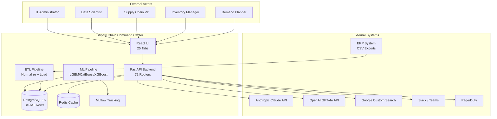
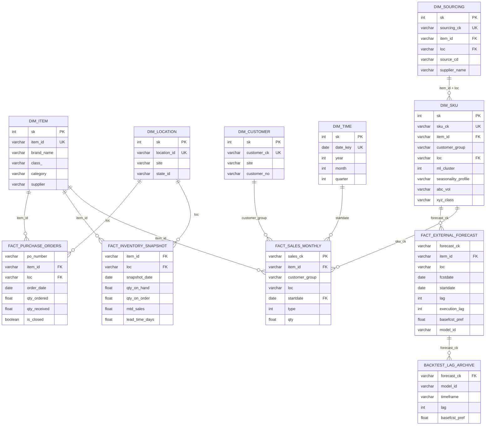
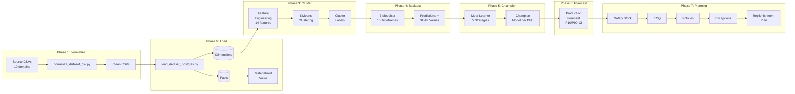

# Enterprise Architecture Document

## Supply Chain Command Center

**TOGAF ADM Framework | Version 1.0 | 2026-03-31**

| Attribute | Value |
|---|---|
| Document Owner | Architecture Team |
| Classification | Internal |
| TOGAF Version | 10 |
| Status | Baselined |
| Last Updated | 2026-03-31 |

---

## Table of Contents

1. [Executive Summary](#1-executive-summary)
2. [Architecture Vision (Phase A)](#2-architecture-vision-phase-a)
3. [Business Architecture (Phase B)](#3-business-architecture-phase-b)
4. [Information Systems Architecture -- Data (Phase C)](#4-information-systems-architecture--data-phase-c)
5. [Information Systems Architecture -- Application (Phase C)](#5-information-systems-architecture--application-phase-c)
6. [Technology Architecture (Phase D)](#6-technology-architecture-phase-d)
7. [Reference Architecture](#7-reference-architecture)
8. [Security Architecture](#8-security-architecture)
9. [Architecture Decision Records](#9-architecture-decision-records)
10. [Governance and Compliance](#10-governance-and-compliance)
11. [Transition Architecture](#11-transition-architecture)
12. [Appendices](#12-appendices)

---

## 1. Executive Summary

### 1.1 Business Context

Supply chain teams at consumer goods organizations operate across fragmented toolchains -- spreadsheets for demand planning, disconnected BI dashboards for inventory visibility, manual data pipelines bridging ERP systems, and ad-hoc email-based S&OP cycles. This fragmentation produces stale data, inconsistent metrics, and slow decision cycles that directly translate into excess inventory, stockouts, and missed service-level targets.

The **Supply Chain Command Center** consolidates demand forecasting, inventory optimization, S&OP execution, and AI-driven decision support into a single, unified platform.

### 1.2 Strategic Goals

| # | Strategic Goal | Platform Capability |
|---|---|---|
| SG-1 | Unify demand sensing, forecasting, and inventory planning into one analytical platform | 10 data domains, 6 dimension tables, 4 fact tables, 35+ materialized views serving 25 interactive UI tabs |
| SG-2 | Replace manual Excel-based planning workflows with ML-driven decision support | 3 tree-based ML models (LightGBM, CatBoost, XGBoost) with automated champion selection across 5 strategies |
| SG-3 | Reduce forecast error through automated model selection and ensemble methods | Expanding-window backtest (10 timeframes), 31-expert panel testing 30+ algorithms, champion accuracy 75.24% |
| SG-4 | Optimize inventory investment by balancing service levels against working capital | Safety stock (Z-score + Monte Carlo), EOQ, 4 replenishment policy types, efficient frontier optimization |
| SG-5 | Enable proactive exception management through AI-driven insight generation | Claude-powered AI Planning Agent with 10 tools, portfolio-wide scans, 5 insight types |
| SG-6 | Establish a unified S&OP process with measurable governance | 6-stage S&OP state machine with approval workflows and financial impact analysis |

### 1.3 Quantitative Scope

| Metric | Value |
|---|---|
| Data Domains | 10 (item, location, customer, time, sku, sales, forecast, inventory, sourcing, purchase_order) |
| Database Tables | ~85 (6 dimension, 4 fact, 35+ materialized views, 40+ planning/config) |
| Total Database Rows | 349.8M+ (198M in inventory snapshots alone) |
| DFU Count | 112,000+ demand forecast units |
| API Routers | 72 mounted routers across 6 domain groups |
| UI Tabs | 25 lazy-loaded dashboard tabs |
| ML Models | 3 tree-based + 30+ statistical algorithms |
| Config Files | 57 YAML configuration files |
| Design Specs | 75 specifications across 8 business domains |
| DDL Migrations | 89 sequential SQL migration files |
| Automated Tests | 3,916 (3,042 backend + 874 frontend) |
| Make Targets | 130+ build/deploy/test/pipeline targets |

### 1.4 System Context Diagram



---

## 2. Architecture Vision (Phase A)

### 2.1 Problem Statement and Opportunity

**Current State Problem**: Supply chain teams need a single platform that combines sales history, ML forecasts, inventory snapshots, and planning workflows. Without it, teams juggle spreadsheets, disconnected BI tools, and manual data pipelines -- leading to stale data, inconsistent metrics, and slow decision cycles.

**Opportunity Dimensions**:

| Dimension | Current Pain | Platform Solution | Measurable Outcome |
|---|---|---|---|
| Forecast Accuracy | Manual model selection, no systematic evaluation | Champion selection achieves 75.24% accuracy (236 bps over baseline) | Reduced forecast error across 112K DFUs |
| Inventory Optimization | Gut-feel safety stock, no variability analysis | Combined CV + Monte Carlo simulation with ABC/XYZ classification | Right-sized inventory per service-level target |
| Process Automation | Ad-hoc S&OP meetings, email-based approvals | 6-stage S&OP state machine with audit trail | Measurable cycle time reduction |
| Exception Management | Reactive firefighting, no prioritization | AI Planning Agent scans portfolio, generates prioritized insights | Proactive resolution of forecast degradation, stockout risk, excess inventory |
| Data Freshness | Monthly batch updates, manual reconciliation | Automated ETL with materialized view tiered refresh | Near-real-time KPI dashboards |

### 2.2 Stakeholder Map

| Persona | Primary Tabs | Key Capabilities | RBAC Role | Frequency |
|---|---|---|---|---|
| **Demand Planner** | Accuracy, Item Analysis, Clusters, Model Tuning | Forecast review, SHAP analysis, champion selection, bias correction | `planner` | Daily |
| **Inventory Manager** | Inv Planning (34 panels), Fill Rate, Rebalancing | Safety stock, EOQ, exception queue, replenishment plan, supplier performance | `planner` | Daily |
| **Supply Chain VP** | Control Tower, S&OP, Dashboard, AI Planner | KPI command center, S&OP approval, scenario planning, AI insights | `manager` | Weekly |
| **Data Scientist** | Model Tuning Studio, Cluster Experiments, Champion Experiments | Hyperparameter tuning, backtest runs, cluster experimentation, expert panel | `planner` / `admin` | Weekly |
| **IT Administrator** | Jobs, Data Quality, Settings, SQL Runner | Job scheduling, DQ checks, system config, audit logs | `admin` | As needed |

### 2.3 Architecture Principles

| # | Principle | Rationale | Implication | Codebase Evidence |
|---|---|---|---|---|
| AP-1 | **Configuration over Code** | Zero hardcoded thresholds; all parameters must be tunable without code changes | Every module has a corresponding YAML config file loaded via `load_config(name)` | 57 YAML files in `config/` |
| AP-2 | **Domain-Driven Generic Design** | Reduce per-dataset duplication; single code path for new domains | All datasets extend `DomainSpec` dataclass (frozen, immutable) in `common/core/domain_specs.py` | 10 domain specs driving generic CRUD |
| AP-3 | **Explicit over Implicit** | Planning date must be reproducible, not derived from system clock | All date-sensitive code uses `get_planning_date()`, never `date.today()` | `common/core/planning_date.py` |
| AP-4 | **Test-First Development** | 3,916 tests ensure regression safety across 174 backend + 111 frontend test files | Every feature ships with tests; every removed feature removes its tests | `tests/` (pytest), `frontend/src/**/__tests__/` (vitest) |
| AP-5 | **Raw SQL over ORM** | Full control over PostgreSQL features (partitions, MVs, CTEs, window functions) | psycopg3 with `%s` placeholders; no SQLAlchemy ORM layer | `api/core.py`, all router files |
| AP-6 | **Separation of Compute and Serve** | Heavy ML pipelines must not block API request paths | Scripts populate tables; API reads from pre-computed tables and materialized views | `scripts/` (55+ scripts) vs `api/routers/` (72 routers) |
| AP-7 | **Graceful Degradation** | Optional features (GPU, Redis, AI APIs) must not crash the system when unavailable | Feature detection with fallback paths for every optional dependency | `DEMAND_GPU` env var, Redis optional in cache, Google Search fallback |

### 2.4 Key Requirements and Constraints

**Functional Requirements** (grouped by domain):

| Domain | Key Requirements | Spec Count |
|---|---|---|
| Foundation | CSV normalization for 10 domains, data quality (12 check types), planning date config | 6 |
| Forecasting | Expanding-window backtest, champion selection (5 strategies), production forecast with CI bands | 17 |
| Demand Intelligence | KMeans clustering (14 features), seasonality detection, blended demand | 5 |
| Inventory Planning | Safety stock, EOQ, 4 replenishment policies, exception queue, fill rate, rebalancing | 11 |
| Operations | S&OP 6-stage cycle, financial planning, event calendar, scenario planning | 4 |
| AI & Decision Support | Claude planning agent, NL-to-SQL chatbot, control tower, storyboard | 4 |
| User Experience | 25 lazy-loaded tabs, global filters, theming, job scheduler UI | 6 |
| Integration | JWT + RBAC, notifications (4 channels), webhooks (HMAC-SHA256), API governance | 10 |

**Non-Functional Constraints**:

| Constraint | Value | Rationale |
|---|---|---|
| Deployment Model | Single-machine Docker Compose | Simplicity; no Kubernetes overhead for current scale |
| Query Latency (KPIs) | Sub-second on 198M rows | Achieved via materialized views and monthly range partitioning |
| Connection Pool | max=20, timeout=10s, recycling=3600s | Balance throughput with PostgreSQL max_connections=50 |
| Rate Limiting | Sliding window, 100 req/min standard tier | Protect API from abuse without impacting interactive use |
| JWT Token Expiry | Access: 30 min, Refresh: 7 days | Balance security with user convenience |
| AI Circuit Breakers | 40 turns, 100K tokens, $10M financial cap | Prevent runaway AI agent cost/latency |
| Test Coverage | 3,916 tests mandatory passing | Every PR must pass `make test-all` |

---

## 3. Business Architecture (Phase B)

### 3.1 Business Capability Model

```
Supply Chain Command Center
│
├── L1: FOUNDATION
│   ├── L2: Data Ingestion & Normalization
│   │   └── CSV parsing, null normalization, type casting, batch tracking
│   ├── L2: Data Quality Management
│   │   └── 12 check types: freshness, completeness, uniqueness, range, referential integrity, volume delta
│   ├── L2: Master Data Management
│   │   └── dim_item (499K), dim_location (149), dim_customer (1M), dim_sku (273K), dim_sourcing (1M)
│   └── L2: Performance Profiling
│       └── Script profiling, DB query tracking, memory monitoring, 8 anti-pattern detectors
│
├── L1: DEMAND FORECASTING
│   ├── L2: Statistical Forecasting
│   │   └── External model ingestion with execution-lag tracking (lags 0-4)
│   ├── L2: ML-Based Forecasting
│   │   └── LightGBM, CatBoost, XGBoost via unified model_registry.py
│   ├── L2: Champion Model Selection
│   │   └── 5 strategies: expanding, rolling, decay, ensemble, meta-learner
│   ├── L2: Production Forecast Generation
│   │   └── 12-month forward with P10/P90 confidence intervals
│   ├── L2: Forecast Accuracy Measurement
│   │   └── WAPE, bias, accuracy% with multi-dimensional slicing (model, lag, cluster, month)
│   ├── L2: Hyperparameter Tuning
│   │   └── Optuna Bayesian optimization with cluster-adaptive profiles
│   └── L2: Expert Panel Algorithm Selection
│       └── 31-expert panel testing 30+ statistical algorithms (croston, tsb, theta, ETS, ARIMA)
│
├── L1: DEMAND INTELLIGENCE
│   ├── L2: SKU Clustering
│   │   └── KMeans with 14 features, Silhouette + Calinski-Harabasz scoring, What-If scenarios
│   ├── L2: Seasonality Detection
│   │   └── Peak/trough identification per item, profile labeling
│   ├── L2: ABC-XYZ Classification
│   │   └── 9-cell segmentation matrix (volume x variability)
│   └── L2: Blended Demand Sensing
│       └── Alpha-weighted statistical + demand signal combination
│
├── L1: INVENTORY PLANNING
│   ├── L2: Safety Stock Calculation
│   │   └── Z-score + Monte Carlo simulation, ABC class service-level rules
│   ├── L2: EOQ & Cycle Stock
│   │   └── Economic order quantity with sensitivity analysis
│   ├── L2: Replenishment Policy
│   │   └── 4 types (fixed_qty, fixed_period, min_max, rop_roq) with auto-assignment
│   ├── L2: Exception Queue Management
│   │   └── 6 exception types, severity scoring, root cause attribution, work queue
│   ├── L2: Fill Rate Analytics
│   │   └── Order-level and line-level fill rates with trend tracking
│   ├── L2: Demand Signal Processing
│   │   └── Velocity sensing + movement detection for intramonth alerting
│   ├── L2: Supplier Performance Monitoring
│   │   └── On-time delivery, lead time reliability, quality metrics
│   ├── L2: Capital Investment Optimization
│   │   └── Efficient frontier for inventory investment vs service level
│   ├── L2: Inventory Rebalancing
│   │   └── Cross-location transfer optimization (greedy + LP solvers)
│   ├── L2: Multi-Echelon Safety Stock
│   │   └── 2-echelon with risk pooling
│   └── L2: Replenishment Plan
│       └── Forward 12-month order schedule with CI bands
│
├── L1: OPERATIONS & PLANNING
│   ├── L2: S&OP Cycle Management
│   │   └── 6-stage state machine: demand_review → supply_review → pre_sop → executive_sop → approved → closed
│   ├── L2: Financial Planning
│   │   └── Inventory value, carrying cost, budget utilization tracking
│   ├── L2: Event Calendar
│   │   └── Promotions, demand adjustments with approval workflow
│   └── L2: Scenario Planning
│       └── Disruption what-if analysis with financial impact quantification
│
├── L1: AI & DECISION SUPPORT
│   ├── L2: AI Planning Agent
│   │   └── Claude-powered, 10 tools (9 read-only SQL + 1 create_insight), portfolio scans
│   ├── L2: NL-to-SQL Chatbot
│   │   └── GPT-4o with pgvector schema retrieval, read-only SQL execution
│   ├── L2: Control Tower
│   │   └── Cross-dimensional KPI command center with drill-down
│   ├── L2: Market Intelligence
│   │   └── Google Custom Search + GPT-4o narrative synthesis
│   └── L2: Storyboard
│       └── Exception-driven workflow cards with causal chains
│
├── L1: USER EXPERIENCE
│   ├── L2: Interactive Analytics
│   │   └── 25 lazy-loaded tabs, Recharts + ECharts visualization
│   ├── L2: Data Explorer
│   │   └── Type-aware filtering, pagination, CSV export, full-text search
│   ├── L2: Job Automation
│   │   └── APScheduler with 8 job types, cron/interval scheduling, progress tracking
│   └── L2: Theming & Personalization
│       └── Light/dark modes, keyboard shortcuts, command palette (Cmd+K)
│
└── L1: INTEGRATION & PLATFORM
    ├── L2: Authentication & Authorization
    │   └── JWT Bearer + API key fallback, 4-tier RBAC, audit logging
    ├── L2: Multi-Channel Notifications
    │   └── Slack, Teams, Email, PagerDuty with severity-based routing
    ├── L2: Webhook Event Delivery
    │   └── HMAC-SHA256 signed, 8 event types, exponential backoff retry
    ├── L2: Multi-Tier Caching
    │   └── In-memory LRU (5000 entries) + Redis (256MB), TTL per endpoint
    └── L2: API Governance
        └── Tier-based rate limiting, versioning readiness, usage analytics
```

### 3.2 Value Streams

#### Value Stream 1: Sense-to-Respond (Primary)

```
┌──────────┐    ┌───────────┐    ┌──────────────┐    ┌───────────────┐    ┌──────────────┐
│  Market   │───>│   Data    │───>│   Demand     │───>│   Forecast    │───>│  Champion    │
│  Signal   │    │ Ingestion │    │   Sensing    │    │  Generation   │    │  Selection   │
│           │    │           │    │              │    │              │    │              │
│ CSV drops │    │ normalize │    │ variability  │    │ LGBM/CatBoost│    │ 5 strategies │
│ from ERP  │    │ + load    │    │ + signals    │    │ /XGBoost     │    │ meta-learner │
└──────────┘    └───────────┘    └──────────────┘    └───────────────┘    └──────────────┘
                                                                                │
┌──────────────┐    ┌───────────────┐    ┌──────────────┐    ┌──────────────┐   │
│   Order      │<───│  Inventory    │<───│  Planner     │<───│  Exception   │<──┘
│  Execution   │    │  Decision     │    │   Action     │    │  Detection   │
│              │    │              │    │              │    │              │
│ planned      │    │ safety stock │    │ AI insight   │    │ exception    │
│ orders       │    │ + EOQ + ROP  │    │ review       │    │ engine       │
└──────────────┘    └───────────────┘    └──────────────┘    └──────────────┘
```

**Stage-to-Component Mapping**:

| Stage | System Component | Key Files |
|---|---|---|
| Market Signal | External CSV drops from ERP | `data/input/*.csv` |
| Data Ingestion | Normalize + Load pipeline | `scripts/etl/normalize_dataset_csv.py`, `scripts/etl/load_dataset_postgres.py` |
| Demand Sensing | Variability analysis + demand signals | `scripts/ml/compute_sku_features.py` (unified SKU features), `scripts/inventory/compute_demand_signals.py` |
| Forecast Generation | 3 tree-model backtests | `scripts/run_backtest.py`, `common/ml/backtest_framework.py` |
| Champion Selection | Meta-learner + simulate + select | `scripts/ml/run_champion_selection.py`, `common/ml/champion_strategies.py` |
| Exception Detection | 6 exception types with severity | `scripts/inventory/generate_replenishment_exceptions.py`, `common/engines/exception_engine.py` |
| Planner Action | AI insight generation + review | `common/ai/ai_planner.py`, `api/routers/intelligence/ai_planner.py` |
| Inventory Decision | Safety stock + EOQ + policy | `scripts/inventory/compute_safety_stock.py`, `scripts/inventory/compute_eoq.py` |
| Order Execution | Planned order generation | `scripts/inventory/generate_planned_orders.py` |

#### Value Stream 2: Plan-to-Fulfill

```
S&OP Demand Review → Supply Review → Gap Analysis → Pre-S&OP → Executive Review → Approved Plan → Planned Orders
```

**Mapped to**: 6-stage S&OP state machine in `scripts/ops/run_sop_cycle.py`, 5 S&OP tables (`fact_sop_cycles`, `fact_sop_demand_review`, `fact_sop_supply_constraints`, `fact_sop_gaps`, `fact_sop_approved_plan`), `api/routers/operations/sop.py`.

#### Value Stream 3: Measure-to-Improve

```
Backtest Accuracy → Dimensional Slicing → Root Cause → Tuning → Re-backtest → Promote Champion
```

**Mapped to**: Accuracy KPI endpoints, Model Tuning Studio, Cluster Experiments, Champion Experiments tabs.

### 3.3 Business Process Models

#### S&OP Cycle Process (6-Stage State Machine)

```
┌─────────────────┐     ┌─────────────────┐     ┌─────────────────┐
│  1. DEMAND       │────>│  2. SUPPLY       │────>│  3. GAP          │
│     REVIEW       │     │     REVIEW       │     │     ANALYSIS     │
│                  │     │                  │     │                  │
│ Owner: Planner   │     │ Owner: Supply    │     │ Owner: S&OP Lead │
│ Gate: Statistical│     │ Gate: Capacity & │     │ Gate: All gaps   │
│ + override fcsts │     │ material flagged │     │ w/ root cause    │
│ loaded           │     │                  │     │                  │
└─────────────────┘     └─────────────────┘     └─────────────────┘
                                                         │
┌─────────────────┐     ┌─────────────────┐     ┌───────▼─────────┐
│  6. CLOSED       │<────│  5. APPROVED     │<────│  4. PRE-S&OP     │
│                  │     │     PLAN         │     │     MEETING      │
│ Archive cycle    │     │                  │     │                  │
│ data, publish    │     │ Owner: System    │     │ Owner: Cross-    │
│ KPIs             │     │ Gate: Executive  │     │ Functional       │
│                  │     │ approval logged  │     │ Gate: Resolution │
│                  │     │                  │     │ proposals ready  │
└─────────────────┘     └─────────────────┘     └─────────────────┘
```

#### Demand Planning Process

```
Data Ingestion → Clustering → Backtest (3 models x 10 timeframes) → SHAP Feature Attribution
    → Champion Selection → Bias Correction → Production Forecast → Blended Demand
```

#### Inventory Optimization Process

```
Demand Variability → Lead Time Profiling → Safety Stock (Z-score + Monte Carlo)
    → EOQ Cycle Stock → Policy Assignment (4 types) → Exception Detection (6 types)
    → AI Triage → Rebalancing Optimization → Replenishment Plan → Planned Orders
```

### 3.4 RACI Matrix

| Activity | Demand Planner | Inventory Manager | SC VP | Data Scientist | IT Admin |
|---|---|---|---|---|---|
| Demand Review | **R/A** | I | I | C | - |
| Forecast Override | **R** | I | **A** | C | - |
| Backtest Execution | C | - | - | **R/A** | I |
| Champion Selection | I | - | - | **R/A** | I |
| Hyperparameter Tuning | - | - | - | **R/A** | I |
| Safety Stock Configuration | C | **R/A** | I | C | - |
| Exception Triage | C | **R/A** | I | - | - |
| S&OP Demand Stage | **R** | C | **A** | - | - |
| S&OP Executive Approval | C | C | **R/A** | - | - |
| Scenario Planning | C | C | **R/A** | C | - |
| Job Scheduling | - | - | - | C | **R/A** |
| Data Quality Monitoring | - | - | - | C | **R/A** |
| AI Insight Review | **R** | **R** | **A** | C | - |
| System Configuration | - | - | I | C | **R/A** |

*R = Responsible, A = Accountable, C = Consulted, I = Informed*

---

## 4. Information Systems Architecture -- Data (Phase C)

### 4.1 Conceptual Data Model



### 4.2 Logical Data Model

#### Dimension Tables (6)

| Table | Rows | Primary Key | Business Key | Key Columns | Indexes |
|---|---|---|---|---|---|
| `dim_item` | 499,598 | `sk` | `item_id` | brand_name, class_, category, supplier, case_weight, item_proof, bpc | pg_trgm on brand_name, item_id |
| `dim_location` | 149 | `sk` | `location_id` | site, state_id, demand_location | pg_trgm on site |
| `dim_customer` | 1,007,168 | `sk` | `site + customer_no` | customer_name, channel, region | pg_trgm on customer_name |
| `dim_time` | 5,844 | `sk` | `date_key` | year, month, quarter, day_of_week, is_month_end | B-tree on date_key |
| `dim_sku` | 273,212 | `sk` | `item_id + customer_group + loc` | ml_cluster, seasonality_profile, abc_vol, xyz_class, execution_lag, total_lt | Composite on (item_id, loc) |
| `dim_sourcing` | ~1,050,000 | `sk` | `item_id + loc + source_cd` | supplier_name, supplier_plant, lead_time, moq | Composite on (item_id, loc) |

#### Fact Tables (4)

| Table | Rows | Grain | Partitioning | Key Measures |
|---|---|---|---|---|
| `fact_sales_monthly` | ~15M | item + customer_group + loc + month + type | None | qty, qty_shipped, qty_ordered |
| `fact_external_forecast_monthly` | ~45M | item + loc + fcstdate + startdate + model_id | None | basefcst_pref, tothist_dmd |
| `fact_inventory_snapshot` | 198M | item_id + loc + snapshot_date | **Monthly range** by snapshot_date (15 partitions) | qty_on_hand, qty_on_order, mtd_sales, lead_time_days |
| `fact_purchase_orders` | 5.64M | po_number + item_id + loc | None | qty_ordered, qty_received, lead_time_planned, lead_time_actual |

**Uniqueness Constraint**: `fact_external_forecast_monthly` has `UNIQUE(forecast_ck, model_id)` to allow multiple model predictions per DFU-month.

#### Materialized Views -- Tiered Refresh Strategy

| Tier | Views | Refresh Order | Purpose |
|---|---|---|---|
| **Tier 1** (Base Aggregates) | `agg_sales_monthly`, `agg_forecast_monthly`, `agg_inventory_monthly` | First | Pre-aggregated KPI queries |
| **Tier 2** (Accuracy) | `agg_accuracy_by_dim`, `agg_accuracy_lag_archive`, `agg_dfu_coverage` | After Tier 1 | Forecast accuracy measurement |
| **Tier 3** (Inventory) | `mv_inventory_health_score`, `mv_fill_rate_monthly`, `mv_supplier_performance`, `mv_intramonth_stockout` | After Tier 2 | Inventory KPI dashboards |
| **Tier 4** (Cross-Domain) | `mv_inventory_forecast_monthly`, `mv_control_tower_kpis`, `mv_network_balance` | Last | Cross-domain analytics, control tower |

All materialized views support `CONCURRENTLY` refresh for zero-downtime reads during rebuild.

#### Additional Table Categories

| Category | Table Count | Examples |
|---|---|---|
| Inventory Planning | 12 | `demand_variability`, `safety_stock`, `eoq_cycle_stock`, `replenishment_policy`, `replenishment_exceptions` |
| Forecasting & Champion | 7 | `backtest_lag_archive`, `champion_model`, `production_forecast`, `bias_corrections` |
| AI & Exception | 5 | `ai_insights`, `ai_call_log`, `ai_recommendation_outcomes`, `storyboard_cards` |
| Operations | 12 | `fact_sop_cycles`, `fact_financial_plan`, `fact_events`, `fact_scenarios` |
| Platform | 8 | `dim_user`, `dim_role`, `fact_audit_log`, `notification_log`, `webhook_registrations` |

### 4.3 Data Flow Architecture

#### 7-Phase Pipeline



#### Forecast Dual-Path Loading (Critical)

The forecast loading process uses phase ordering to preserve historical lag data while resolving execution-lag semantics:

```
Step 1: 12-month filter
    DELETE FROM staging WHERE startdate < planning_date - 12 months

Step 2: Archive load (FIRST, from untouched staging)
    INSERT INTO backtest_lag_archive FROM staging
    (original lag values preserved for all-lag accuracy analysis)

Step 3: Execution-lag mutation
    UPDATE staging SET lag = execution_lag FROM dim_sku
    (all external forecasts assumed at execution lag)

Step 4: Main insert
    INSERT INTO fact_external_forecast_monthly FROM staging
    ON CONFLICT (forecast_ck, model_id) DO UPDATE
```

**Flags**: `--replace` (preserves backtest/champion/ceiling rows), `--skip-archive` (faster reload).

#### Setup Dependency Tree

```
setup-all (~4-6 hours)
├── setup-backtest
│   ├── setup-features
│   │   ├── setup-data
│   │   │   ├── normalize-all (10 domains)
│   │   │   └── load-all (dims + facts + MVs)
│   │   ├── cluster-all
│   │   ├── seasonality-all
│   │   ├── variability-all
│   │   ├── lt-profile-all
│   │   ├── abc-xyz-all
│   │   └── demand-signals-all
│   ├── backtest-all (LGBM + CatBoost + XGBoost)
│   ├── backtest-load-all
│   ├── accuracy-slice-refresh
│   └── champion-all (meta-learner + simulate + select)
├── setup-inv-planning (SS + EOQ + policies + exceptions)
├── setup-demand-planning (production forecast + projections)
└── setup-ops (S&OP + events + financial + storyboard + DQ)
```

### 4.4 Data Governance and Quality Framework

#### Data Quality Engine

| Check Type | Description | Severity |
|---|---|---|
| `freshness` | Detect stale data beyond configured threshold | Warning / Critical |
| `completeness` | NULL percentage exceeds threshold | Warning |
| `row_count` | Row count deviation from expected baseline | Warning |
| `uniqueness` | Duplicate detection on key columns | Critical |
| `range` | Value outside configured min/max bounds | Warning |
| `volume_delta` | Day-over-day load volume change exceeds threshold | Warning |
| `referential_integrity` | Foreign key orphan detection | Critical |
| `statistical` | Z-score outlier detection, auto-fix via winsorization | Warning |
| `pattern` | Regex pattern validation on text fields | Warning |
| `distribution` | Distribution shift detection (KS test) | Warning |
| `consistency` | Cross-table consistency checks | Critical |
| `timeliness` | Data arrival within SLA window | Warning |

**Implementation**: `common/engines/dq_engine.py`, config in `config/data_quality_config.yaml`, API at `/data-quality/`, Self-Heal UI in Data Quality tab.

#### Data Loading Controls

| Control | Implementation |
|---|---|
| Null Normalization | `''`, `'null'`, `'none'`, `'NA'` converted to SQL NULL |
| Type Casting | Integer/float/date auto-cast with null coercion on failure |
| Sales Filtering | Only `TYPE=1` rows loaded into `fact_sales_monthly` |
| Forecast Lag Filter | Lags 0-4 only for fact table; all lags archived |
| Batch Tracking | `audit_load_batch` records each load run with row counts |
| Idempotent Reload | `--replace` flag for safe re-execution |

#### Audit Trail

All data mutations are logged to `fact_audit_log` with: user_id, action, resource_type, resource_id, old_value, new_value, ip_address, user_agent, created_at. Synthetic user IDs (anonymous, api-key-user) are excluded.

### 4.5 Master Data Management Strategy

| MDM Aspect | Implementation |
|---|---|
| **Surrogate Keys** | All dimension tables have `sk` (auto-increment) and `ck` (composite key) |
| **Full-Text Search** | `pg_trgm` trigram indexes on high-cardinality text fields |
| **Progressive Enrichment** | `dim_sku` enriched by compute pipelines: `ml_cluster`, `seasonality_profile`, `abc_vol`, `xyz_class` |
| **Time Dimension** | Auto-generated 2020-2035 calendar (not from external file) |
| **Cross-Referential Integrity** | DQ engine validates FK relationships between facts and dimensions |
| **Data Lineage** | Medallion infrastructure (`sql/080_medallion_infrastructure.sql`) tracks data flow through bronze/silver/gold layers |

---

## 5. Information Systems Architecture -- Application (Phase C)

### 5.1 Application Portfolio Catalog

| # | Component | Technology | Purpose | Key Files |
|---|---|---|---|---|
| 1 | **FastAPI Backend** | Python, FastAPI, Uvicorn | REST API serving 72 routers | `api/main.py`, `api/routers/` |
| 2 | **React Frontend** | React 18, Vite, TypeScript | 25 lazy-loaded interactive tabs | `frontend/src/` |
| 3 | **ETL Pipeline** | Python scripts, Make | Data normalization + loading for 10 domains | `scripts/etl/` |
| 4 | **ML Pipeline** | scikit-learn, LightGBM, CatBoost, XGBoost | Training, backtesting, champion selection | `scripts/ml/`, `common/ml/` |
| 5 | **Forecasting Pipeline** | Python scripts | Production forecast, consensus, blended demand | `scripts/forecasting/` |
| 6 | **Inventory Pipeline** | Python scripts | Safety stock through rebalancing (18 scripts) | `scripts/inventory/` |
| 7 | **AI Planning Agent** | Claude API (tool_use) | Proactive exception analysis across portfolio | `common/ai/ai_planner.py` |
| 8 | **NL-to-SQL Chatbot** | GPT-4o, pgvector | Natural language database query | `api/routers/intelligence/chat.py` |
| 9 | **Job Scheduler** | APScheduler 3.11 | Cron/interval job management, 8 job types | `common/services/job_scheduler.py` |
| 10 | **Notification Engine** | Python adapters | Multi-channel alert delivery | `common/services/notification_engine.py` |
| 11 | **Cache Layer** | In-memory LRU + Redis | Multi-tier response caching with TTL | `common/services/cache.py` |
| 12 | **ML Tracking** | MLflow v3 | Experiment logging and artifact storage | Docker service, port 5003 |

### 5.2 Application Interaction Matrix

```
                 Frontend  API  PostgreSQL  MLflow  Redis  Slack/Teams  Claude  GPT-4o  Google
Frontend            -      R/W      -         -       -       -           -       -       -
API (FastAPI)     Serve     -      R/W        -      R/W      -           -       -       -
ETL Scripts         -       -      Write      -       -       -           -       -       -
ML Scripts          -       -      R/W      Write    -       -           -       -       -
AI Planner          -      via     Read       -       -       -         R/W      -       -
NL-to-SQL           -      via     Read       -       -       -          -      R/W      -
Market Intel        -      via      -         -       -       -          -      R/W     Read
Notification        -      via      -         -       -     Write        -       -       -
Job Scheduler       -      via     R/W        -       -       -          -       -       -
Cache Layer         -      via      -         -      R/W      -          -       -       -
```

### 5.3 Component Architecture

#### API Layer (72 Routers)

| Domain Group | Router Count | Path Prefix Examples | Key Responsibilities |
|---|---|---|---|
| `api/routers/inventory/` | 23 | `/inv-planning/*`, `/inventory/*`, `/fill-rate/*`, `/demand-history/*` | Safety stock, EOQ, policies, exceptions, health, rebalancing |
| `api/routers/forecasting/` | 10 | `/forecast/*`, `/accuracy-budget/*`, `/champion-experiments/*` | Accuracy KPIs, SHAP, tuning, champion, model competition |
| `api/routers/operations/` | 10 | `/sop/*`, `/control-tower/*`, `/storyboard/*`, `/events/*` | S&OP cycle, control tower, storyboard, financial planning |
| `api/routers/platform/` | 10 | `/auth/*`, `/users/*`, `/notifications/*`, `/webhooks/*` | Auth, RBAC, DQ, config, notifications, collaboration |
| `api/routers/intelligence/` | 4 | `/ai-planner/*`, `/chat/*`, `/market-intelligence/*` | AI agent, chatbot, analysis, market intel |
| `api/routers/core/` | 2 | `/dashboard/*`, `/jobs/*` | Dashboard KPIs, job management |
| `api/routers/domains.py` | 1 | `/domains/{domain}/*` | Generic CRUD for all 10 domains (**mounted LAST**) |

**Middleware Stack** (outermost first):
1. **GZipMiddleware** -- compress responses > 1000 bytes
2. **CORSMiddleware** -- allow `localhost:5173`, headers: Content-Type, Authorization, X-API-Key
3. **Rate Limiting** -- sliding window on POST/PUT/DELETE, tier-based (100 req/min standard)
4. **Request Logging** -- method, path, status, duration (ms), skip `/health`

#### ML Engine (`common/ml/`)

| Module | Purpose |
|---|---|
| `model_registry.py` | Canonical-to-native parameter mapping for LGBM/CatBoost/XGBoost |
| `backtest_framework.py` | Expanding-window evaluation (10 timeframes A-J), DFU cohort classification |
| `champion_strategies.py` | 5 selection strategies (expanding, rolling, decay, ensemble, meta-learner) |
| `feature_engineering.py` | Causal feature construction (lag 1-12, rolling stats, Fourier, Croston, calendar) |
| `tuning.py` | Optuna Bayesian hyperparameter optimization with cluster-adaptive profiles |
| `shap_selector.py` | SHAP-based feature importance and selection (cumulative threshold 0.95) |

**Canonical Parameter Mapping** (model_registry.py):

| Canonical | LightGBM | CatBoost | XGBoost |
|---|---|---|---|
| `estimators` | n_estimators | iterations | n_estimators |
| `max_depth` | max_depth | depth | max_depth |
| `l2_reg` | reg_lambda | l2_leaf_reg | reg_lambda |
| `l1_reg` | reg_alpha | *(unsupported)* | reg_alpha |
| `min_leaf_samples` | min_child_samples | min_data_in_leaf | min_child_weight |
| `col_sample` | colsample_bytree | colsample_bylevel | colsample_bytree |

#### UI Shell (`frontend/src/`)

| Component | Purpose |
|---|---|
| `App.tsx` | 25 lazy-loaded tabs with ErrorBoundary + Suspense wrapping |
| `AppSidebar.tsx` | 12-tab sidebar across 5 sections (Tower, Operations, Supply, Demand, System) |
| `hooks/useUrlState.ts` | URL state management for tab + filters with history |
| `hooks/useGlobalFilters.ts` | Global filter bar (brand, category, item, location, market, channel) |
| `context/ThemeContext.tsx` | Light/dark mode with supply chain theme |
| `api/queries/` | 39 domain API modules with TanStack Query key factory pattern |

**State Management Architecture**:
- **Server State**: TanStack React Query v5 (stale time: 30s, GC: 5min, retry: 2)
- **UI State**: React Context (ThemeProvider, GlobalFilterProvider, ScenarioNotificationProvider, JobNotificationProvider)
- **URL State**: `useUrlState` hook syncs tab + filter parameters to URL
- **No Redux** -- Context + React Query covers all state needs

### 5.4 Integration Patterns

| Pattern | Implementation | Details |
|---|---|---|
| **REST API** | Primary integration | 72 routers serve JSON; pagination offset/limit (50-1000 rows); JWT Bearer or X-API-Key auth |
| **Webhooks (Outbound)** | HMAC-SHA256 signed | 8 event types: job_completed, forecast_published, insight_created, exception_generated, stockout_alert, threshold_breach, approval_required, data_loaded |
| **Event-Driven** | Notification engine | Routes events to Slack/Teams/Email/PagerDuty based on severity rules |
| **File-Based ETL** | CSV ingestion | Source CSVs from ERP dropped to `data/input/`, normalized and loaded via Make targets |
| **AI Tool-Use** | Claude API | Structured tool calling (10 tools, up to 40 turns per session) |
| **Cloud Connectors** | Planned | Abstract `CloudConnector` base class for Snowflake, BigQuery, S3, Databricks |
| **ERP Adapters** | Planned | Abstract `ERPAdapter` base class for SAP S/4HANA, Oracle Fusion, NetSuite, Manhattan WMS |

### 5.5 API Architecture Detail

#### Authentication Flow

```
┌────────┐     POST /auth/login      ┌──────────┐     Verify bcrypt     ┌────────────┐
│ Client │ ────────────────────────> │  FastAPI  │ ──────────────────> │ PostgreSQL │
│        │ <──────────────────────── │  Auth     │ <────────────────── │ dim_user   │
│        │  {access_token, refresh}  │  Router   │  user row + hash    │            │
└────────┘                           └──────────┘                      └────────────┘
    │
    │  Authorization: Bearer <token>
    │
    ▼
┌──────────┐     Decode JWT          ┌──────────┐     Check role ≥     ┌──────────┐
│  API     │ ──────────────────────> │  Auth    │ ──────────────────> │  RBAC    │
│  Request │                         │  Dep     │                     │  Check   │
│          │ <──────────────────────  │          │ <──────────────────  │          │
│          │   CurrentUser(id,role)   │          │   403 or proceed    │          │
└──────────┘                          └──────────┘                     └──────────┘
```

#### Generic Domain Endpoint Pattern

All 10 data domains share a single set of endpoints via `DomainSpec` registry:

| Endpoint | Purpose | SQL Pattern |
|---|---|---|
| `GET /domains/{domain}/page` | Paginated list with filtering | `SELECT * FROM {table} WHERE {filters} ORDER BY {sort} LIMIT {limit} OFFSET {offset}` |
| `GET /domains/{domain}/search` | Full-text search across search_fields | `WHERE col ILIKE %{q}%` with pg_trgm index |
| `GET /domains/{domain}/meta` | Column names, types, cardinality | Introspect `DomainSpec.columns`, `int_fields`, `float_fields`, `date_fields` |
| `GET /domains/{domain}/suggest` | Autocomplete for filter values | `SELECT DISTINCT {field} WHERE {field} ILIKE %{q}% LIMIT 20` |
| `GET /domains/{domain}/analytics` | Grouped aggregation | `SELECT {group_by}, SUM({metric}) FROM {table} GROUP BY {group_by}` |

---

## 6. Technology Architecture (Phase D)

### 6.1 Technology Portfolio and Standards

| Category | Technology | Version | Purpose | Status |
|---|---|---|---|---|
| **Runtime** | Python | 3.12 | Backend API, scripts, ML | Adopt |
| **Web Framework** | FastAPI | latest | Async REST API with OpenAPI docs | Adopt |
| **ASGI Server** | Uvicorn | latest | Production ASGI server | Adopt |
| **Database** | PostgreSQL | 16 | Primary relational data store | Adopt |
| **Vector Extension** | pgvector | pg16 | Embedding storage for NL-to-SQL | Adopt |
| **DB Driver** | psycopg | v3 | Async-capable connection pool | Adopt |
| **Validation** | Pydantic | v2 | Request/response model validation | Adopt |
| **Frontend Framework** | React | 18.3.1 | Single-page application | Adopt |
| **Build Tool** | Vite | 5.4.14 | Frontend bundling + HMR + proxy | Adopt |
| **Type System** | TypeScript | 5.8.3 | Frontend type safety | Adopt |
| **CSS** | Tailwind CSS | 3.4.17 | Utility-first styling | Adopt |
| **UI Components** | shadcn/ui (Radix) | latest | Accessible component library | Adopt |
| **Charts** | Recharts + ECharts | latest | Data visualization (simple + complex) | Adopt |
| **Data Tables** | TanStack Table | 8.21.3 | Virtualized data grid + sorting + filtering | Adopt |
| **Server State** | TanStack Query | 5.90.21 | React data fetching + caching | Adopt |
| **ML: Gradient Boosting** | LightGBM, CatBoost, XGBoost | latest | Tree-based demand forecasting | Adopt |
| **ML: Explainability** | SHAP | latest | Feature attribution for model interpretability | Adopt |
| **ML: Tuning** | Optuna | latest | Bayesian hyperparameter optimization | Adopt |
| **ML Tracking** | MLflow | v3.0.0 | Experiment logging + artifact storage | Trial |
| **AI: Planning** | Anthropic Claude | opus-4-6 | Tool-use agent for exception triage | Trial |
| **AI: NL-to-SQL** | OpenAI GPT-4o | latest | SQL generation + market intelligence | Trial |
| **Job Scheduling** | APScheduler | 3.11 | Cron/interval background jobs | Adopt |
| **Caching** | Redis | 7-alpine | Distributed cache (256MB, allkeys-lru) | Adopt |
| **Containerization** | Docker Compose | latest | Service orchestration | Adopt |
| **Reverse Proxy** | Nginx | alpine | Production frontend + API proxy | Adopt |
| **Package Manager** | uv | latest | Python dependency management | Adopt |
| **Build System** | Make (GNU) | latest | Task runner (130+ targets) | Adopt |
| **Backend Testing** | pytest | latest | 3,042 tests | Adopt |
| **Frontend Testing** | Vitest | 4.0.18 | 874 tests | Adopt |
| **E2E Testing** | Playwright | 1.58.2 | Browser automation tests | Adopt |
| **Linting** | Ruff | latest | Python linting + formatting | Adopt |
| **Maps** | Leaflet | 1.9.4 | Geographic visualization | Adopt |

### 6.2 Infrastructure Architecture

#### Development Environment

```
┌─────────────────────────────────────────────────────────────────┐
│                     Developer Workstation                        │
│                                                                  │
│  ┌─────────────────────┐     ┌─────────────────────┐           │
│  │  Vite Dev Server    │     │  FastAPI + Uvicorn   │           │
│  │  localhost:5173     │────>│  localhost:8000      │           │
│  │                     │proxy│                      │           │
│  │  React App + HMR    │     │  72 routers          │           │
│  │  25 lazy tabs       │     │  GZip + CORS + Auth  │           │
│  └─────────────────────┘     └──────────┬───────────┘           │
│                                          │                       │
│  ┌───────────────────────────────────────┼──────────────────┐   │
│  │              Docker Compose           │                   │   │
│  │                                       │                   │   │
│  │  ┌──────────────┐  ┌────────────┐  ┌─┴──────────┐      │   │
│  │  │ PostgreSQL   │  │  MLflow    │  │   Redis    │      │   │
│  │  │ pgvector:pg16│  │  v3.0.0   │  │   7-alpine │      │   │
│  │  │ :5440→5432   │  │  :5003→5000│  │   :6379    │      │   │
│  │  │              │  │            │  │            │      │   │
│  │  │ shared_buf   │  │ Backend:   │  │ maxmem:    │      │   │
│  │  │  =512MB      │  │ postgresql │  │  256MB     │      │   │
│  │  │ work_mem     │  │            │  │ allkeys-   │      │   │
│  │  │  =64MB       │  │ Artifacts: │  │  lru       │      │   │
│  │  │ eff_cache    │  │ mlflow-    │  │            │      │   │
│  │  │  =1536MB     │  │ artifacts  │  │            │      │   │
│  │  │ max_conn=50  │  │            │  │            │      │   │
│  │  └──────────────┘  └────────────┘  └────────────┘      │   │
│  │                                                          │   │
│  │  Volumes: pg_data, mlflow_data, redis_data              │   │
│  └──────────────────────────────────────────────────────────┘   │
│                                                                  │
│  Python .venv (managed by uv)                                   │
└─────────────────────────────────────────────────────────────────┘
```

#### Production Environment

```
┌─────────────────────────────────────────────────────────────────┐
│                      Production Host                             │
│                                                                  │
│  ┌─────────────────────────────────────────────────────────┐    │
│  │                    Nginx (:80)                           │    │
│  │                                                          │    │
│  │  /static/* ──> React SPA (dist/)                        │    │
│  │  /domains/* ──┐                                          │    │
│  │  /forecast/* ─┤                                          │    │
│  │  /inventory/*─┤ proxy_pass ──> http://api:8000           │    │
│  │  /jobs/* ─────┤                                          │    │
│  │  /auth/* ─────┘                                          │    │
│  │                                                          │    │
│  │  Security Headers:                                       │    │
│  │    X-Frame-Options: SAMEORIGIN                          │    │
│  │    X-Content-Type-Options: nosniff                      │    │
│  │    Content-Security-Policy: strict                       │    │
│  │    Referrer-Policy: strict-origin-when-cross-origin      │    │
│  └─────────────────────────────────────────────────────────┘    │
│                          │                                       │
│  ┌───────────────────────┴─────────────────────────────────┐    │
│  │              FastAPI Container (:8000)                    │    │
│  │                                                          │    │
│  │  Connection Pool:                                        │    │
│  │    min=2, max=20, timeout=10s, max_lifetime=3600s       │    │
│  │    reconnect_timeout=5s                                  │    │
│  │                                                          │    │
│  │  Middleware: GZip → CORS → RateLimit → RequestLog       │    │
│  └──────────┬──────────┬──────────┬────────────────────────┘    │
│             │          │          │                               │
│  ┌──────────┴───┐  ┌──┴────────┐  ┌──┴────────┐                │
│  │ PostgreSQL   │  │ MLflow    │  │ Redis     │                │
│  │ pgvector:pg16│  │ v3.0.0   │  │ 7-alpine  │                │
│  │ :5432        │  │ :5000    │  │ :6379     │                │
│  └──────────────┘  └──────────┘  └───────────┘                │
└─────────────────────────────────────────────────────────────────┘
```

### 6.3 Docker Compose Services

| Service | Image | Port | Health Check | Volumes | Key Config |
|---|---|---|---|---|---|
| `postgres` | pgvector/pgvector:pg16 | `${POSTGRES_HOST_PORT:-5440}:5432` | `pg_isready` every 10s | `pg_data` | shared_buffers=512MB, work_mem=64MB, max_connections=50 |
| `mlflow` | ghcr.io/mlflow/mlflow:v3.0.0 | `${MLFLOW_HOST_PORT:-5003}:5000` | - | `mlflow_data` | Backend: postgresql, Artifacts: mlflow-artifacts:/ |
| `redis` | redis:7-alpine | `${REDIS_HOST_PORT:-6379}:6379` | `redis-cli ping` every 10s | `redis_data` | maxmemory=256mb, maxmemory-policy=allkeys-lru |

### 6.4 Network Topology

```
┌─────────────────────────────────────────────────────────────┐
│                        NETWORK MAP                           │
├─────────────────────────────────────────────────────────────┤
│                                                              │
│  [Browser] ──── :80 ────> [Nginx]                           │
│                              ├── /static → React SPA         │
│                              └── /api/* → [FastAPI :8000]    │
│                                              │               │
│                              ┌───────────────┼──────────┐   │
│                              │               │          │   │
│                        [:5440/5432]    [:5003/5000]  [:6379] │
│                       [PostgreSQL]     [MLflow]     [Redis]  │
│                                                              │
├─────────────────────────────────────────────────────────────┤
│  EXTERNAL APIs (Outbound Only)                               │
│                                                              │
│  [FastAPI] ───> api.anthropic.com  (Claude, AI Planning)    │
│  [FastAPI] ───> api.openai.com     (GPT-4o, NL-to-SQL)     │
│  [FastAPI] ───> customsearch.googleapis.com (Market Intel)  │
│                                                              │
├─────────────────────────────────────────────────────────────┤
│  OUTBOUND INTEGRATIONS                                       │
│                                                              │
│  [Notification Engine] ───> Slack Webhooks                   │
│                        ───> Microsoft Teams                  │
│                        ───> SMTP (Email)                     │
│                        ───> PagerDuty Events API             │
│                                                              │
│  [Webhook Dispatcher]  ───> Registered webhook endpoints     │
│                              (HMAC-SHA256 signed payloads)   │
└─────────────────────────────────────────────────────────────┘
```

### 6.5 Technology Standards Catalog

| Standard | Rule | Enforcement |
|---|---|---|
| SQL Placeholders | All SQL uses `%s` (psycopg3), never string interpolation or `$1` | Code review, security scanning |
| Configuration | All parameters externalized to YAML in `config/`, loaded via `load_config(name)` | No magic numbers in scripts |
| Planning Date | All date-sensitive code uses `get_planning_date()`, never `date.today()` | `common/core/planning_date.py` |
| Timestamps | All timestamps via `_ts()` from `common/utils.py`, no per-file definitions | Import check |
| DB Connections | Scripts use `get_db_params()` from `common/db.py`, no inline connection helpers | Code review |
| ML Models | All model logic flows through `model_registry.py`, no per-model if/elif blocks | Architectural rule |
| Logging | `logging.getLogger(__name__)`, no raw `print()`, `basicConfig()` only in `__main__` | Ruff lint hook |
| Exception Handling | Catch specific exceptions (`psycopg.Error`, `ValueError`), never bare `except Exception` | Code review |
| File Placement | New files in correct domain subdirectory per placement rules | Architectural rule |
| Router Mounting | `domains.py` mounted LAST in `api/main.py` to avoid path shadowing | `make audit-routers` |

---

## 7. Reference Architecture

### 7.1 Layered Architecture Model

```
┌──────────────────────────────────────────────────────────────────┐
│                                                                   │
│  ┌────────────────────────────────────────────────────────────┐  │
│  │  PRESENTATION LAYER                                        │  │
│  │                                                             │  │
│  │  React 18 + Vite + TypeScript + Tailwind + shadcn/ui       │  │
│  │  25 lazy-loaded tabs, ErrorBoundary, Suspense              │  │
│  │  Charts: Recharts (simple) + ECharts (complex)             │  │
│  │  State: TanStack Query (server) + Context (UI) + URL       │  │
│  └────────────────────────────────────────────────────────────┘  │
│                              │                                    │
│  ┌────────────────────────────────────────────────────────────┐  │
│  │  API GATEWAY LAYER                                         │  │
│  │                                                             │  │
│  │  Nginx reverse proxy (:80)                                 │  │
│  │  Security headers (CSP, X-Frame-Options, HSTS)             │  │
│  │  SPA fallback (try_files $uri /index.html)                 │  │
│  │  API prefix routing to backend (50+ path prefixes)          │  │
│  └────────────────────────────────────────────────────────────┘  │
│                              │                                    │
│  ┌────────────────────────────────────────────────────────────┐  │
│  │  APPLICATION LAYER                                          │  │
│  │                                                             │  │
│  │  FastAPI + Uvicorn (:8000), 72 routers                     │  │
│  │  Middleware: GZip → CORS → Rate Limiting → Request Logging │  │
│  │  Auth: JWT Bearer + API Key fallback + RBAC (4 roles)      │  │
│  │  Validation: Pydantic v2 request/response models           │  │
│  └────────────────────────────────────────────────────────────┘  │
│                              │                                    │
│  ┌────────────────────────────────────────────────────────────┐  │
│  │  SERVICE LAYER                                              │  │
│  │                                                             │  │
│  │  common/services/: cache, job_scheduler, job_registry,     │  │
│  │    notification_engine, webhook_dispatcher, rate_limiter,  │  │
│  │    perf_profiler, query_tracker, metrics                   │  │
│  │  common/engines/: dq_engine, exception_engine              │  │
│  │  common/ai/: ai_planner, tuning_advisor                   │  │
│  └────────────────────────────────────────────────────────────┘  │
│                              │                                    │
│  ┌────────────────────────────────────────────────────────────┐  │
│  │  DOMAIN LAYER                                               │  │
│  │                                                             │  │
│  │  common/core/: domain_specs (10 domains), db, utils,       │  │
│  │    planning_date, constants, sql_helpers                    │  │
│  │  common/ml/: model_registry, backtest_framework,           │  │
│  │    champion_strategies, feature_engineering, tuning,        │  │
│  │    shap_selector                                           │  │
│  └────────────────────────────────────────────────────────────┘  │
│                              │                                    │
│  ┌────────────────────────────────────────────────────────────┐  │
│  │  DATA ACCESS LAYER                                          │  │
│  │                                                             │  │
│  │  psycopg3 connection pool (min=2, max=20)                  │  │
│  │  Raw SQL with %s parameterized placeholders                │  │
│  │  COPY for bulk loads, CTEs for complex queries             │  │
│  │  api/core.py: build_where(), fetch_page(), compute_kpis()  │  │
│  │  common/core/sql_helpers.py                                 │  │
│  └────────────────────────────────────────────────────────────┘  │
│                              │                                    │
│  ┌────────────────────────────────────────────────────────────┐  │
│  │  INFRASTRUCTURE LAYER                                       │  │
│  │                                                             │  │
│  │  PostgreSQL 16 (pgvector) — 349M+ rows, 85+ tables        │  │
│  │  Redis 7 — 256MB cache, allkeys-lru eviction              │  │
│  │  MLflow v3 — experiment tracking + artifact storage        │  │
│  │  Docker Compose — service orchestration                    │  │
│  │  Named volumes — pg_data, mlflow_data, redis_data          │  │
│  └────────────────────────────────────────────────────────────┘  │
│                                                                   │
└──────────────────────────────────────────────────────────────────┘
```

### 7.2 Cross-Cutting Concerns

#### Security

| Concern | Implementation |
|---|---|
| Authentication | JWT Bearer tokens (30 min access, 7 day refresh), API key fallback |
| Authorization | 4-tier RBAC: viewer < planner < manager < admin |
| Input Validation | Pydantic v2 models on all endpoints |
| SQL Injection Prevention | `%s` parameterized queries exclusively |
| XSS Prevention | Nginx CSP headers, React DOM auto-escaping |
| Rate Limiting | Sliding window on mutations, tier-based limits |
| Webhook Signing | HMAC-SHA256 payload signatures |
| Audit Trail | `fact_audit_log` with user, action, resource, IP |

#### Caching

| Layer | Backend | Configuration | Use Case |
|---|---|---|---|
| L1 | In-memory LRU | 5,000 entries max, TTL per key | Hot-path API responses |
| L2 | Redis | 256MB, allkeys-lru | Shared cache across workers |
| MV | PostgreSQL MVs | Tiered CONCURRENTLY refresh | Pre-computed aggregates |

**`@cached` decorator**: Configurable TTL per endpoint, namespace isolation, group-based invalidation.

#### Logging

| Logger | Purpose | Destination |
|---|---|---|
| `logging.getLogger(__name__)` | Application logging | stdout/stderr |
| API access middleware | Request method, path, status, duration | `api.access` logger |
| AI call logging | Token usage, model, cost | `ai_call_log` table |
| Audit logging | User actions with resource + IP | `fact_audit_log` table |
| Query tracking | SQL execution time, row counts | `common/services/query_tracker.py` |

#### Monitoring

| Component | Implementation | Metrics |
|---|---|---|
| Script Profiling | `@profile_function`, `profiled_section()` | Wall time, memory delta |
| DB Query Tracking | `wrap_connection()` (read-only, ROLLBACK) | Query time, row count |
| Memory Monitoring | `tracemalloc` integration | Peak memory, allocation hot spots |
| Anti-Pattern Detection | 8 rule-based detectors | Slow queries, N+1, unbatched inserts, memory spikes |
| Cache Statistics | `cache.stats()` | Hit rate, miss rate, entry count |

### 7.3 ML/AI Reference Architecture

```
┌──────────────────────────────────────────────────────────────────┐
│                     ML PIPELINE                                   │
│                                                                   │
│  ┌─────────────────────────────────────────────────────────┐     │
│  │ Feature Engineering                                      │     │
│  │                                                          │     │
│  │ Clustering Features (14):                                │     │
│  │   Volume, trend, seasonality, periodicity,              │     │
│  │   intermittency, lifecycle                              │     │
│  │                                                          │     │
│  │ Backtest Features:                                       │     │
│  │   Lag 1-12, rolling 3/6/12, MoM growth, volatility     │     │
│  │   Fourier (sin/cos 12,6,4,3), Croston decomposition    │     │
│  │   Calendar (month, quarter, is_quarter_end)             │     │
│  │   DFU attributes (execution_lag, total_lt)               │     │
│  │   ml_cluster (metadata — partitioning only, not a feat) │     │
│  │   External forecast signals                              │     │
│  └─────────────────────────────────────────────────────────┘     │
│                         │                                         │
│  ┌─────────────────────────────────────────────────────────┐     │
│  │ Training & Evaluation                                    │     │
│  │                                                          │     │
│  │ ┌────────────┐  ┌────────────┐  ┌────────────┐         │     │
│  │ │  LightGBM  │  │  CatBoost  │  │  XGBoost   │         │     │
│  │ │ per_cluster │  │  global    │  │  global    │         │     │
│  │ │ recursive  │  │            │  │            │         │     │
│  │ │ SHAP select│  │            │  │            │         │     │
│  │ └──────┬─────┘  └──────┬─────┘  └──────┬─────┘         │     │
│  │        │               │               │                │     │
│  │        └───────────────┴───────────────┘                │     │
│  │                        │                                │     │
│  │         Expanding-Window Backtest (10 Timeframes A-J)    │     │
│  │         Execution-lag-aware accuracy (WAPE, bias, acc%)  │     │
│  │         All-lag archive (0-4) for any-horizon analysis   │     │
│  │         Per-cohort: cold-start, sparse, active           │     │
│  └─────────────────────────────────────────────────────────┘     │
│                         │                                         │
│  ┌─────────────────────────────────────────────────────────┐     │
│  │ Selection & Inference                                    │     │
│  │                                                          │     │
│  │ Champion Selection (5 strategies):                       │     │
│  │   Expanding, Rolling, Decay, Ensemble, Meta-Learner     │     │
│  │   Exec-lag-aware strict causality with fallback model   │     │
│  │                                                          │     │
│  │ Production Forecast:                                     │     │
│  │   12-month forward with P10/P90 CI bands                │     │
│  │   Versioned plan_version for audit trail                │     │
│  │                                                          │     │
│  │ Expert Panel:                                            │     │
│  │   31 experts testing 30+ algorithms (croston, tsb,      │     │
│  │   theta, ETS, ARIMA, seasonal_naive, etc.)              │     │
│  └─────────────────────────────────────────────────────────┘     │
│                         │                                         │
│  ┌─────────────────────────────────────────────────────────┐     │
│  │ Experiment Tracking & Tuning                             │     │
│  │                                                          │     │
│  │ MLflow: sku_clustering, demand_backtest experiments      │     │
│  │ Optuna: Bayesian hyperparameter optimization            │     │
│  │ Cluster-adaptive profiles (config/cluster_tuning_       │     │
│  │   profiles.yaml)                                        │     │
│  │ AI Tuning Advisor: interactive chat for param recs      │     │
│  └─────────────────────────────────────────────────────────┘     │
│                                                                   │
├──────────────────────────────────────────────────────────────────┤
│                     AI AGENTS                                     │
│                                                                   │
│  ┌────────────────────────────┐  ┌────────────────────────────┐  │
│  │ AI Planning Agent          │  │ NL-to-SQL Chatbot          │  │
│  │ (Claude opus-4-6)         │  │ (GPT-4o)                   │  │
│  │                            │  │                            │  │
│  │ 10 tools:                 │  │ pgvector schema retrieval  │  │
│  │  9 read-only SQL          │  │ text-embedding-3-small     │  │
│  │  1 create_insight         │  │ Read-only SQL execution    │  │
│  │                            │  │  SELECT only, 5s timeout  │  │
│  │ Circuit breakers:         │  │  500-row cap               │  │
│  │  40 turns                 │  │  Regex DML/DDL rejection   │  │
│  │  100K tokens              │  │                            │  │
│  │  $10M financial cap       │  │                            │  │
│  │                            │  │                            │  │
│  │ 5 insight types:          │  │                            │  │
│  │  forecast_degradation     │  │                            │  │
│  │  stockout_risk            │  │                            │  │
│  │  excess_inventory         │  │                            │  │
│  │  policy_mismatch          │  │                            │  │
│  │  supplier_risk            │  │                            │  │
│  └────────────────────────────┘  └────────────────────────────┘  │
│                                                                   │
│  ┌────────────────────────────┐  ┌────────────────────────────┐  │
│  │ AI Tuning Advisor          │  │ Market Intelligence        │  │
│  │ (OpenAI/Anthropic)         │  │ (GPT-4o + Google)          │  │
│  │                            │  │                            │  │
│  │ 7 tools, 20-turn loop    │  │ Google Custom Search       │  │
│  │ Reviews runs, recommends  │  │ GPT-4o narrative synthesis │  │
│  │ params, triggers backtests│  │                            │  │
│  │ 1 concurrent, 5-min cool  │  │                            │  │
│  └────────────────────────────┘  └────────────────────────────┘  │
└──────────────────────────────────────────────────────────────────┘
```

### 7.4 Integration Reference Architecture

Four integration vectors (from `docs/specs/08-integration/01-integration-architecture.md`):

| Vector | Status | Components | Protocol |
|---|---|---|---|
| **1. Notifications & Alerting** | Implemented | Slack, Teams, Email, PagerDuty | HTTPS webhooks, SMTP |
| **2. REST API Consumers** | Implemented | 72 routers, JWT auth, rate limiting | REST/JSON over HTTPS |
| **3. Cloud Data Pipelines** | Planned | Snowflake, BigQuery, S3, Databricks | Abstract `CloudConnector` |
| **4. ERP/WMS Integration** | Planned | SAP S/4HANA, Oracle Fusion, NetSuite, Manhattan WMS | Abstract `ERPAdapter` |

**Event Types** (8 outbound triggers):

| Event | Trigger Condition | Default Channel |
|---|---|---|
| `job_completed` | Background job finishes successfully | Slack |
| `job_failed` | Background job fails with error | PagerDuty |
| `forecast_published` | Production forecast generated | Email |
| `insight_created` | AI Planning Agent creates insight | Slack |
| `exception_generated` | Exception engine detects anomaly | Slack |
| `stockout_alert` | Intramonth stockout detected | PagerDuty |
| `threshold_breach` | KPI exceeds configured threshold | Teams |
| `data_loaded` | ETL pipeline completes load | Slack |

---

## 8. Security Architecture

### 8.1 Authentication and Authorization Model

#### Authentication Flow

```
┌──────────┐                    ┌──────────────┐                ┌────────────┐
│  Client   │  POST /auth/login │   FastAPI     │  Verify bcrypt │ PostgreSQL │
│  Browser  │ ─────────────────>│   Auth Router │ ──────────────>│  dim_user  │
│           │                   │               │                │            │
│           │ <─────────────────│               │ <──────────────│            │
│           │ {access_token,    │               │ user row       │            │
│           │  refresh_token}   │               │                │            │
└──────────┘                    └──────────────┘                └────────────┘
      │
      │  Authorization: Bearer <access_token>
      ▼
┌──────────┐                    ┌──────────────┐                ┌────────────┐
│  API      │  Every request    │   Auth        │  Role check    │   RBAC     │
│  Request  │ ─────────────────>│   Dependency  │ ──────────────>│   Matrix   │
│           │                   │               │                │            │
│           │ <─────────────────│               │ <──────────────│            │
│           │ CurrentUser or 401│               │ 403 or proceed │            │
└──────────┘                    └──────────────┘                └────────────┘
```

**Authentication Methods** (priority order):
1. **JWT Bearer Token** -- Primary. Claims: sub (user_id), email, role, type (access/refresh), exp. Algorithm: HS256.
2. **Legacy API Key** -- Fallback via `X-API-Key` header. Maps to synthetic admin user.
3. **Anonymous Access** -- Dev mode only. When `JWT_SECRET` is default AND `API_KEY` not set.

#### RBAC Permission Matrix

| Role | Level | Read | Write Forecast | Write Policy | Write Exceptions | Run Jobs | Admin |
|---|---|---|---|---|---|---|---|
| `viewer` | 1 | Yes | - | - | - | - | - |
| `planner` | 2 | Yes | Yes | Yes | Yes | Yes | - |
| `manager` | 3 | Yes | Yes | Yes | Yes | Yes | - |
| `admin` | 4 | Yes | Yes | Yes | Yes | Yes | Yes |

**Data Model**: `dim_user` (email, password_hash, role, is_active), `dim_role` (role_name, permissions), `fact_audit_log`.

### 8.2 Data Classification and Protection

| Classification | Examples | Access Control | Storage |
|---|---|---|---|
| **Public** | API schema, UI static assets, documentation | None | CDN / Nginx |
| **Internal** | Sales data, forecasts, inventory snapshots, KPIs | JWT auth + RBAC role check | PostgreSQL (encrypted at rest via OS) |
| **Confidential** | User credentials, API keys, JWT secrets | bcrypt hashing, env vars only | Environment variables, never in YAML/git |
| **Restricted** | Audit logs, AI call logs, financial data | Admin-only access | PostgreSQL with row-level access |

**Secrets Management**:
- All secrets via environment variables (`.env` file, never committed)
- YAML configs use `${ENV_VAR}` references for sensitive values
- Insecure defaults warn at startup (JWT_SECRET default triggers warning log)
- `.gitignore` excludes `.env`, `credentials.*`, `*.key` files

### 8.3 Network Security Zones

```
┌─────────────────────────────────────────────────────────────────┐
│  ZONE 1: PUBLIC INTERNET                                         │
│                                                                   │
│  ┌─────────────────────────────────────────────────────────┐     │
│  │  Nginx (:80)                                            │     │
│  │  ● Security headers (CSP, X-Frame-Options, HSTS)       │     │
│  │  ● SPA fallback for React routing                       │     │
│  │  ● API prefix routing to backend                        │     │
│  └─────────────────────────────────────────────────────────┘     │
│                              │                                    │
├──────────────────────────────┼────────────────────────────────────┤
│  ZONE 2: APPLICATION DMZ    │                                    │
│                              ▼                                    │
│  ┌─────────────────────────────────────────────────────────┐     │
│  │  FastAPI (:8000)                                        │     │
│  │  ● Rate limiting (100 req/min standard tier)            │     │
│  │  ● CORS origin restriction (localhost:5173)             │     │
│  │  ● JWT validation + RBAC enforcement                    │     │
│  │  ● Pydantic input validation                            │     │
│  │  ● Parameterized SQL queries only                       │     │
│  └─────────────────────────────────────────────────────────┘     │
│                              │                                    │
├──────────────────────────────┼────────────────────────────────────┤
│  ZONE 3: DATA (Docker Internal Network)                          │
│                              ▼                                    │
│  ┌──────────────┐  ┌──────────────┐  ┌──────────────┐          │
│  │ PostgreSQL   │  │ MLflow       │  │ Redis        │          │
│  │ :5432        │  │ :5000        │  │ :6379        │          │
│  │ Password auth│  │ No auth      │  │ No auth      │          │
│  │ max_conn=50  │  │ Internal only│  │ Internal only│          │
│  └──────────────┘  └──────────────┘  └──────────────┘          │
│                                                                   │
├──────────────────────────────────────────────────────────────────┤
│  ZONE 4: EXTERNAL APIs (Outbound Only)                           │
│                                                                   │
│  [FastAPI] ───> api.anthropic.com   (ANTHROPIC_API_KEY)          │
│  [FastAPI] ───> api.openai.com      (OPENAI_API_KEY)             │
│  [FastAPI] ───> googleapis.com      (GOOGLE_API_KEY)             │
│  [Notif]  ───> Slack / Teams / SMTP / PagerDuty                 │
└──────────────────────────────────────────────────────────────────┘
```

### 8.4 Security Controls Catalog

| # | Control | Implementation | Location |
|---|---|---|---|
| SC-1 | Authentication | JWT Bearer tokens, bcrypt password hashing | `common/auth.py` |
| SC-2 | Authorization | 4-tier RBAC with role hierarchy | `common/auth.py`, `config/auth_config.yaml` |
| SC-3 | Rate Limiting | Sliding window, tier-based (100 req/min) | `common/services/rate_limiter.py` |
| SC-4 | Input Validation | Pydantic v2 models on all endpoints | All router files |
| SC-5 | SQL Injection Prevention | `%s` parameterized queries exclusively | All SQL in routers and scripts |
| SC-6 | XSS Prevention | Nginx CSP headers, React auto-escaping | `frontend/nginx.conf` |
| SC-7 | Clickjacking Prevention | X-Frame-Options: SAMEORIGIN | `frontend/nginx.conf` |
| SC-8 | Webhook Signing | HMAC-SHA256 payload signatures | `common/services/webhook_dispatcher.py` |
| SC-9 | SQL Runner Safety | Regex DML/DDL rejection + DB-level READ ONLY | `api/routers/platform/sql_runner.py` |
| SC-10 | AI Safety | Circuit breakers (40 turns, 100K tokens, $10M cap) | `common/ai/ai_planner.py` |
| SC-11 | Audit Trail | All mutations logged with user, action, resource, IP | `fact_audit_log` table |
| SC-12 | Connection Management | Pool timeout=10s, max_lifetime=3600s, reconnect=5s | `api/pool.py` |

### 8.5 Threat Model Summary

| # | Threat | Likelihood | Impact | Mitigation |
|---|---|---|---|---|
| T-1 | Credential stuffing | Medium | High | bcrypt hashing, JWT 30-min expiry, rate limiting |
| T-2 | SQL injection | Low | Critical | `%s` parameterized queries, no string interpolation |
| T-3 | Unauthorized data modification | Medium | High | RBAC role checks on all write endpoints |
| T-4 | API abuse / DDoS | Medium | Medium | Rate limiting (100 req/min), CORS origin restriction |
| T-5 | Webhook spoofing | Low | Medium | HMAC-SHA256 signature verification on all deliveries |
| T-6 | LLM prompt injection | Medium | Medium | Read-only SQL (SELECT only), 5s timeout, 500-row cap |
| T-7 | Runaway AI agent cost | Low | High | Circuit breakers: 40 turns, 100K tokens, $10M financial cap |
| T-8 | Connection pool exhaustion | Medium | Medium | Pool limits (max=20), timeout (10s), auto-recycling (3600s) |

---

## 9. Architecture Decision Records

### ADR-001: FastAPI over Django/Flask

| Attribute | Value |
|---|---|
| **Status** | Accepted |
| **Context** | Need a Python web framework for 68+ REST endpoints serving a React SPA with async capability |
| **Decision** | FastAPI with Uvicorn |
| **Rationale** | Native async support, automatic OpenAPI docs, Pydantic v2 validation, dependency injection system, higher throughput than Flask/Django REST Framework. No admin panel needed -- React UI replaces it. |
| **Consequences** | No built-in ORM (intentional, see ADR-002). No built-in admin UI. Team must learn FastAPI dependency injection patterns. |

### ADR-002: Raw SQL with psycopg3 over SQLAlchemy ORM

| Attribute | Value |
|---|---|
| **Status** | Accepted |
| **Context** | 198M row fact tables, complex CTEs, window functions, materialized views, monthly range partitioning, pgvector |
| **Decision** | psycopg v3 with raw SQL and `%s` parameterized placeholders |
| **Rationale** | Full control over PostgreSQL features (range partitioning, CONCURRENTLY refresh, pg_trgm, pgvector, COPY bulk loads). ORM abstraction would hide critical performance characteristics and limit use of advanced PostgreSQL features. |
| **Consequences** | 103 hand-written DDL migrations. Requires SQL expertise on team. More verbose but more predictable performance. No automatic schema migration tooling. |

### ADR-003: YAML Configuration over Environment Variables

| Attribute | Value |
|---|---|
| **Status** | Accepted |
| **Context** | 57 modules each need tunable parameters -- thresholds, feature flags, algorithm hyperparameters, model settings |
| **Decision** | All config externalized to YAML files in `config/`, loaded via `load_config(name)`. Secrets use environment variables. |
| **Rationale** | YAML is human-readable, supports nested structures (algorithm parameter sets, cluster tuning profiles), and is version-controllable. Env vars alone cannot express complex config. YAML with env var substitution provides the best of both worlds. |
| **Consequences** | 57 config files to maintain. Config changes require no code changes. All parameters are documentable and auditable. Slight startup cost loading YAML. |

### ADR-004: APScheduler over Celery

| Attribute | Value |
|---|---|
| **Status** | Accepted |
| **Context** | Need job scheduling for ML training (hours-long), data refresh, MV refresh, and cron jobs |
| **Decision** | APScheduler 3.11 with BackgroundScheduler + ThreadPoolExecutor (4 workers) |
| **Rationale** | In-process scheduler with no external broker dependency (Celery requires RabbitMQ/Redis as broker). PostgreSQL persistence for job state. Simpler deployment. Subprocess isolation for resilient long-running jobs (Popen with start_new_session=True, PID tracking, SIGTERM kill). |
| **Consequences** | No distributed task execution (single-machine constraint). 4-worker thread pool limits concurrent jobs. Acceptable for current scale. |

### ADR-005: DomainSpec Dataclass for Generic CRUD

| Attribute | Value |
|---|---|
| **Status** | Accepted |
| **Context** | 10 data domains each need normalize, load, search, paginate, and filter operations |
| **Decision** | Single frozen `DomainSpec` dataclass (`common/core/domain_specs.py`) driving generic scripts and a catch-all API router |
| **Rationale** | Adding a new domain requires only defining a spec and DDL -- no new scripts or routers needed. Eliminates per-dataset duplication. Type-aware filtering leverages B-tree indexes. |
| **Consequences** | Catch-all `domains.py` router must be mounted LAST in `api/main.py` to avoid shadowing specific routes. All domain queries go through generic code path. |

### ADR-006: Materialized Views over Application-Level Caching

| Attribute | Value |
|---|---|
| **Status** | Accepted |
| **Context** | 198M row inventory table needs sub-second KPI query response |
| **Decision** | 35+ materialized views with tiered refresh strategy (base aggregates first, then derived views) |
| **Rationale** | PostgreSQL MVs provide O(1) read performance with zero application-level cache invalidation logic. `CONCURRENTLY` refresh allows reads during rebuild. Tiered refresh ensures correct dependency ordering. |
| **Consequences** | Stale data between refreshes (acceptable for monthly planning cadence). Refresh ordering must be correct (enforced via Makefile tiered targets). Storage overhead for materialized copies. |

### ADR-007: Dual AI Models (Claude + GPT-4o)

| Attribute | Value |
|---|---|
| **Status** | Accepted |
| **Context** | Two distinct AI use cases -- proactive exception analysis (multi-step agentic) and natural language query (single-shot SQL generation) |
| **Decision** | Claude (opus-4-6) for AI Planning Agent; GPT-4o for NL-to-SQL chatbot and market intelligence |
| **Rationale** | Claude's tool_use API provides structured tool calling ideal for multi-step agentic loops (10 tools, up to 40 turns). GPT-4o excels at SQL generation with pgvector-assisted schema context. Dual-model avoids vendor lock-in and uses each model's strengths. |
| **Consequences** | Two API key dependencies (ANTHROPIC_API_KEY, OPENAI_API_KEY). Both are optional -- platform degrades gracefully when keys are absent. Higher operational complexity monitoring two AI providers. |

### ADR-008: Expanding-Window Backtest over Time-Series Cross-Validation

| Attribute | Value |
|---|---|
| **Status** | Accepted |
| **Context** | Need to evaluate forecast model accuracy across multiple time horizons for 112K DFUs |
| **Decision** | Expanding-window backtest with 10 fixed timeframes (A-J) storing lag 0-4 predictions in archive table |
| **Rationale** | Expanding window mirrors real-world forecast production (model always trains on all available history). Fixed timeframes provide reproducible, comparable results across model variants. Lag archiving enables execution-lag-aware accuracy measurement. |
| **Consequences** | Full backtest runs 3 models x 10 timeframes = expensive compute (~4-6 hours). Sampled backtest option (stratified DFU sampling) provides fast ~3-min iteration runs for development. |

---

## 10. Governance and Compliance

### 10.1 Architecture Governance -- Feature Integration Checklist

Every new feature must complete this checklist before merge:

#### Database
- [ ] Create DDL migration in `sql/` (next sequence number in NNN format)
- [ ] Add tables/MVs to `docs/RUNBOOK.md` cleanup section
- [ ] Add `TRUNCATE` / `REFRESH` to Makefile targets if applicable

#### Backend
- [ ] Create router in correct `api/routers/{domain}/` subdirectory
- [ ] Use `get_conn()` pattern (not `Depends(_get_pool)` for inv_planning)
- [ ] Use `%s` placeholders in all SQL
- [ ] Add `app.include_router()` in `api/main.py` -- before `domains.py`
- [ ] Add auth guard on write endpoints
- [ ] Externalize config to `config/<name>.yaml`

#### Frontend
- [ ] Add query module in `frontend/src/api/queries/`
- [ ] Add Vite proxy entry in `frontend/vite.config.ts` for new API prefix
- [ ] Create component(s) in `frontend/src/tabs/` or `frontend/src/components/`
- [ ] Use `useThemeContext()` for theme -- never pass as prop

#### Testing
- [ ] Backend test in `tests/api/test_<feature>.py`
- [ ] Frontend test in `src/tabs/__tests__/<Tab>.test.tsx`
- [ ] Run `make test-all` to verify (3,916 tests must pass)

#### Documentation
- [ ] Update `docs/ARCHITECTURE.md`
- [ ] Update `docs/PLATFORM_GUIDE.md`
- [ ] Create/update spec in `docs/specs/<domain>/`

#### Verification
- [ ] Run `make audit-routers` to check route consistency
- [ ] Verify Vite proxy works (no "HTML instead of JSON" errors)

### 10.2 Change Management Workflow

```
Code Change → Ruff Lint (auto) → Anti-Pattern Check (auto) → Unit Tests (auto)
    → Code Review (agent) → Security Review → Test Suite (make test-all)
    → Route Audit (make audit-routers) → Merge
```

**Automated Quality Gates** (configured as hooks):
- **PostToolUse (Write/Edit)**: Auto-runs `ruff check` on Python files, SQL anti-pattern checks, auto-runs edited test files
- **PreToolUse (Bash)**: Blocks `git commit` if ruff lint or pytest fails

**Agent-Assisted Reviews**:
| Agent | Trigger |
|---|---|
| `python-reviewer` | After Python code changes |
| `database-reviewer` | After SQL/schema changes |
| `code-reviewer` | Before commits, after features |
| `tdd-guide` | New features, bug fixes (tests FIRST) |
| `planner` | Complex multi-file changes |

### 10.3 Quality Gates and Testing Strategy

#### Testing Pyramid

```
                    ┌──────────┐
                    │   E2E    │  Playwright
                    │  8 suites│  (browser automation)
                ┌───┴──────────┴───┐
                │   Integration     │  httpx AsyncClient
                │   API Tests       │  + ASGITransport
                │   (~1000 tests)   │  (fully mocked DB)
            ┌───┴──────────────────┴───┐
            │   Unit Tests              │  pytest (backend)
            │   + Component Tests       │  vitest (frontend)
            │   (~2900 tests)           │
            └──────────────────────────┘
```

| Layer | Framework | Count | Speed | Mock Strategy |
|---|---|---|---|---|
| Backend Unit | pytest | ~2,042 | ~0.7s total | `make_pool()` factory, `cursor.fetchall.return_value` |
| Backend API | pytest + httpx | ~1,000 | Included above | `ASGITransport(app)`, `patch("api.core._get_pool")` |
| Frontend Component | Vitest + RTL | 874 | ~1.5s total | `vi.mock("../api/queries")`, `TestQueryWrapper` |
| E2E | Playwright | 8 suites | ~30s | Live API on :8000 required |
| **Total** | | **3,916** | | |

**Execution Commands**:
- `make test` -- Backend pytest (~0.7s, DB mocked)
- `make ui-test` -- Frontend vitest (~1.5s)
- `make test-all` -- Backend + frontend combined
- `make test-cov` -- Backend with coverage report
- `make e2e` -- Playwright E2E (needs running API)

### 10.4 Performance Management

#### Profiling Infrastructure

| Tool | Purpose | Location |
|---|---|---|
| `@profile_function` | Decorator for function-level timing | `common/services/perf_profiler.py` |
| `profiled_section()` | Context manager for code blocks | `common/services/perf_profiler.py` |
| `wrap_connection()` | Read-only DB profiling (always ROLLBACK) | `common/services/perf_profiler.py` |
| `tracemalloc` | Memory peak and allocation tracking | Built-in Python |
| Anti-pattern detectors | 8 rule-based checks | `common/services/perf_profiler.py` |

**Anti-Pattern Detectors**:
1. Slow queries (> threshold)
2. N+1 query pattern
3. Unbatched inserts
4. Memory spikes
5. Sequential processing (could be parallel)
6. Query-dominated runtime
7. Large result sets without pagination
8. Missing indexes (full table scans)

**Performance Targets**:

| Component | Target | Current |
|---|---|---|
| API KPI query on 198M rows | < 1 second | Sub-second via MVs |
| Backend test suite | < 2 seconds | ~0.7s |
| Frontend test suite | < 3 seconds | ~1.5s |
| Full backtest pipeline | < 6 hours | ~4-6 hours |
| Sampled backtest (dev) | < 5 minutes | ~3 minutes |
| MV refresh (tiered) | < 30 minutes | Config-dependent |

---

## 11. Transition Architecture

### 11.1 Current State to Target State Gap Analysis

| # | Capability | Current State | Target State | Gap | Priority |
|---|---|---|---|---|---|
| G-1 | Deployment | Single-machine Docker Compose | Kubernetes orchestration with auto-scaling | No container orchestration, no horizontal scaling | Medium |
| G-2 | Data Ingestion | CSV-based file drops | Cloud connector pipelines (Snowflake, BigQuery, S3) | `CloudConnector` abstract class exists, adapters unimplemented | High |
| G-3 | ERP Integration | No ERP connectivity | Bidirectional SAP/Oracle/NetSuite | `ERPAdapter` abstract class exists, no concrete implementations | Medium |
| G-4 | Observability | `perf_profiler.py` + access logs | Prometheus + Grafana + OpenTelemetry | No metrics export, no distributed tracing, no alerting dashboards | High |
| G-5 | Authentication | JWT with insecure dev default | Enterprise SSO (SAML/OIDC) | `_JWT_INSECURE_DEFAULT` in `common/auth.py` warns but does not block | Medium |
| G-6 | Database HA | Single PostgreSQL instance | Primary-replica with automatic failover | No replication configuration | High |
| G-7 | CI/CD | Manual `make` commands | Automated pipeline (GitHub Actions) | No CI/CD pipeline defined | High |
| G-8 | API Versioning | Single unversioned API | Multi-version support with deprecation | Version infrastructure in `rate_limiter.py` but no versioned routers | Low |

### 11.2 Migration Roadmap

#### Phase 1: Production Hardening (Near-Term)

| Initiative | Description | Effort |
|---|---|---|
| **Mandatory JWT Secret** | Replace insecure default with mandatory env var; block startup if not set | Small |
| **Health Check Endpoints** | Add `/health/ready` and `/health/live` for all Docker services | Small |
| **Structured Log Shipping** | Implement JSON logging format + shipping to ELK or CloudWatch | Medium |
| **Automated DB Backups** | Configure pg_dump cron or WAL archiving to S3 | Medium |
| **CI/CD Pipeline** | GitHub Actions: lint, type-check, test, build, deploy | Medium |
| **Secrets Manager** | Migrate from `.env` files to AWS Secrets Manager or HashiCorp Vault | Medium |

#### Phase 2: Cloud Readiness (Medium-Term)

| Initiative | Description | Effort |
|---|---|---|
| **Cloud Data Connectors** | Implement Snowflake and S3 connectors (highest-priority cloud sources) | Large |
| **Database Replication** | PostgreSQL streaming replication for read scaling | Medium |
| **Prometheus Metrics** | Export application metrics + Grafana dashboards | Medium |
| **OpenTelemetry Tracing** | Distributed tracing across API and ML pipeline stages | Large |
| **Container Registry** | Push Docker images to ECR/GCR for deployment automation | Small |
| **Load Testing** | Establish performance baselines with k6 or Locust | Medium |

#### Phase 3: Enterprise Integration (Long-Term)

| Initiative | Description | Effort |
|---|---|---|
| **ERP Adapters** | SAP S/4HANA adapter (first priority), then Oracle Fusion, NetSuite | X-Large |
| **Kubernetes Migration** | Helm charts for all services, HPA for API pods | Large |
| **Enterprise SSO** | SAML/OIDC integration with corporate IdP | Medium |
| **Multi-Tenant Isolation** | Schema-per-tenant or row-level security for SaaS model | X-Large |
| **API Versioning** | Versioned router groups (`/v1/`, `/v2/`) with deprecation headers | Medium |
| **Real-Time Streaming** | Replace CSV batch with Kafka/Debezium CDC for near-real-time data | X-Large |

### 11.3 Risk Register

| # | Risk | Likelihood | Impact | Mitigation Strategy | Owner |
|---|---|---|---|---|---|
| R-1 | Single-machine failure causes total outage | Medium | High | Phase 1: automated backups; Phase 2: DB replication + Kubernetes | IT Admin |
| R-2 | 198M row table exceeds single-node capacity | Low | High | Monthly partitioning already in place; Phase 2: read replicas | Data Scientist |
| R-3 | AI API rate limits or outages block planning | Medium | Medium | Graceful degradation already implemented; local fallback models planned | IT Admin |
| R-4 | Connection pool exhaustion under load | Medium | Medium | Current max=20 with 10s timeout; Phase 1: monitoring + alerting | IT Admin |
| R-5 | YAML config drift between environments | Low | Medium | Version-control all configs; Phase 1: add config validation in CI | IT Admin |

---

## 12. Appendices

### 12.1 Glossary

| Term | Definition |
|---|---|
| **DFU** | Demand Forecast Unit -- unique combination of item + location (or item + customer_group + location) |
| **WAPE** | Weighted Absolute Percentage Error -- `SUM(\|F-A\|) / \|SUM(A)\|` |
| **Bias** | Forecast bias -- `(SUM(Forecast) / SUM(History)) - 1` |
| **Accuracy** | Forecast accuracy -- `100 - (100 * WAPE)` |
| **DOS** | Days of Supply -- `qty_on_hand / avg_daily_demand` |
| **WOC** | Weeks of Cover -- `DOS / 7` |
| **EOQ** | Economic Order Quantity -- optimal order size minimizing total cost |
| **ROP** | Reorder Point -- inventory level triggering a new order |
| **ABC** | Volume-based classification (A=top 80% revenue, B=next 15%, C=bottom 5%) |
| **XYZ** | Variability-based classification (X=low CV, Y=medium, Z=high) |
| **S&OP** | Sales & Operations Planning -- monthly cross-functional planning cycle |
| **FVA** | Forecast Value Add -- measures incremental accuracy across the planning ladder (`naive seasonal -> external -> champion`, later AI/planner adjustments) |
| **SHAP** | SHapley Additive exPlanations -- ML feature attribution method |
| **CI** | Confidence Interval -- P10/P90 bands on production forecast |
| **ml_cluster** | KMeans cluster assignment per SKU — used for per-cluster model partitioning only, excluded from model features (`METADATA_COLS`) to prevent data leakage |
| **model_id** | Identifies which model produced a forecast (e.g., `lgbm_cluster`, `external`, `champion`) |
| **execution_lag** | Months between forecast issuance and evaluation -- controls what data was available at forecast time |
| **ADM** | Architecture Development Method (TOGAF framework for EA development) |
| **TOGAF** | The Open Group Architecture Framework -- enterprise architecture methodology |
| **RACI** | Responsible, Accountable, Consulted, Informed -- responsibility assignment matrix |
| **RBAC** | Role-Based Access Control -- authorization model based on user roles |
| **MV** | Materialized View -- pre-computed query result stored as a table in PostgreSQL |
| **CTE** | Common Table Expression -- `WITH` clause in SQL for readable subqueries |
| **HMR** | Hot Module Replacement -- Vite dev feature for instant code updates |

### 12.2 Technology Radar

| Ring | Technologies | Rationale |
|---|---|---|
| **Adopt** | PostgreSQL 16, FastAPI, React 18, psycopg3, LightGBM, Tailwind CSS, TanStack Query, pytest, Vite, Docker Compose | Core production stack, proven at current scale |
| **Trial** | Claude API (tool_use), GPT-4o, MLflow v3, Redis 7, CatBoost, XGBoost, Playwright | In production, monitoring for stability and cost-effectiveness |
| **Assess** | Kubernetes, OpenTelemetry, Snowflake connectors, Kafka/Debezium, Prometheus/Grafana | Planned for Phase 2-3; evaluating fit and effort |
| **Hold** | SQLAlchemy ORM (see ADR-002), Django (see ADR-001), Celery (see ADR-004), RabbitMQ | Evaluated and rejected with documented rationale |

### 12.3 Design Spec Index

| Domain | Spec # | Title | File |
|---|---|---|---|
| **01 Foundation** | 01 | Infrastructure | `docs/specs/01-foundation/01-infrastructure.md` |
| | 02 | Data Models | `docs/specs/01-foundation/02-data-models.md` |
| | 03 | Data Quality | `docs/specs/01-foundation/03-data-quality.md` |
| | 04 | Planning Date | `docs/specs/01-foundation/04-planning-date.md` |
| | 05 | Performance Profiling | `docs/specs/01-foundation/05-performance-profiling.md` |
| | 06 | Execution Lag | `docs/specs/01-foundation/06-execution-lag.md` |
| **02 Forecasting** | 01-17 | Accuracy KPIs through Expert System Backtest | `docs/specs/02-forecasting/` (17 specs) |
| **03 Demand Intelligence** | 01-05 | Clustering through Champion Experimentation | `docs/specs/03-demand-intelligence/` (5 specs) |
| **04 Inventory** | 01-11 | Snapshot through Rebalancing | `docs/specs/04-inventory/` (11 specs) |
| **05 Operations** | 01-04 | S&OP through Scenario Planning | `docs/specs/05-operations/` (4 specs) |
| **06 AI Platform** | 01-04 | AI Agent through Storyboard | `docs/specs/06-ai-platform/` (4 specs) |
| **07 User Experience** | 01-06 | Data Explorer through Backtest Cleanup | `docs/specs/07-user-experience/` (6 specs) |
| **08 Integration** | 01-10 | Integration Architecture through Webhooks | `docs/specs/08-integration/` (10 specs) |

**Total: 63 design specifications across 8 business domains.**

### 12.4 Cross-Reference Matrix

| Section | References | Referenced By |
|---|---|---|
| 2.2 Stakeholder Map | 8.1 RBAC Roles | 3.4 RACI Matrix |
| 3.1 Capability Model | 5.1 App Portfolio | 11.1 Gap Analysis |
| 4.2 Logical Data Model | 4.3 Data Flow | 5.3 Component Architecture |
| 4.3 Data Flow Architecture | 4.2 Data Model, 10.3 Quality Gates | 3.2 Value Streams |
| 5.3 Component Architecture | 7.1 Layered Architecture | 6.2 Infrastructure |
| 5.5 API Architecture | 8.1 Auth Model | 6.5 Technology Standards |
| 7.3 ML Reference Architecture | 9 (ADR-007, ADR-008) | 3.2 Value Streams |
| 8 Security Architecture | 5.5 API Architecture | 10.1 Governance |
| 9 Architecture Decisions | 6.1 Technology Portfolio | 11.1 Gap Analysis |
| 10 Governance | 4.3 Data Flow, 8 Security | 11.2 Migration Roadmap |

---

*This document follows the TOGAF Architecture Development Method (ADM) Phases A through D, supplemented by Security Architecture, Architecture Decision Records, Governance, and Transition Architecture. It is intended as a living reference -- update as the system evolves.*
