# Advanced Expert Panel — Process Flow

```mermaid
flowchart TD
    %% ─────────────────────────────────────────────────────────────────
    %% DATA LOADING
    %% ─────────────────────────────────────────────────────────────────
    A([START]) --> S1

    subgraph S1["Step 1–2 · Golden Set & Data Loading"]
        GS["Stratified sample N DFUs\ncreate_golden_set() / create_loc_golden_set()"]
        DB["Load from PostgreSQL\n• fact_sales_monthly → sales_df\n• dim_sku → dfu_attrs incl. ml_cluster ①\n• dim_item → item_attrs"]
        GS --> DB
    end

    subgraph S2["Step 3 · Demand Classification"]
        DC["classify_demand()\nADI + CV² → 8 archetypes\nsmooth_high / smooth_low\nerratic_high / erratic_low\nintermittent / lumpy\ninsufficient / unclassified"]
    end

    subgraph S3["Step 4 · Timeframe Generation"]
        TF["generate_timeframes()\nN expanding windows\ntrain_end / predict_start / predict_end"]
    end

    subgraph S4["Step 5 · Feature Engineering"]
        FM["build_feature_matrix()\n• Lag features (lag 1–12)\n• Rolling stats (3m/6m/12m)\n• Calendar & Fourier seasonality\n• Croston decomposition\n• Cross-DFU cluster aggregates\n• DFU attrs incl. ml_cluster ①"]
    end

    S1 --> S2 --> S3 --> S4

    %% ─────────────────────────────────────────────────────────────────
    %% PER-TIMEFRAME ALGORITHMS (loop)
    %% ─────────────────────────────────────────────────────────────────
    S4 --> TFLoop

    subgraph TFLoop["Steps 6–9 · Per-Timeframe Loop  ⟳ for each timeframe"]
        direction TB

        subgraph ALG1["Step 6 · Base Statistical"]
            BS["ARIMA\nExponential Smoothing\nTBATS"]
        end

        subgraph ALG2["Step 7 · Baselines + Tree Models"]
            BL["Baselines:\n• seasonal_naive\n• rolling_mean\n• ridge (ml_cluster as cat feature)"]
            TREE["Tree Models — per ml_cluster ①:\n• lgbm_cluster → one model / cluster\n• catboost_cluster → one model / cluster\n• xgboost_cluster → one model / cluster"]
            BL --- TREE
        end

        subgraph ALG3["Step 8 · Statistical Upgrades"]
            SU["AutoCES  ·  DynamicTheta\nIMAPA  ·  TSB\nADIDA  ·  MSTL"]
        end

        subgraph ALG4["Step 9 · DL Baselines"]
            DLB["DLinear\nNLinear"]
        end

        ALG1 --> ALG2 --> ALG3 --> ALG4
    end

    %% ─────────────────────────────────────────────────────────────────
    %% GLOBAL ALGORITHMS (last timeframe data only)
    %% ─────────────────────────────────────────────────────────────────
    TFLoop --> Global

    subgraph Global["Steps 10–11 · Global Models  (last timeframe)"]
        direction LR

        subgraph DL["Step 10 · Deep Learning"]
            DLM["N-BEATS  ·  N-HiTS  ·  TFT\nDeepAR  ·  TiDE  ·  TCN\nPatchTST  ·  iTransformer"]
        end

        subgraph FM2["Step 11 · Foundation Models"]
            FMM["Chronos  ·  TimesFM  ·  Moirai\nTimeGPT  ·  Lag-Llama\n(zero-shot, no fine-tuning)"]
        end

        DL --- FM2
    end

    %% ─────────────────────────────────────────────────────────────────
    %% BASELINES FROM DB
    %% ─────────────────────────────────────────────────────────────────
    TFLoop --> S5
    Global --> S5

    subgraph S5["Step 12 · Load Comparison Baselines from DB"]
        EXT["External Forecast\nfact_external_forecast_monthly"]
        EXP["Existing Tree Predictions\nbacktest_lag_archive\n(lgbm/catboost/xgboost champion)"]
        EXT --- EXP
    end

    %% ─────────────────────────────────────────────────────────────────
    %% MERGE ALL PREDICTIONS
    %% ─────────────────────────────────────────────────────────────────
    S5 --> MERGE["all_predictions_df\n~25 algorithms × N DFUs × M months"]

    %% ─────────────────────────────────────────────────────────────────
    %% PORTFOLIO OPTIMISATION
    %% ─────────────────────────────────────────────────────────────────
    MERGE --> S6

    subgraph S6["Step 13 · Affinity Matrix & Portfolio Optimisation"]
        AM["build_affinity_matrix()\naccuracy % per archetype × algorithm"]
        OPT["optimize_constrained() / optimize_greedy()\n• coverage-weighted adj accuracy\n• naive floor safety net\n→ assignments_df: archetype → best_algorithm"]
        CEIL["compute_ceiling_accuracy()\noracle upper bound per segment"]
        AM --> OPT --> CEIL
    end

    subgraph S6B["Step 13b · Per-DFU Hybrid Ensemble"]
        DAM["build_dfu_accuracy_matrix()\nWAPE per DFU × algorithm"]
        META["train_meta_router()\nLightGBM meta-model on DFU features\n→ routes each DFU to best algorithm"]
        HYB["compute_hybrid_predictions()\nblend top-K predictions\nweighted by meta-model confidence"]
        DAM --> META --> HYB
    end

    S6 --> S6B

    %% ─────────────────────────────────────────────────────────────────
    %% COMPARISON
    %% ─────────────────────────────────────────────────────────────────
    S6B --> S7

    subgraph S7["Step 14 · Comparison & Reporting"]
        PP["compute_portfolio_predictions()\nroute each DFU via assignments\n+ demand-aware fallback cascade"]
        CA["compare_all()\n• Portfolio vs Seasonal Naive\n• Portfolio vs External Forecast\n• Portfolio vs Tree Backtest Oracle\n• Portfolio vs Causal Champion\n• Portfolio vs Golden Oracle  ← all 25 algos"]
        HYBACC["Inject hybrid metrics\nhybrid_vs_portfolio_bps\nhybrid_vs_naive_bps"]
        MON["compute_monthly_accuracy()\nexec-lag matched\n3M / 6M rolling windows"]
        PP --> CA --> HYBACC --> MON
    end

    S7 --> OUT

    subgraph OUT["Outputs"]
        direction LR
        O1["all_predictions.parquet\naffinity_matrix.csv\nassignments.csv"]
        O2["comparison.json\nportfolio_stats.json\nmonthly_accuracy.json"]
        O3["dfu_accuracy_matrix.csv\nhybrid_assignments.csv\nexperiment_report.txt"]
    end

    OUT --> Z([END])

    %% ─────────────────────────────────────────────────────────────────
    %% ANNOTATION: ml_cluster sourcing
    %% ─────────────────────────────────────────────────────────────────
    NOTE["① ml_cluster source:\nOffline k-means run via make cluster-all\nStored in dim_sku.ml_cluster\nLoaded at run time — not computed live\nTree models train one model per cluster value"]
    style NOTE fill:#fffbe6,stroke:#f0c040,color:#555
```

## ml_cluster Sourcing Detail

| Stage | What happens | File |
|---|---|---|
| Offline (prior) | k-means clustering of SKU demand patterns | `scripts/ml/run_cluster_pipeline.py` |
| DB write | Cluster labels stored in `dim_sku.ml_cluster` | `sql/` DDL |
| Runtime load | `load_golden_set_data()` queries `dim_sku` → `dfu_attrs["ml_cluster"]` | `algorithm_testing/golden_set.py:168` |
| Feature matrix | `build_feature_matrix()` merges `dfu_attrs` incl. `ml_cluster` into grid | `common/ml/feature_engineering.py` |
| Tree model use | One model trained per `ml_cluster` value, predictions concatenated | `algorithm_testing/tree_models.py:179` |

`ml_cluster` is used for **per-cluster model partitioning** only — it is no longer included as a model feature (removed to prevent leakage from full-history cluster assignments). See [spec 23](23-feature-selection-pipeline.md) and `docs/KNOWN_GAPS.md` §1.

## Algorithm Count Summary

| Group | Algorithms | Scope |
|---|---|---|
| Base statistical | ARIMA, Exponential Smoothing, TBATS | Per-timeframe |
| Baselines | seasonal_naive, rolling_mean, ridge | Per-timeframe |
| Tree models | lgbm_cluster, catboost_cluster, xgboost_cluster | Per-timeframe, per-cluster |
| Statistical upgrades | AutoCES, DynamicTheta, IMAPA, TSB, ADIDA, MSTL | Per-timeframe |
| DL baselines | DLinear, NLinear | Per-timeframe |
| Deep learning | N-BEATS, N-HiTS, TFT, DeepAR, TiDE, TCN, PatchTST, iTransformer | Global (last TF) |
| Foundation models | Chronos, TimesFM, Moirai, TimeGPT, Lag-Llama | Global, zero-shot |
| **Total** | **~25 algorithms** | |
