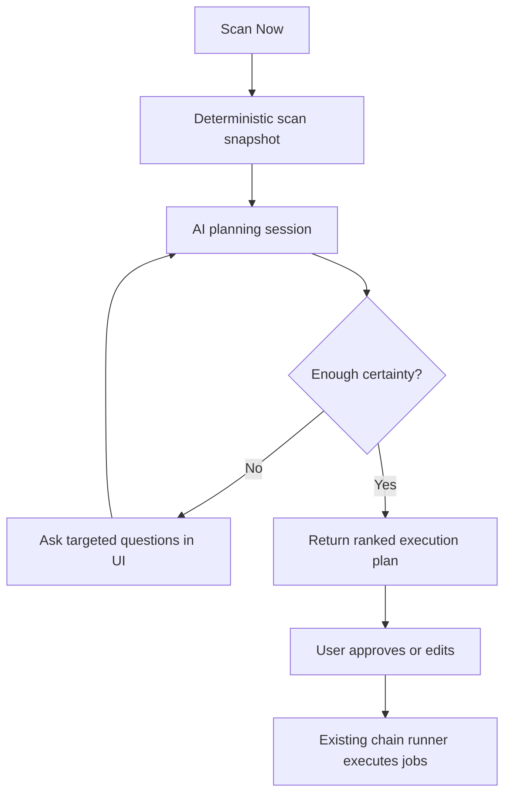

# AI Integration Scan Orchestrator

> A question-asking planning layer for the Integration tab's `Scan Now` button. It inspects the raw input files, the warehouse load state, and recent chain history, then either asks the minimum set of clarifying questions or returns a safe execution sequence for the existing chain runner.

| | |
|---|---|
| **Status** | Proposed |
| **UI Tab** | IntegrationTab (`ScanPanel` + `ChainComposer`) |
| **Key Files** | `frontend/src/tabs/IntegrationTab.tsx`, `frontend/src/components/integration/ScanPanel.tsx`, `frontend/src/components/integration/ChainComposer.tsx`, `api/routers/platform/integration_chain.py`, `common/services/integration_scanner.py`, `common/services/integration_chain_runner.py`, `common/ai/integration_scan/` (new), `config/ai/integration_scan_config.yaml` (new) |

---

## Problem

The current `Scan Now` flow is deterministic: it hashes files under `data/input/`, compares them with the last completed load batch, and proposes a fixed dimension-first / fact-last chain. That is reliable, but it is not intelligent.

When the warehouse state and the input state are not perfectly obvious, the UI cannot answer basic operational questions:

- Is this a true content change or only a cleanup artifact?
- Should the run be a file-level slice load or a broader delta refresh?
- Are there downstream facts that must wait for a specific master to complete first?
- Is the chain safe to execute right now, or is there already an overlapping job in flight?

The result is too much guesswork for operators. We need a best-in-class planning system that can reason over both the files and the database, ask concise follow-up questions when the plan is ambiguous, and then hand the existing loader an execution order that is easy to trust.

---

## Solution

Add an AI planning layer between the deterministic scanner and the chain executor.

The planner does not replace the existing scanner. It consumes the scanner's evidence, queries the current database state, and emits one of two structured outcomes:

1. `NeedInfo` - a small set of targeted questions the user must answer before the plan is final.
2. `ExecutionPlan` - a ranked, evidence-backed sequence of jobs that the existing `POST /integration/chains` endpoint can run unchanged.

The planner uses the repo's two OpenAI runtime paths so local development can reuse the developer's Codex sign-in and production can use the paid OpenAI API:

- local development: `provider: codex`, model `gpt-5.5`, through `codex exec` and the laptop's saved ChatGPT/Codex authentication; the subprocess is read-only and does not use an API key
- production: `provider: openai`, model `gpt-5.5`, backed by `OPENAI_API_KEY`
- runtime selection: `INTEGRATION_SCAN_AI_RUNTIME=codex|openai` overrides the YAML default

The key design choice is separation of concerns:

- sensing stays deterministic
- reasoning is AI-driven
- execution stays deterministic and already audited

---

## How It Works

### Architecture

### Planning contract

The planner should only return structured output. Free-form prose is allowed in the UI, but the service contract is JSON-first so it can be validated and tested.

| Field | Purpose |
|---|---|
| `plan_id` | Stable identifier for the planning session |
| `scan_snapshot_id` | Which deterministic scan result the plan is based on |
| `confidence` | `0.0` to `1.0`; below threshold the planner must ask questions |
| `questions` | One to three focused questions, each with a concrete tradeoff |
| `recommended_chain` | Ordered job list with `domain`, `mode`, and optional `slice` |
| `risk_flags` | Ambiguities, overlapping jobs, stale batches, or slice conflicts |
| `evidence` | Paths, hashes, batch ids, and DB facts used to justify the answer |
| `explanation` | Short human-readable rationale for the sequence |

### Questioning policy

The planner should ask questions only when the answer changes the safe sequence or prevents a bad run.

Examples:

| Situation | Question |
|---|---|
| A single snapshot changed but the warehouse already has an equivalent load | "This looks like a cleanup-only edit. Do you want to skip it, re-run it, or just validate the data?" |
| Multiple facts changed but the upstream master files did not move | "Should I run facts only, or do you want me to refresh masters first and keep the chain conservative?" |
| Inventory snapshots changed and the month slice is ambiguous | "I found multiple snapshot files. Should I run only the newest changed month or replay every changed slice?" |
| A matching domain is already queued or running | "There is already an active job for this domain. Do you want to wait for it, queue behind it, or stop and inspect?" |

The planner should prefer closed-form questions whenever possible. If the user needs to choose between two valid paths, the question should make the tradeoff explicit.

### Execution flow

1. The user clicks `Scan Now`.
2. The UI requests the deterministic scan snapshot.
3. The backend gathers supporting facts from the database:
   - last completed batch hashes
   - recent chain history
   - currently queued or running jobs
   - domain dependency metadata
4. The AI planner synthesizes the evidence and either:
   - asks the minimum number of clarifying questions, or
   - emits a final execution sequence.
5. The UI shows the questions inline, preserves the evidence trail, and disables execution until the plan is resolved.
6. When the user approves, the existing chain runner executes the jobs exactly as today.

### Why this is best-in-class

The planner should optimize for three things at once:

- correctness: never invent state that is not in the files or database
- brevity: ask the fewest possible questions
- auditability: explain why each step is in the sequence

That means the model should be used as a decision helper, not as a blind executor.

---

## Data Model

The planner should persist enough state to support replay, debugging, and operator trust.

| Table | Purpose | Key Columns |
|---|---|---|
| `integration_scan_session` | One `Scan Now` planning session | `id`, `scan_snapshot_id`, `provider`, `model`, `confidence`, `status`, `created_at`, `created_by` |
| `integration_scan_question` | Questions the model asked | `id`, `session_id`, `ordinal`, `question_text`, `answer_type`, `required`, `evidence_json`, `resolved_at` |
| `integration_scan_answer` | User responses to questions | `id`, `question_id`, `answer_text`, `answer_json`, `answered_by`, `answered_at` |
| `integration_scan_plan` | Final recommended execution plan | `id`, `session_id`, `plan_json`, `confidence`, `approved`, `approved_at`, `executed_chain_id` |
| `integration_scan_call_log` | Per-turn observability | `id`, `session_id`, `provider`, `model`, `prompt_tokens`, `completion_tokens`, `latency_ms`, `truncated`, `created_at` |

If persistence is disabled, the feature should still work in memory for the current session. Persistence is for auditability and support, not for correctness.

---

## API

The existing integration endpoints stay in place for execution and raw scanning. The AI planner adds a thin orchestration layer on top.

| Method | Path | Purpose |
|---|---|---|
| GET | `/integration/scan` | Deterministic file-hash scan and proposed raw chain |
| POST | `/integration/scan/plan` | Start or continue an AI planning session from a scan snapshot |
| POST | `/integration/scan/{session_id}/answer` | Submit a user answer and continue planning |
| POST | `/integration/chains` | Execute the approved chain unchanged |
| GET | `/integration/scan/{session_id}` | Return the current questions, plan, and evidence |

The planner API should be safe to call repeatedly. It must be idempotent with respect to the same scan snapshot and answer set.

---

## Configuration

File: `config/ai/integration_scan_config.yaml`

| Key | Purpose | Default |
|---|---|---|
| `runtime.provider` | `codex` or `openai` | `codex` in development; set `INTEGRATION_SCAN_AI_RUNTIME=openai` in production |
| `models.codex` | Codex subscription-authenticated model id | `gpt-5.5` |
| `models.openai` | OpenAI API model id | `gpt-5.5` |
| `codex.sandbox` | Filesystem permission for local planning | `read-only` |
| `confidence_threshold` | Below this, the planner must ask more questions | `0.80` |
| `max_questions_per_scan` | Cap on interactive questions | `3` |
| `max_turns` | Upper bound on the reasoning loop | `8` |
| `token_budget` | Max tokens per planning session | `20000` |
| `persist_sessions` | Store sessions, questions, and plans in Postgres | `true` |
| `include_db_state` | Pull current load and job state into the prompt context | `true` |
| `include_scan_evidence` | Include file hashes and batch hashes in the prompt context | `true` |
| `fallback_to_deterministic_plan` | Return the current raw chain when the model is unavailable | `true` |

For laptop development, the spec intentionally uses a no-cost local provider path rather than a paid OpenAI API key. That keeps the feedback loop fast and free. In production, the same configuration surface flips to `provider: openai` and uses `OPENAI_API_KEY`.

---

## UI

The Integration tab should evolve from a one-click detector into a guided planning surface.

- `ScanPanel` becomes the entry point for the AI session.
- If the planner needs more information, it renders a compact question card directly under the scan result.
- If the planner is confident, `ChainComposer` shows the recommended sequence and the evidence behind it.
- The run button should read something like `Run Suggested Chain`, so the distinction between generated plan and actual execution is obvious.
- The UI should show whether the current plan is using local development inference or production OpenAI inference.

The experience should feel like a planning copilot, not a chatbot:

- answers are short
- questions are specific
- sequence changes are visible
- the actual load execution still happens through the existing chain runner

---

## Security

- The AI planner must never execute writes directly.
- The planner can recommend a sequence, but only the existing chain endpoint can run jobs.
- Prompt context must not include secrets, credentials, or private environment variables.
- Tool outputs are evidence, not instructions.
- All structured outputs should be validated before the UI renders them.
- Production OpenAI credentials belong only on the server, never in the browser.

The planner should be treated as advisory until the user confirms the final chain.

---

## Testing

| Layer | Test | Notes |
|---|---|---|
| Planner core | `tests/unit/test_integration_scan_planner.py` | Questions, confidence gating, sequence ranking, and fallback behavior |
| Router | `tests/api/test_integration_scan_planner.py` | Session creation, answer submission, and execution handoff |
| UI | `frontend/src/components/integration/__tests__/ScanPanel.test.tsx` | Question rendering, run gating, and local-vs-production status |
| End-to-end | `frontend/e2e/tests/integration-scan.spec.ts` | Scan Now -> question loop -> approved chain flow |

The tests should mock the LLM provider in every CI path. No live model calls in the test suite.

---

## Rollout

1. Keep the existing deterministic scan and chain runner working exactly as they do today.
2. Add the AI planner in advisory mode only.
3. Add persistence and audit logging for questions and plans.
4. Switch the Integration tab to surface questions and recommendations.
5. Only after the advisory flow is stable, consider richer agentic behavior such as deeper DB tool use or multi-step clarifications.

---

## See Also

- `06-ai-platform/01-ai-planning-agent.md` -- portfolio-wide agentic reasoning patterns to reuse
- `06-ai-platform/07-sku-chatbot.md` -- provider selection, local development modes, and structured AI UX patterns
- `08-integration/01-integration-architecture.md` -- integration vectors and API governance
- `08-integration/07-fva.md` -- why human review loops matter for forecast and planning decisions
