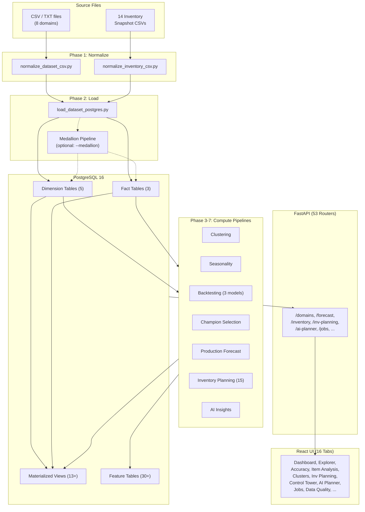
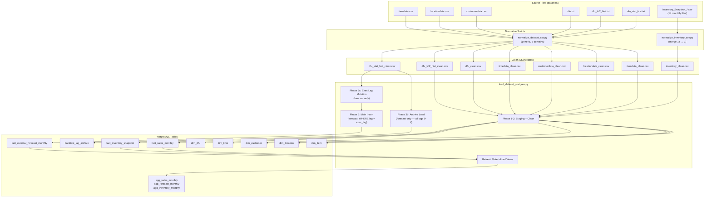
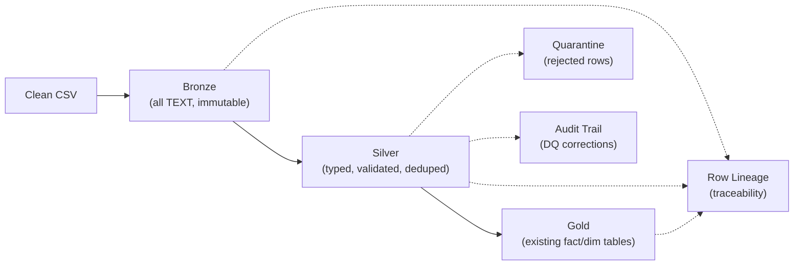
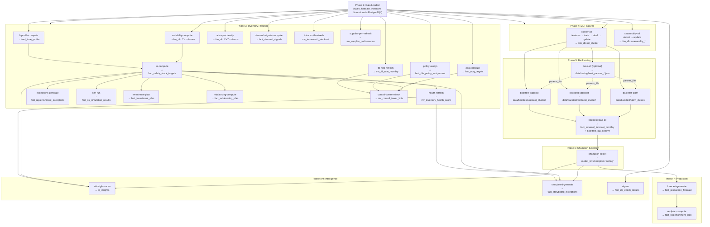
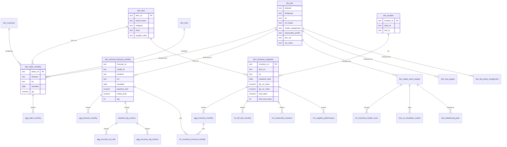

# Demand Studio — Data Flow Reference

Complete data flow documentation: source files, pipeline scripts, database tables, API endpoints, and frontend tabs.

---

## 1. High-Level Pipeline Overview



---

## 2. Input Files Inventory

| Domain | Source File | Format | Delimiter | Normalize Script | Clean Output | Key Columns |
|--------|-----------|--------|-----------|-----------------|-------------|-------------|
| **item** | `datafiles/itemdata.csv` | CSV | `,` | `normalize_dataset_csv.py --dataset item` | `data/itemdata_clean.csv` | `item_no` (PK) |
| **location** | `datafiles/locationdata.csv` | CSV | `,` | `normalize_dataset_csv.py --dataset location` | `data/locationdata_clean.csv` | `location_id` (PK) |
| **customer** | `datafiles/customerdata.csv` | CSV | `,` | `normalize_dataset_csv.py --dataset customer` | `data/customerdata_clean.csv` | `site + customer_no` (CK) |
| **time** | _(auto-generated 2020-2035)_ | — | — | `normalize_dataset_csv.py --dataset time` | `data/timedata_clean.csv` | `date_key` (PK) |
| **dfu** | `datafiles/dfu.txt` | TXT | `\|` | `normalize_dataset_csv.py --dataset dfu` | `data/dfu_clean.csv` | `dmdunit + dmdgroup + loc` (CK) |
| **sales** | `datafiles/dfu_lvl2_hist.txt` | TXT | `\|` | `normalize_dataset_csv.py --dataset sales` | `data/dfu_lvl2_hist_clean.csv` | `dmdunit + dmdgroup + loc + startdate + type` |
| **forecast** | `datafiles/dfu_stat_fcst.txt` | TXT | `\|` | `normalize_dataset_csv.py --dataset forecast` | `data/dfu_stat_fcst_clean.csv` | `dmdunit + dmdgroup + loc + fcstdate + startdate` |
| **inventory** | `datafiles/Inventory_Snapshot_YYYY_MM.csv` (14 files) | CSV | `,` | `normalize_inventory_csv.py` | `data/inventory_clean.csv` | `item_no + loc + snapshot_date` |

**Normalization rules applied to all domains:**
- Null normalization: `''`, `'null'`, `'none'`, `'NA'` → `NULL`
- Type casting: integer/float/date fields auto-cast with null coercion
- Sales: only `TYPE=1` rows retained
- Forecast: `lag = month_diff(startdate, fcstdate)`, only lags 0-4
- Inventory: `qty_on_order = qty_on_hand_on_order - qty_on_hand` (derived)

---

## 3. Data Ingestion Flow



### Forecast Dual-Path Loading (Critical Detail)

The forecast loader uses phase ordering to preserve multi-horizon accuracy:

1. **Phase 3b** — Archive load FIRST from untouched staging (all lags 0-4 → `backtest_lag_archive`)
2. **Phase 3c** — Mutate staging: set `execution_lag` from `dim_dfu` per DFU
3. **Phase 5** — Main insert: only rows where `lag = execution_lag` enter `fact_external_forecast_monthly`

**Flags:** `--replace` (keep backtest/champion rows), `--skip-archive` (skip 45M-row archive for speed)

### Medallion Pipeline (Optional)

When `--medallion` flag is used, data flows through 3 additional layers:



Tables: `bronze_*` (8), `silver_*` (8), `silver_quarantine`, `audit_dq_corrections`, `audit_row_lineage`, `audit_load_batch`, `fact_sales_monthly_original` (uncorrected baseline)

---

## 4. Compute Pipeline Dependency Graph



### Script-Level Dependency Details

| Pipeline | Scripts (in order) | Reads | Writes | Config |
|----------|--------------------|-------|--------|--------|
| **Clustering** | `generate_clustering_features.py` → `train_clustering_model.py` → `label_clusters.py` → `update_cluster_assignments.py` | `dim_dfu`, `dim_item`, `fact_sales_monthly` | `dim_dfu.ml_cluster`, `data/clustering/` | `clustering_config.yaml` |
| **Seasonality** | `detect_seasonality.py` → `update_seasonality_profiles.py` | `fact_sales_monthly`, `dim_dfu` | `dim_dfu.seasonality_*` (6 cols) | `seasonality_config.yaml` |
| **Variability** | `compute_demand_variability.py` | `fact_sales_monthly` | `dim_dfu.cv_demand` + variability cols | `variability_config.yaml` |
| **Lead Time** | `compute_lead_time_variability.py` | `fact_inventory_snapshot` | lead time profile table | `lead_time_config.yaml` |
| **Safety Stock** | `compute_safety_stock.py` | `dim_dfu` (variability), LT profile | `fact_safety_stock_targets` | `safety_stock_config.yaml` |
| **EOQ** | `compute_eoq.py` | `agg_inventory_monthly`, `dim_dfu` | `fact_eoq_targets` | `eoq_config.yaml` |
| **Policy** | `assign_replenishment_policies.py` | `dim_dfu` (ABC/XYZ) | `dim_replenishment_policy`, `fact_dfu_policy_assignment` | `replenishment_policy_config.yaml` |
| **ABC-XYZ** | `classify_abc_xyz.py` | `agg_sales_monthly`, `dim_dfu` | `dim_dfu.abc_vol`, `xyz_class` | — |
| **Exceptions** | `generate_replenishment_exceptions.py` | inventory + policy + SS data | `fact_replenishment_exceptions` | `exception_config.yaml` |
| **Demand Signals** | `compute_demand_signals.py` | `fact_inventory_snapshot`, forecast | `fact_demand_signals` | — |
| **SS Simulation** | `run_ss_simulation.py` | `fact_safety_stock_targets`, LT | `fact_ss_simulation_results` | `simulation_config.yaml` |
| **Investment** | `compute_investment_plan.py` | `fact_safety_stock_targets`, `dim_dfu` | `fact_inventory_investment_plan` | — |
| **Rebalancing** | `compute_rebalancing.py` | `agg_inventory_monthly`, SS, `dim_transfer_lane` | `fact_rebalancing_plan`, `fact_rebalancing_transfer` | `rebalancing_config.yaml` |
| **Tuning** | `tune_hyperparams.py` | `fact_sales_monthly`, `fact_external_forecast_monthly` | `data/tuning/best_params_*.json` | `hyperparameter_tuning.yaml` |
| **LGBM Backtest** | `run_backtest.py` | sales, forecast, `dim_dfu.ml_cluster` | `data/backtest/lgbm_cluster/` | `algorithm_config.yaml` |
| **CatBoost Backtest** | `run_backtest_catboost.py` | same | `data/backtest/catboost_cluster/` | `algorithm_config.yaml` |
| **XGBoost Backtest** | `run_backtest_xgboost.py` | same | `data/backtest/xgboost_cluster/` | `algorithm_config.yaml` |
| **Backtest Load** | `load_backtest_forecasts.py` | `data/backtest/*/` CSVs | `fact_external_forecast_monthly`, `backtest_lag_archive` | — |
| **Champion** | `run_champion_selection.py` | `fact_external_forecast_monthly`, archive | rows with `model_id='champion'`, `'ceiling'` | `model_competition.yaml` |
| **Prod Forecast** | `generate_production_forecasts.py` | champion assignments, cluster `.pkl` models | `fact_production_forecast`, `fact_model_registry` | `production_forecast_config.yaml` |
| **Repl Plan** | `compute_replenishment_plan.py` | `fact_production_forecast`, SS, EOQ | `fact_replenishment_plan` | — |
| **AI Insights** | `generate_ai_insights.py` | multi-table queries (DFU, forecast, inventory, health) | `ai_insights`, `ai_planning_memos`, `ai_call_log` | `ai_planner_config.yaml` |
| **Storyboard** | `generate_storyboard_exceptions.py` | forecast, inventory, accuracy views | `fact_storyboard_exceptions` | `exception_config.yaml` |
| **DQ Checks** | `populate_dq_checks.py` + DQ engine | all data tables | `fact_dq_check_results`, `mv_dq_dashboard` | `data_quality_config.yaml` |
| **Bias Correction** | `compute_bias_corrections.py` | `fact_external_forecast_monthly` | `fact_bias_corrections` | `bias_correction_config.yaml` |
| **Blended Forecast** | `compute_blended_forecast.py` | forecast, demand signals | `fact_blended_forecast` | — |
| **Echelon SS** | `compute_echelon_targets.py` | `fact_safety_stock_targets`, network | `fact_echelon_planning` | `echelon_config.yaml` |
| **Inv Projection** | `compute_inventory_projection.py` | `agg_inventory_monthly`, prod forecast | `fact_inventory_projection` | `projection_config.yaml` |
| **Financial Plan** | `compute_financial_plan.py` | SS targets, `dim_dfu` | `fact_financial_plan` | `financial_plan_config.yaml` |
| **S&OP** | `run_sop_cycle.py` | consensus plan, S&OP tables | `fact_sop_cycles` + 4 phase tables | `sop_config.yaml` |

---

## 5. Database Schema Map



### All Tables by Category

**Core Dimensions (5):** `dim_item`, `dim_location`, `dim_customer`, `dim_time`, `dim_dfu`

**Core Facts (3):** `fact_sales_monthly`, `fact_external_forecast_monthly`, `fact_inventory_snapshot`

**Archive:** `backtest_lag_archive`

**Core Materialized Views (6):**
`agg_sales_monthly`, `agg_forecast_monthly`, `agg_inventory_monthly`, `agg_accuracy_by_dim`, `agg_accuracy_lag_archive`, `agg_dfu_coverage`

**Inventory Planning Tables (12):**
`fact_safety_stock_targets`, `fact_eoq_targets`, `dim_replenishment_policy`, `fact_dfu_policy_assignment`, `fact_replenishment_exceptions`, `fact_demand_signals`, `fact_ss_simulation_results`, `fact_inventory_investment_plan`, `fact_efficient_frontier`, `dim_transfer_lane`, `fact_rebalancing_plan`, `fact_rebalancing_transfer`

**Inventory Planning Views (6):**
`mv_inventory_forecast_monthly`, `mv_inventory_health_score`, `mv_fill_rate_monthly`, `mv_supplier_performance`, `mv_intramonth_stockout`, `mv_network_balance`, `mv_control_tower_kpis`

**Forecasting & Champion (3):**
`fact_production_forecast`, `fact_model_registry`, `fact_replenishment_plan`

**AI & Exception Tables (5):**
`ai_insights`, `ai_planning_memos`, `ai_call_log`, `ai_recommendation_outcomes`, `fact_storyboard_exceptions`

**Operations Tables (12):**
`fact_bias_corrections`, `fact_service_level_tracking`, `fact_lead_time_learning`, `fact_blended_forecast`, `fact_echelon_planning`, `fact_financial_plan`, `fact_sop_cycles` (+ 4 phase tables), `fact_event_planning`, `fact_supply_scenarios`

**Supply Chain (5):**
`dim_supplier_master`, `fact_open_purchase_orders`, `fact_po_receipts`, `fact_inventory_projection`, `fact_planned_orders`, `fact_demand_plan`, `fact_consensus_plan`, `fact_procurement_workflow`

**Platform Tables (8):**
`dim_dq_check_catalog`, `fact_dq_check_results`, `mv_dq_dashboard`, `dim_user`, `fact_audit_log`, `fact_notification_log`, `fact_annotation`, `fact_external_signals`, `fact_fva_tracking`, `dim_report_template`, `fact_report_schedule`, `fact_webhook_registrations`, `fact_query_performance`

**Medallion Pipeline (8):**
`audit_load_batch`, `bronze_*` (8 tables), `silver_*` (8 tables), `silver_quarantine`, `audit_dq_corrections`, `audit_row_lineage`, `fact_sales_monthly_original`

**Chat:** `schema_embeddings`

**Jobs:** `job_history`, `job_schedule`

---

## 6. Materialized View Refresh Order

Views must be refreshed in dependency order. Later views depend on earlier ones.

```
1. agg_sales_monthly          ← fact_sales_monthly
2. agg_forecast_monthly       ← fact_external_forecast_monthly
3. agg_inventory_monthly      ← fact_inventory_snapshot
4. agg_accuracy_by_dim        ← backtest_lag_archive + dim_dfu
5. agg_accuracy_lag_archive   ← backtest_lag_archive
6. agg_dfu_coverage           ← fact_sales_monthly + dim_dfu
│
├─ (parallel, independent of each other)
├── 7a. mv_fill_rate_monthly          ← fact_inventory_snapshot
├── 7b. mv_supplier_performance       ← fact_inventory_snapshot (receipts)
├── 7c. mv_intramonth_stockout        ← fact_inventory_snapshot
├── 7d. mv_inventory_forecast_monthly ← agg_inventory_monthly + fact_external_forecast_monthly + dim_dfu
│
8. mv_inventory_health_score  ← fact_safety_stock_targets + fact_replenishment_exceptions
                                 + mv_fill_rate_monthly + fact_dfu_policy_assignment
9. mv_network_balance         ← agg_inventory_monthly + fact_safety_stock_targets
10. mv_control_tower_kpis     ← all IPfeature tables (aggregates everything)
11. mv_dq_dashboard           ← fact_dq_check_results
```

**Note:** `mv_inventory_forecast_monthly` must refresh BEFORE `mv_inventory_health_score`. Use `SET max_parallel_workers_per_gather = 0` if you encounter shared memory errors during concurrent refresh.

---

## 7. API → Frontend Data Flow

| Frontend Tab | API Endpoints | Primary DB Tables/Views |
|-------------|---------------|------------------------|
| **Dashboard** | `/dashboard/kpis`, `/trend`, `/heatmap`, `/alerts`, `/top-movers` | `fact_external_forecast_monthly`, `agg_sales_monthly`, `mv_top_movers` |
| **Data Explorer** | `/domains/{domain}/rows`, `/search`, `/filter`, `/meta` | All dimension + fact tables |
| **Portfolio Analysis** | `/forecast/accuracy/slice`, `/lag-curve`, `/champions/*`, `/shap/*` | `agg_accuracy_by_dim`, `backtest_lag_archive`, `fact_external_forecast_monthly` |
| **Item Analysis** | `/dfu/*`, `/forecast/shap/{model}/dfu`, `/inventory/*` | `fact_sales_monthly`, `fact_external_forecast_monthly`, `fact_inventory_snapshot`, SHAP CSVs |
| **Clusters** | `/clustering/list`, `/scenario`, `/scenario/{id}/status` | `dim_dfu`, `data/clustering/` |
| **Inv Planning** (28 panels) | `/inv-planning/*` (13 router modules) | All `fact_*` inv planning tables + MVs |
| **Control Tower** | `/control-tower/kpis`, `/alerts`, `/top-critical`, `/trend` | `mv_control_tower_kpis` |
| **AI Planner** | `/ai-planner/insights`, `/portfolio-scan`, `/metrics` | `ai_insights`, `ai_planning_memos`, `ai_call_log` |
| **Storyboard** | `/storyboard/exceptions`, `/summary`, `/detail` | `fact_storyboard_exceptions` |
| **Jobs** | `/jobs/*` (12 endpoints) | `job_history`, `job_schedule` |
| **Data Quality** | `/data-quality/dashboard`, `/checks`, `/results`, `/run` | `dim_dq_check_catalog`, `fact_dq_check_results`, `mv_dq_dashboard` |
| **FVA** | `/fva/waterfall`, `/roi`, `/detail` | `fact_fva_tracking` |
| **S&OP** | `/sop/cycles`, `/advance`, `/plan` | `fact_sop_cycles` + 4 phase tables |

### Vite Proxy Routes (frontend/vite.config.ts)

All API prefixes proxied to FastAPI at `http://127.0.0.1:8000`:

`/domains`, `/jobs`, `/clustering`, `/forecast`, `/inventory`, `/dashboard`, `/health`, `/chat`, `/dfu`, `/competition`, `/bench`, `/market-intelligence`, `/inv-planning`, `/fill-rate`, `/control-tower`, `/ai-planner`, `/storyboard`, `/data-quality`, `/sop`, `/fva`, `/supply`, `/notifications`, `/reports`, `/webhooks`, `/auth`

> **CRITICAL:** When adding a new API path prefix, add a corresponding proxy entry in `vite.config.ts` or the frontend will receive HTML instead of JSON.

---

## 8. Make Target Quick Reference — Full Pipeline

Run from `mvp/demand/`. Execute phases in order; within a phase, targets can run in parallel unless noted.

```bash
# ─── Phase 0: One-Time Setup ───────────────────────────────────
make init                    # Python venv + uv + deps
make up                      # Docker: Postgres + MLflow
make ui-init                 # npm install

# ─── Phase 1: Schema ───────────────────────────────────────────
make db-apply-sql            # Core tables (001-018)
make db-apply-inventory      # Inventory snapshot table
make db-apply-jobs           # Job scheduler tables
make ss-schema               # Safety stock
make eoq-schema              # EOQ
make policy-schema           # Replenishment policies
make health-schema           # Health score MV
make exceptions-schema       # Exception queue
make fill-rate-schema        # Fill rate MV
make demand-signals-schema   # Demand signals
make sim-schema              # SS simulation
make abc-xyz-schema          # ABC-XYZ columns
make supplier-perf-schema    # Supplier perf MV
make investment-schema       # Investment plan
make intramonth-schema       # Intramonth stockout MV
make control-tower-schema    # Control tower MV
make rebalancing-schema      # Network balance
make ai-insights-schema      # AI insights tables
make forecast-prod-schema    # Production forecast
make replplan-schema         # Replenishment plan
make storyboard-schema       # Storyboard exceptions
make dq-schema               # Data quality tables
make medallion-schema        # Bronze/silver/gold/audit tables
# (+ auth, fva, sop, notification, collaboration, etc.)

# ─── Phase 2: Data Ingestion ───────────────────────────────────
make normalize-all           # All 8 domains → clean CSVs
make load-all                # Load + refresh agg views
make inventory-pipeline      # Normalize + load inventory (~190M rows)

# ─── Phase 3: Inventory Planning Computations ──────────────────
make variability-compute     # Demand variability → dim_dfu
make lt-profile-compute      # Lead time variability
make ss-compute              # Safety stock (needs variability + LT)
make eoq-compute             # EOQ cycle stock
make policy-assign           # Replenishment policies
make abc-xyz-classify        # ABC-XYZ segmentation
make fill-rate-refresh       # Fill rate MV
make demand-signals-compute  # Demand signals
make intramonth-refresh      # Intramonth stockout MV
make supplier-perf-refresh   # Supplier performance MV
make health-refresh          # Health score MV (needs SS)
make exceptions-generate     # Exception queue (needs SS + EOQ)
make sim-run                 # Monte Carlo simulation (needs SS)
make investment-plan         # Investment optimization (needs SS)
make rebalancing-compute     # Rebalancing plan (needs SS)
make control-tower-refresh   # Control tower KPIs (needs all above)

# ─── Phase 4: ML Features ──────────────────────────────────────
make cluster-all             # features → train → label → update dim_dfu
make seasonality-all         # detect → update dim_dfu

# ─── Phase 5: Backtesting ──────────────────────────────────────
make tune-all                # (optional) Hyperparameter tuning
make backtest-all            # LGBM + CatBoost + XGBoost (sequential)
# or: make backtest-all-parallel
make backtest-load-all       # Load predictions → DB

# ─── Phase 6: Champion Selection ────────────────────────────────
make champion-all            # meta-learner + simulate + select

# ─── Phase 7: Production Forecast ───────────────────────────────
make forecast-generate       # 12-month forward forecast
make replplan-compute        # Forward replenishment plan (needs forecast + SS + EOQ)

# ─── Phase 8-9: Intelligence & Quality ──────────────────────────
make ai-insights-scan        # Portfolio AI scan
make storyboard-generate     # Exception detection
make dq-run                  # Data quality checks

# ─── Phase 10: Start Services ──────────────────────────────────
make api                     # FastAPI on :8000
make ui                      # React dev server on :5173

# ─── Verification ──────────────────────────────────────────────
make check-all               # DB + API health checks
make test-all                # Backend + frontend tests
make e2e                     # Playwright E2E smoke tests
```

### Config Files Reference

All config files live in `config/`. Every compute script externalizes parameters to YAML — no hardcoded thresholds.

| Config File | Used By | Key Parameters |
|-------------|---------|---------------|
| `algorithm_config.yaml` | All 3 backtest scripts | `cluster_strategy`, `recursive`, `shap_select`, `tune_inline`, `params_file` |
| `clustering_config.yaml` | Clustering pipeline | `k_range`, `min_cluster_size_pct`, `time_window_months` |
| `model_competition.yaml` | Champion selection | `strategy`, `competing_models`, `fallback_model_id` |
| `hyperparameter_tuning.yaml` | Optuna tuning | Search spaces (8 LGBM, 5 CatBoost, 8 XGBoost params) |
| `safety_stock_config.yaml` | Safety stock compute | Service levels by ABC class, Z-table |
| `eoq_config.yaml` | EOQ compute | `ordering_cost`, `holding_cost_pct`, `moq` |
| `replenishment_policy_config.yaml` | Policy assignment | 4 policy types, auto-assign rules |
| `rebalancing_config.yaml` | Rebalancing | `solver` (greedy/LP), thresholds, costs |
| `exception_config.yaml` | Exceptions + storyboard | 6 exception types, severity thresholds |
| `simulation_config.yaml` | Monte Carlo SS | `n_simulations`, `random_seed` |
| `seasonality_config.yaml` | Seasonality detection | CV thresholds, profile labels |
| `variability_config.yaml` | Demand variability | CV thresholds, `history_months` |
| `lead_time_config.yaml` | LT variability | LT CV thresholds, reliability bands |
| `ai_planner_config.yaml` | AI agent | `model`, DOS/WAPE/bias thresholds |
| `production_forecast_config.yaml` | Prod forecast | Inference horizon, plan_version format |
| `data_quality_config.yaml` | DQ engine | 12 check types across 8 domains |
| `planning_config.yaml` | Planning date | `planning_date`, `use_system_date` |
| `medallion_config.yaml` | Medallion pipeline | Layer retention, promotion gates, auto-fix strategies |

---

## 9. Key Output Directories

| Directory | Contents | Created By |
|-----------|----------|-----------|
| `data/` | Clean CSVs from normalization | `normalize_*.py` |
| `data/backtest/<model_id>/` | Backtest predictions + SHAP CSVs | `run_backtest*.py` |
| `data/clustering/` | Feature matrices, KMeans model, labels | `generate_clustering_features.py`, `train_clustering_model.py` |
| `data/tuning/` | `best_params_<model>.json` | `tune_hyperparams.py` |
| `data/models/<model_id>/` | Persisted `.pkl` model artifacts | Backtest scripts (via `model_persistence_fn`) |
| `datafiles/` | Raw source CSVs/TXTs (read-only) | External system export |
